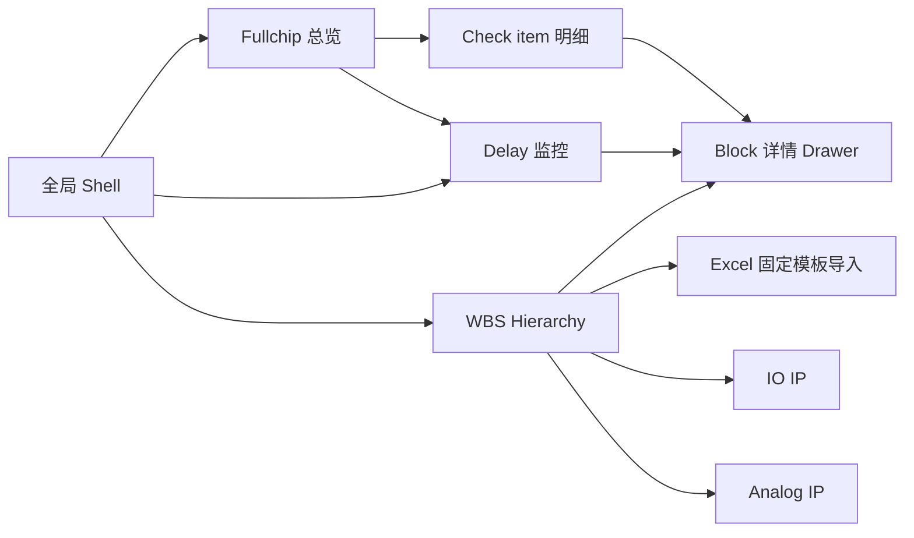
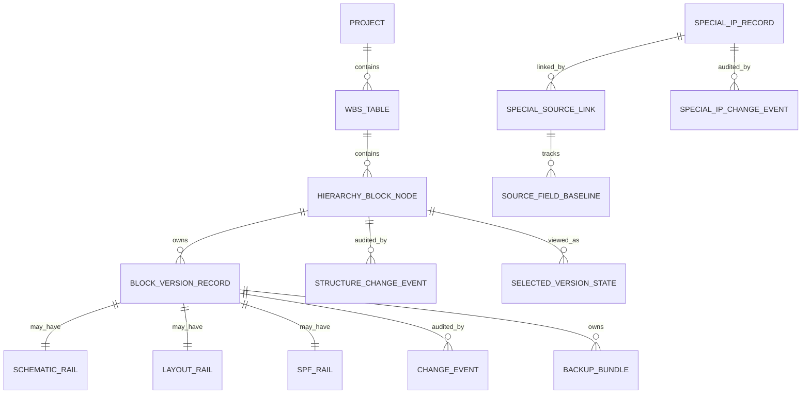
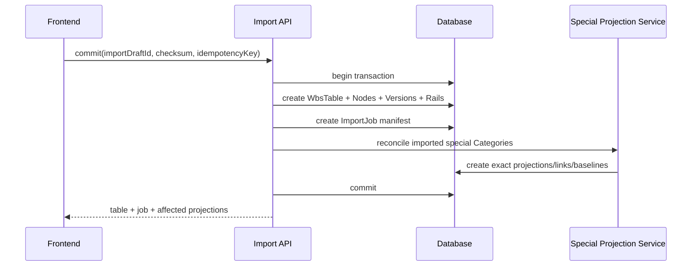

# DE-WBS 前后端开发 PRD

> 文档状态：开发基线候选版，需产品对第 37 章阻塞项完成最终签字后冻结  
> 文档版本：v2.0  
> 更新日期：2026-09-09  
> 适用对象：前端、后端、测试、架构、产品、项目 PL/LPL  
> 对应原型：[DE-WBS-prototype-v1.html](DE-WBS-prototype-v1.html)  
> 原型基线 SHA-256：`3daf294a5bf30a02656ab6d1f7f50580e4a5ac3be019b1956d59874ed15a7752`  
> 需求基线：[decisions.json](decisions.json)、[CONTEXT.md](CONTEXT.md)、[data-model.md](data-model.md)  
> 本文替代旧版 [DE-WBS-development-PRD.md](DE-WBS-development-PRD.md) 作为后续开发评审入口。

---

## 0. 文档使用规则

### 0.1 规则优先级

当实现、原型和文档出现冲突时，按以下顺序判断：

1. 产品经理最新书面确认。
2. `decisions.json` 中未被 superseded 的确认项。
3. `CONTEXT.md` 与 `data-model.md`。
4. 本 PRD 作为上述来源的开发汇总入口。
5. 当前主原型 `DE-WBS-prototype-v1.html` 的可见交互证据。
6. 历史 PRD、旧原型和完整对话仅用于追溯。

发现冲突后，不允许开发自行选择其中一种行为。应把冲突反馈给产品并同步修订本 PRD、决策记录与验收用例。

### 0.2 需求状态

| 状态 | 定义 | 开发动作 |
|---|---|---|
| 已确认 | 产品行为已经确认 | 必须实现并纳入验收 |
| 实现约束 | 为保证前后端一致而规定的技术契约 | 技术实现可替换，业务语义不可改变 |
| 原型表现 | 当前 HTML 的演示行为 | 仅在不与已确认规则冲突时作为实现依据 |
| 提议 | 为降低开发阻塞给出的方案 | 未获产品签字前不得当成正式业务规则 |
| 开放 | 产品尚未决定 | 不得擅自实现；见第 37 章 |
| 不在范围 | 本期明确排除 | 不开发、不预留可见入口 |

### 0.3 开发完成口径

“完成”不是页面看起来与原型相似，而是同时满足：

- 前端交互、状态、键盘行为和异常恢复符合本文。
- 后端数据模型不使用已废弃的 Instance 模型。
- 五张表的字段、计算、同步、事务和审计一致。
- 并发请求不能破坏 hierarchy、Version 或特殊 IP 关联。
- 第 29 章验收用例全部通过。
- 第 37 章中标为“上线阻塞”的开放项已由产品签字。

---

## 1. 产品概述

### 1.1 背景

DE-WBS 服务于半导体 DRAM Design & Layout 部门。当前团队通过飞书/Lark 表格维护 Block 层级、Owner、日期、Check item 和项目进度，层级依赖 Tier 列与单元格颜色，Schematic/Layout 依赖筛选颜色切换，状态大量人工维护。

产品目标是把这些信息结构化为可计算、可审计、可导入、可跨表同步的独立应用，同时保持工程团队可快速扫描和重复操作的表格工作方式。

### 1.2 用户规模

- 单张 WBS 表 100+ unique Blocks。
- 40+ 项目成员。
- 多个项目并行，但当前原型固定 Project 为 DDCPC。
- 同一 Project 下可存在多张普通 WBS 表。
- Schematic Owner 与 Layout Owner是不同角色和不同人员。

### 1.3 产品目标

1. 用显式 Schematic、Layout、SPF 切换替代颜色筛选。
2. 保证 Schematic/Layout 共享同一冻结身份区域，业务 rail 相互独立。
3. 用日期和详细 Check 自动派生 Progress、Check status 和 Delay。
4. 用一个逻辑 Block 节点管理多个 Version，表格只显示当前选中 Version。
5. 支持固定 Excel 模板创建新 WBS 表，并保证全量校验和事务提交。
6. 从普通 WBS 的 Block Category 自动维护 IO IP、Analog IP 特殊流程表。
7. 所有跨表同步使用稳定 ID 和明确事务，不使用名称、路径或显示文本猜测关联。

### 1.4 成功标准

- 任意表切换后，用户看到的是该表自己的完整数据快照。
- Schematic/Layout 的 Block、Version、Category、Reference project、节点数和顺序始终一致。
- 一个 Block 的 Version 切换会替换整行数据，不残留前一 Version 的业务字段。
- IO IP/Analog IP 的来源投影、隐藏保留、恢复、删除和字段镜像行为可重复且可审计。
- Excel 错误数据不能部分写入正式 WBS 表。
- 前后端对所有派生字段返回相同结果。

---

## 2. 产品范围

### 2.1 本期范围

- Block-level Schematic 和 Layout，截止 Block signoff。
- 独立 SPF hierarchy。
- Fullchip 总览。
- WBS Hierarchy。
- Delay 监控。
- Check item 明细。
- Block 详情 Drawer。
- 普通 WBS 表切换与数据隔离。
- IO IP 和 Analog IP 特殊流程表。
- 固定 Excel 模板下载、上传、校验和新表创建。
- Block/Version 新增、切换和删除。
- Block Category 驱动特殊 IP 投影。
- 最近修改和 Block变更记录。
- Materials、Comments、AI Routing。

### 2.2 不在范围

- Tape-out、Top-level 集成和 silicon debug。
- 飞书/Lark 作为生产平台。
- 跨项目 IP registry、跨项目 ECO fan-out。
- 单独 Mapping 页面或 Mapping 状态。
- 独立 Instance 实体、Instance ID 和 repeated-placement badge。
- Definition ID 的用户可见展示。
- SPF 文件解析、SPF Validation 和人工确认工作流。
- Changed release/finish date 和改期原因流程。
- Owner 手填百分比进度。
- WBS 表头级 Add Block、全部折叠和导出当前视图。
- 通用 Excel 字段映射、粘贴导入和 Sheet 选择。
- 移动端适配。
- Handshake submit/ack 流程。
- Plan finish 自动根据 Start date + Workdays 推导。

---

## 3. 核心术语

| 术语 | 定义 |
|---|---|
| Project | 项目。当前固定为 DDCPC |
| WBS Table | Project 下的一套独立 WBS 数据，如 ChanEdgel、ChanLeft、ChanMid |
| Ordinary WBS Table | 包含 Schematic/Layout/SPF hierarchy 的普通 WBS 表 |
| Special IP Table | IO IP 或 Analog IP 流程表 |
| Hierarchy | Schematic、Layout 或 SPF 的 Block 层级视图 |
| Hierarchy Block Node | hierarchy 中一个逻辑 Block 位置，拥有 Parent、Tier、顺序、展开状态和 Versions |
| Version Record | Block Node 下的业务记录，Version 为 1st 至 5th 或手工新 Block 的暂时空值 |
| Version Group | 同一个 Block Node 下的全部 Version Records |
| Selected Version | 当前 WBS 行或 Drawer 显示的 Version，不是业务状态变更 |
| Shared Identity | Schematic/Layout 共享的 Block name、Version、Category、Reference project 及节点骨架 |
| Rail | 某 hierarchy 独立的 Owner、日期、Check、Materials、Comments 等业务数据 |
| Source | 特殊 IP 行来自哪张普通 WBS 表 |
| Source Link | 特殊 IP 记录与精确普通表 + Block Node + Definition Version 的稳定关联 |
| Dormant Record | Category 离开特殊类型后隐藏但未删除的特殊 IP Version 记录 |
| Source Baseline | 每个 Source Link、每个公共字段最后一次已处理的来源值 |
| Stable Order Slot | 特殊 IP 来源行在其 Source 区域中的确定性位置 |
| Direct Edit History | 用户直接编辑某条记录产生的字段历史 |
| Structure Change | Block Node/Version 的新增、删除和结构变化 |

### 3.1 明确废弃的术语

生产数据模型和 API 不得出现：

- `Instance`
- `instanceId`
- `parentInstanceId`
- `HierarchyVersionInstance`

任何旧文档中的上述概念均替换为 `HierarchyBlockNode`、`nodeId`、`parentNodeId`。

---

## 4. 用户角色与权限

### 4.1 原型角色

| 角色 | 原型表现 |
|---|---|
| 普通成员 | 可编辑原型中所有可编辑字段 |
| Schematic Owner | 维护 Schematic rail |
| Layout Owner | 维护 Layout rail |
| PL/LPL | 可解锁或重新锁定 Schematic Planned release |
| 系统 | 计算派生字段、执行校验、同步和审计 |

### 4.2 生产权限原则

- 所有后端 Mutation 必须经过服务端鉴权，不能只依赖前端隐藏控件。
- Planned release 锁必须由服务端判断 PL/LPL 权限。
- 新增、删除、导入、回滚、附件下载都必须有明确 capability。
- 原型中的 `Lin Q. / Process Leader` 只是占位用户，不是生产角色映射。
- 完整权限矩阵仍是上线阻塞项，见第 37 章。

### 4.3 推荐权限能力码

以下仅是提议的 API capability 命名，不代表最终角色分配；权限矩阵确认后才冻结：

```text
wbs.read
wbs.block.create
wbs.block.rename
wbs.block.delete
wbs.version.create
wbs.version.delete
wbs.identity.edit
wbs.schematic.edit
wbs.layout.edit
wbs.spf.edit
wbs.check.edit
wbs.planned_release.lock
wbs.import.create
wbs.import.rollback
wbs.material.upload
wbs.material.delete
special_ip.edit
special_ip.block.create
special_ip.block.delete
```

后端返回当前用户的 capabilities，前端仅据此显示或禁用入口。

---

## 5. 信息架构



### 5.1 一级导航

左侧栏只包含：

1. `Fullchip 总览`
2. `WBS Hierarchy`
3. `Delay 监控`

Check item 明细和 Excel 导入为二级页面，不增加侧栏入口。

### 5.2 全局页面上下文

```text
projectId
activeTableId
activeTableType = ordinary | io_ip | analog_ip
activeHierarchy = schematic | layout | spf   // 仅 ordinary 有效
currentUser
capabilities[]
```

切换 activeTable 不改变 Project。切换 hierarchy 不改变 activeTable。

---

## 6. 全局 Shell 与视觉规范

### 6.1 视觉方向

采用 EA light dense enterprise 视觉系统：

| Token | 值 | 用途 |
|---|---|---|
| Primary | `#0052D9` | 主按钮、选中、普通 Focus |
| Primary hover | `#003FA8` | Hover/Pressed |
| Primary soft | 淡蓝色表面 | 选中行、Hover、筛选激活 |
| Canvas | 浅灰白 | 页面背景 |
| Surface | `#FFFFFF` | 表格、Drawer、Popover |
| Sidebar | 白色 + 细边框 | 左侧导航 |
| Danger | 红色语义色 | Delay、删除、错误 |
| Success | 绿色语义色 | Done、On schedule、确认 |

紫色仅可用于未来 AI 专属能力。普通按钮、选中、输入 Focus 不得使用紫色。

### 6.2 布局

- 桌面端最小验收宽度：1180px。
- 桌面端最小验收高度：720px。
- Topbar 高度：56px。
- Sidebar 展开：224px。
- Sidebar 收起：64px。
- Workspace/Popover 圆角约 10px。
- Card 圆角约 14px。
- 普通控件圆角约 8px。
- WBS 保持紧凑工程表格密度，不改造成营销卡片布局。

### 6.3 Sidebar

- 展开与收起约 200ms 动画。
- 状态按用户持久化。
- 收起态只显示图标，导航 title/aria-label 保留。
- Footer 只保留居中的 PanelLeftClose/PanelLeftOpen 按钮。
- Fullchip 使用 LayoutDashboard 线性图标。
- WBS Hierarchy 使用已选 S10 连续单线层级图标，18x18px，路径：

```html
<path d="M12 3v6c0 2-2 3-4 3s-4 1-4 3v6M12 9c0 2 2 3 4 3s4 1 4 3v6"></path>
<circle cx="12" cy="3" r="1.5"></circle>
<circle cx="4" cy="21" r="1.5"></circle>
<circle cx="20" cy="21" r="1.5"></circle>
```

- Delay 使用 ClockAlert 线性图标。
- 普通图标为 secondary gray；Hover/Selected 为 Primary。
- Delay count 在收起态位于右上角，不覆盖图标。

### 6.4 Topbar

从左到右：

1. `Project`
2. 固定值 `DDCPC`
3. `表名称`
4. 横向 segmented 单选表切换器
5. 通知
6. 帮助 `?`
7. 用户头像、显示名、角色

表切换器初始顺序：

```text
ChanEdgel | ChanLeft | ChanMid | IO IP | Analog IP
```

- 导入的新表追加到同一切换器末尾。
- Click 立即切换。
- Left/Right 在选项间移动。
- Home 选择第一项。
- End 选择最后一项。
- 空间不足时仅切换器自身横向滚动，通知、帮助和用户信息不能被挤出。
- 不显示 Execution、Project week 和可见日期。

### 6.5 通知和帮助

- 通知使用 Bell + 独立红点。
- 点击后本地标记已读并隐藏红点。
- 正式通知中心内容不属于本期确认范围。
- Help 当前只保留入口；正式帮助内容需要单独需求。

---

## 7. 领域模型

### 7.1 总体结构



### 7.2 Project

```text
Project {
  id: UUID
  code: string                  // DDCPC
  name: string
  businessDate: date
  createdAt: datetime
  updatedAt: datetime
}
```

`businessDate` 用于未完成任务的 Delay 计算。不得由浏览器本地日期直接决定。

### 7.3 WbsTable

```text
WbsTable {
  id: UUID
  projectId: UUID
  name: string
  type: ordinary | io_ip | analog_ip
  plannedReleaseLocked: boolean
  sourceRegionOrder: UUID[]
  revision: integer
  createdBy: UUID
  createdAt: datetime
  updatedAt: datetime
}
```

规则：

- `name` 在同一 Project 内按 trim + case-insensitive 唯一。
- `plannedReleaseLocked` 仅 ordinary 有效，默认 true。
- IO IP 和 Analog IP 是系统固定特殊表，不是普通表的 hierarchy。

### 7.4 HierarchyBlockNode

```text
HierarchyBlockNode {
  id: UUID
  wbsTableId: UUID
  hierarchyScope: shared_design_layout | spf | io_ip | analog_ip
  parentNodeId: UUID | null
  tier: integer
  order: decimal | integer
  blockName: string
  expanded: boolean
  sourceBlockNodeId: UUID | null
  sourceTableId: UUID | null
  revision: integer
  createdAt: datetime
  updatedAt: datetime
}
```

`shared_design_layout` 表示 Schematic/Layout 共用一个真实 Node spine；Schematic 和 Layout 不是两套 Node，也不能依赖异步复制维持一致。Hierarchy 视图只决定读取哪条 rail。

Node 独占以下属性：

- Parent
- Tier
- sibling/order
- expanded default
- children
- Block name

所有 Versions 必须共享同一 Node。Version 不得拥有 Parent、Tier 或 order。

### 7.5 BlockVersionRecord

```text
BlockVersionRecord {
  id: UUID
  nodeId: UUID
  version: null | 1st | 2nd | 3rd | 4th | 5th
  blockCategory: null | BlockCategory
  referenceProjectId: UUID | null
  blockOwnerId: UUID | null
  aiRoutingEnabled: boolean
  active: boolean
  revision: integer
  createdBy: UUID
  createdAt: datetime
  updatedAt: datetime
}
```

Schematic/Layout 对同一逻辑 Node 共用 Version Record 的身份字段。SPF 使用自己的 Node 和 Version Record。`aiRoutingEnabled` 属于该 Definition Version，在 Schematic/Layout 两个视图中共享；不同 Versions 可以保存各自的 AI Routing 值。Block rename 作用于 Node，因此天然覆盖整个 Version group。

### 7.5.1 SelectedVersionState

```text
SelectedVersionState {
  userId: UUID
  tableId: UUID
  viewScope: shared_design_layout | spf | io_ip | analog_ip
  nodeId: UUID
  selectedVersionRecordId: UUID
  revision: integer
  updatedAt: datetime
}
```

实现约束：

- Schematic/Layout 使用同一个 `shared_design_layout` selection。
- SPF、IO IP、Analog IP 分别独立。
- Selection 是视图状态，不写业务 ChangeEvent。
- Category transaction rollback 必须恢复当前 special selection。
- Version 被删/隐藏时回退到最早 active Version。
- `expanded` 是 Node 状态；普通和特殊本地 hierarchy 都通过 Node Mutation 保存。

### 7.6 SchematicRail

```text
SchematicRail {
  versionRecordId: UUID
  schematicOwnerId: UUID | null
  plannedRelease: date | null
  actualRelease: date | null
  checks: boolean[5]
  revision: integer
}
```

### 7.7 LayoutRail

```text
LayoutRail {
  versionRecordId: UUID
  layoutOwnerId: UUID | null
  planWorkdays: integer | null
  actualWorkdays: integer | null
  resource: string | null
  startDate: date | null
  planFinish: date | null
  actualFinish: date | null
  checks: boolean[4]
  revision: integer
}
```

`resource` 使用字符串保存输入过程，允许 `5`、`-`、`-0.374637762`。需要数值计算时，由独立规范定义最终数值化时点；本期不得擅自拒绝单独 `-`。

### 7.8 SpfRail

```text
SpfRail {
  versionRecordId: UUID
  schematicOwnerId: UUID | null
  layoutOwnerId: UUID | null
  plannedSpfRelease: date | null
  actualSpfRelease: date | null
  lvsPath: string | null
  cdl: string | null
  gds: string | null
  checks: boolean[5]
  revision: integer
}
```

SPF 无 SPF Owner、Category、Reference project、Progress 和 Validation。

### 7.9 BackupBundle

```text
BackupBundle {
  versionRecordId: UUID
  hierarchy: schematic | layout | spf
  materialsText: string | null
  materialsLink: string | null
  comments: string | null
  attachments: Attachment[]
  revision: integer
}
```

`(versionRecordId, hierarchy)` 唯一。一个 shared Schematic/Layout Version 可分别拥有 Schematic 和 Layout 两套 BackupBundle；SPF 拥有自己的 Bundle；特殊 IP 无 BackupBundle。

### 7.10 Attachment

```text
Attachment {
  id: UUID
  fileName: string
  extension: ppt | pptx | xls | xlsx | doc | docx
  mimeType: string
  sizeBytes: integer
  objectKey: string
  uploadedBy: UUID
  uploadedAt: datetime
}
```

### 7.11 ChangeEvent

```text
ChangeEvent {
  id: UUID
  tableId: UUID
  hierarchy: string
  versionRecordId: UUID
  fieldKey: string
  fieldLabelSnapshot: string
  oldValue: JSON
  newValue: JSON
  actorId: UUID
  occurredAt: datetime
}
```

### 7.12 StructureChangeEvent

```text
StructureChangeEvent {
  id: UUID
  tableId: UUID
  hierarchy: string
  nodeId: UUID
  versionRecordId: UUID | null
  action: block_add | block_rename | block_delete | version_add | version_delete | block_move
  before: JSON | null
  after: JSON | null
  actorId: UUID
  occurredAt: datetime
}
```

当前 UI 没有独立 move/reparent 入口，但模型保留历史读取能力。不得因此新增 move UI。

---

## 8. 数据不变量

后端每次写入后必须校验，前端开发模式也应断言：

1. 非空 Parent 必须存在于同表、同 hierarchy。
2. Child tier 必须等于 Parent tier + 1。
3. Parent 图不得成环。
4. 同一 Node 的所有 Versions 共享 Node 结构。
5. Block name 由 Node 唯一保存；Block Owner 属于 Version Record 并随 selected Version 切换。
6. Schematic/Layout 的 Node spine、Version 集、Block name、Category、Reference project、顺序一致。
7. SPF 与 Schematic/Layout 不共享 Node。
8. hierarchy 展示顺序为 Parent-defined depth-first preorder。
9. 一个 Node 只显示一个 selected Version。
10. 普通手工创建唯一键为 normalized Block name + Tier + Version。
11. 特殊表同样使用 normalized raw Block name + Tier + Version，路径不参与唯一键。
12. 直接来源特殊行必须 `parentNodeId=null`，即使来源为 T3/T4。
13. 特殊手工 child 的 Parent 必须是特殊表本地 Node。
14. Source path 只用于展示，不得作为关联键。

### 8.1 名称标准化

用于唯一性比较：

```text
normalizeName(value) = trim(value).toLocaleLowerCase()
```

不移除下划线、空格或标点，除非后续产品另行确认。展示保留用户原始大小写和字符。

---

## 9. 通用枚举与格式

### 9.1 Version

```text
1st | 2nd | 3rd | 4th | 5th
```

### 9.2 Block Category

```text
null
DFT
Analog IP
Fuse
Data path
DqByte
Banklogic
Xdec+Ydec
Row+Refresh+RHR
IO IP
Controller
DLDO
```

不接受旧值 `Analog` 或 `IO`。

### 9.3 Progress

```text
Not started | On schedule | Delay
```

### 9.4 Check status

```text
Ongoing | Done
```

### 9.5 特殊流程 Status

```text
null | Ongoing | Done | Ongoing（delay）
```

### 9.6 Yes/No

```text
null | Yes | No
```

### 9.7 日期

- API：ISO `YYYY-MM-DD` 或 null。
- 必须验证真实日历日期，不能只验证正则。
- 表格空日期显示空白。
- Delay 中 Actual 为空时显示业务日期 fallback，但不能写入 Actual 字段。

---

## 10. 普通 WBS 字段字典

### 10.1 Schematic 列顺序

| # | key | 显示名 | 类型 | 编辑 | 筛选 | 冻结 | 审计 |
|---:|---|---|---|---|---|---|---|
| 1 | blockName | Block | string | Drawer 标题改名 | 是 | 是 | shared recent |
| 2 | version | Version | enum | 仅切换现有记录 | 是 | 是 | blank 初始化时记录 |
| 3 | blockCategory | Block Category | nullable enum | display-first select | 是 | 是 | shared recent |
| 4 | referenceProjectId | Reference project | nullable ref | fuzzy combobox | 是 | 是 | shared recent |
| 5 | schematicProgress | Schematic Progress | derived | 否 | 是 | 否 | 否 |
| 6 | plannedRelease | Planned release | date | 受锁控制 | 否 | 否 | schematic recent |
| 7 | actualRelease | Actual release | date | date picker | 否 | 否 | 否 |
| 8 | schematicOwnerId | Schematic Owner | nullable user | fuzzy combobox | 是 | 否 | schematic recent |
| 9 | checks | Check item | boolean[5] | 5 个方框 | 是 | 否 | 否 |
| 10 | schematicCheckStatus | Schematic check status | derived | 否 | 是 | 否 | 否 |
| 11 | layoutProgress | Layout Progress | derived | 否 | 是 | 否 | 否 |
| 12 | latestChange | 最近修改 | drawer | 打开历史 | 否 | sticky right | 不适用 |

### 10.2 Layout 列顺序

| # | key | 显示名 | 类型 | 编辑 | 筛选 | 冻结 | 审计 |
|---:|---|---|---|---|---|---|---|
| 1 | blockName | Block | string | Drawer 标题改名 | 是 | 是 | shared recent |
| 2 | version | Version | enum | 仅切换现有记录 | 是 | 是 | blank 初始化时记录 |
| 3 | blockCategory | Block Category | nullable enum | display-first select | 是 | 是 | shared recent |
| 4 | referenceProjectId | Reference project | nullable ref | fuzzy combobox | 是 | 是 | shared recent |
| 5 | schematicProgress | Schematic Progress | derived | 否 | 是 | 否 | 否 |
| 6 | layoutOwnerId | Layout Owner | nullable user | fuzzy combobox | 是 | 否 | layout recent |
| 7 | planWorkdays | Plan workdays | integer | text/input | 是 | 否 | 否 |
| 8 | resource | Resource | string-number | text/input | 是 | 否 | 否 |
| 9 | startDate | Start date | date | date picker | 否 | 否 | 否 |
| 10 | planFinish | Plan finish | date | date picker | 否 | 否 | layout recent |
| 11 | actualFinish | Actual finish | date | date picker | 否 | 否 | 否 |
| 12 | layoutProgress | Layout Progress | derived | 否 | 是 | 否 | 否 |
| 13 | checks | Check item | boolean[4] | 4 个方框 | 是 | 否 | 否 |
| 14 | layoutCheckStatus | Layout check status | derived | 否 | 是 | 否 | 否 |
| 15 | latestChange | 最近修改 | drawer | 打开历史 | 否 | sticky right | 不适用 |

`Actual workdays` 只在详情显示和编辑，不在 WBS 列中。

### 10.3 SPF 列顺序

| # | key | 显示名 | 类型 | 编辑 | 筛选 | 冻结 | 审计 |
|---:|---|---|---|---|---|---|---|
| 1 | blockName | Block | string | Drawer 标题改名 | 是 | 是 | recent |
| 2 | version | Version | enum | 仅切换现有记录 | 是 | 是 | blank 初始化时记录 |
| 3 | schematicOwnerId | Schematic Owner | nullable user | fuzzy combobox | 是 | 否 | recent |
| 4 | layoutOwnerId | Layout Owner | nullable user | fuzzy combobox | 是 | 否 | recent |
| 5 | checks | Check item | boolean[5] | 5 个方框 | 是 | 否 | 否 |
| 6 | spfCheckStatus | SPF check status | derived | 否 | 是 | 否 | 否 |
| 7 | lvsPath | LVS path | string | display-first input | 是 | 否 | 否 |
| 8 | cdl | cdl | string | display-first input | 是 | 否 | 否 |
| 9 | gds | gds | string | display-first input | 是 | 否 | 否 |
| 10 | plannedSpfRelease | Planned SPF release | date | date picker | 否 | 否 | 否 |
| 11 | actualSpfRelease | Actual SPF release | date | date picker | 否 | 否 | 否 |
| 12 | latestChange | 最近修改 | drawer | 打开历史 | 否 | sticky right | 不适用 |

SPF body 第一行始终渲染非持久化空白创建行，见第 14.8 节。

---

## 11. Check item 定义

### 11.1 Schematic 5 项

1. Power mapping
2. ERC
3. Fanout
4. CN marker
5. Verification (Verilog & Finesim)

### 11.2 Layout 4 项

1. Floorplan Reviewed
2. IO 满足上层需求
3. Power 合理并满足上层需求
4. Verification (DRC/LVS)

### 11.3 SPF 5 项

1. UT DRC
2. MRC / shielding check
3. LN net
4. LRC
5. Duplicate pin

不得自行增加 EM/IR、antenna、density 或其他建议项。

---

## 12. 派生计算规则

### 12.1 Schematic Progress

```text
if plannedRelease is null:
  Not started
else if actualRelease is not null and actualRelease > plannedRelease:
  Delay
else:
  On schedule
```

### 12.2 Layout Progress

```text
if planFinish is null:
  Not started
else if actualFinish is not null and actualFinish > planFinish:
  Delay
else:
  On schedule
```

### 12.3 Check status

```text
all checks == true -> Done
otherwise -> Ongoing
```

适用于 Schematic、Layout、SPF。

### 12.4 Delay 监控

Schematic：

```text
baseline = plannedRelease
comparison = actualRelease ?? businessDate
isDelay = baseline != null && comparison > baseline
delayDays = calendarDateDiff(comparison, baseline)
```

Layout：

```text
baseline = planFinish
comparison = actualFinish ?? businessDate
isDelay = baseline != null && comparison > baseline
delayDays = calendarDateDiff(comparison, baseline)
```

规则：

- Layout 没有 release date，不得改名。
- Delay 监控只显示 `delayDays > 0` 的记录。
- Actual 为空时使用 businessDate 只参与计算和显示，不写入 Actual。
- 当前使用日历日差；若未来改为工作日必须另行确认。

### 12.5 权威计算位置

- 后端是派生字段权威来源。
- 前端可即时预估，但 Mutation 成功后必须用后端返回值覆盖。
- 列表、Dashboard、Delay、Check matrix 必须复用同一计算服务。

---

## 13. WBS 页面布局与查询

### 13.1 页头

- 标题：`WBS Hierarchy`
- 唯一页头命令：`导入 Excel 表格`
- 特殊表上下文隐藏导入按钮。
- 不显示 Add Block、全部折叠、导出当前视图。

### 13.2 hierarchy 工具行

普通表从左到右：

1. Schematic / Layout / SPF tabs
2. 40-84px 间距
3. 310px Block 搜索
4. 弹性空间
5. 32px 全屏按钮

特殊表隐藏 hierarchy tabs，保留 Block 搜索和全屏。

### 13.3 Block 搜索

- 搜索 Block 显示值。
- 普通表同时匹配 Owner、Reference project。
- 特殊来源行 Block 值使用完整 source path。
- 与所有列筛选按 AND 组合。
- 搜索只作用于当前 selected Version。
- 搜索命中 child 时允许 child 独立显示，但 collapsed ancestor 仍有最高隐藏优先级。

### 13.4 列筛选

- 所有非日期叶列均有筛选。
- 日期列和最近修改无筛选。
- 特殊表 group header 无独立筛选，仅 leaf header 有。
- Popover 顶部为自动 Focus 的 frameless fuzzy input。
- Placeholder 只显示列名，不加“筛选”。
- 选项包含：全选、空白、所有唯一显示值。
- 多列筛选 AND。
- Block 搜索与列筛选 AND。
- Schematic/Layout 共享 Block、Version、Category、Reference 的筛选状态。
- 其他普通 rail 筛选按 hierarchy 隔离。
- IO IP、Analog IP 筛选相互隔离。
- 切换 WBS Table 和导入提交时清空所有列筛选。

### 13.5 Display-first 编辑

- 默认只显示值或 status pill。
- 单元格 Hover 或 focus-within 时才显示 input/select/date picker。
- 编辑器高度 30px、白底、1px 灰边、5px 左右圆角、统一 padding 与 chevron。
- Status 颜色只用于 display，不给编辑器染色。
- 编辑器 click 必须 stopPropagation，避免触发行点击、Drawer 或 rerender。
- 选择成功并失焦后返回纯文本展示。
- null 在表格中显示空白，不显示 `-` 或 `—`。

### 13.6 列宽

- 每个 resizable leaf header 右边界有 2px 可见线。
- 12px 命中区位于所属 header 内部。
- Hover/Focus/Drag 变蓝并有轻微侧高亮。
- Pointer drag 只调宽，不打开筛选。
- Keyboard Left/Right 每次调整 10px。
- 最大宽度 600px。
- 保存用户列宽偏好。
- Schematic/Layout 冻结身份列宽共享。
- 其他 rail 和特殊表列宽分别保存。
- 自动字体测量可提高运行时 minimum，但不得覆盖用户保存值。
- 宽列一行完整显示字段名；窄列最多两行完整显示，不得 ellipsis 或 clip。
- filter、calculation、lock 和 resizer 必须占固定槽位，不能覆盖标题。

### 13.7 冻结列

- Schematic/Layout：Block、Version、Block Category、Reference project。
- SPF：Block、Version。
- IO/Analog：Source、Block、Version、Reference project、Schematic owner、Layout owner。
- 冻结 offset 在列宽改变、字体 minimum 更新和全屏 resize 后立即重算。

### 13.8 全屏表格

- 不使用浏览器 Fullscreen API。
- `tableWrap` 固定覆盖 viewport。
- 只显示表格、sticky header、所有行和低强调 minimize 图标。
- 保留筛选、编辑、Drawer、历史、Add/Delete 等交互。
- 视口宽于基础表宽时，按比例扩展业务列填满。
- 视口窄于基础表宽时保留基础宽度并横向滚动。
- Window resize 时重算。
- 退出时精确恢复保存宽度。
- 点击 minimize 或 Esc 退出。
- 若 Modal 已打开，Esc 先关闭顶层 Modal，不直接退出全屏。

### 13.9 最近修改右侧 Drawer

- Open：44px。
- Collapsed：8px。
- 全局持久化一个状态，跨 hierarchy 和刷新保留。
- 不可手动 resize。
- Open 时保留细微左侧 sticky shadow，不画额外 divider。
- Collapsed 时无 shadow。
- Header 左 22px 放 Block变更记录 list icon。
- Header 右 12px 放 collapse chevron，两者不得重叠。
- Collapsed 只留 reopen handle。
- Row Hover 或 keyboard Focus 才显示 16px clock。
- 不显示蓝色 history dot。

### 13.10 Table 与 hierarchy 切换

切换前按顺序：

1. Flush pending Category edits。
2. 保存当前 table/hierarchy 的 selected Versions、expanded states 和 scroll context。
3. 取消未提交 inline draft 与 Add menu，不写业务数据。
4. 关闭 Filter、Calculation、History、Review AI Popover。
5. 清空 Drawer context、body、backdrop 和 title handlers。
6. 清空当前 table 的 column filters。

切换后：

- Ordinary table 恢复最后 hierarchy 和每个 Node 的 selected Version。
- Schematic/Layout selection 共享，SPF 独立。
- IO IP/Analog IP 隐藏 hierarchy tabs 和 Import。
- Source Category reconciliation 在返回 special table 前完成。
- 列宽、Sidebar 和最近修改 Drawer 偏好保留。
- 主表初始水平滚动回冻结区域起点；同表 rerender 不应无故重置用户 scroll。

---

## 14. Hierarchy 与行行为

### 14.1 深度优先顺序

```text
parent
  first child
    all descendants
  second child
    all descendants
next sibling
```

禁止按 Tier 全局排序。

### 14.2 展开/收起

- 仅有 direct child 的 Node 显示箭头。
- 不从相邻 Tier 推断 child。
- Leaf 保留隐藏 16px 对齐槽。
- 一个 Node 的所有 Versions 共用 expanded state。
- 收起隐藏一个连续完整子树。

### 14.3 行级操作

- 普通状态完全隐藏，不保留空白宽度。
- Row Hover 或 keyboard focus 才显示。
- 顺序固定：`+`、trash。
- `+` 距可见 Block 名称 2px。
- 深层或长名称先截断，不能压住操作按钮。
- `+` 和 trash 都为 22x22px。

### 14.4 Add 菜单

点击 `+` 打开：

1. 添加 Version
2. 添加 Block

两项都使用同一大号无框 `+`，占固定 32px 左槽，跨标题/说明两行垂直居中。

Add Version disabled 时整项置灰并显示：

```text
已达到最高 Version：5th
```

否则显示：

```text
下一版：Nth
```

### 14.5 Add Block

字段：

- Block name：必填。
- Version：可空；非空只能为 1st。
- Tier：只允许 anchor 的同级，或未到最大层级时的下一级。
- 不显示 Parent selector。
- 不显示 Definition reuse。

当前 hierarchy 的草稿业务字段：

| hierarchy | 可填写字段 | 确认后生成 |
|---|---|---|
| Schematic | Block Category、Reference project、Planned release、Actual release、Schematic Owner | 两个 Progress、5 个空 Check、Check status、Layout blank rail |
| Layout | Block Category、Reference project、Layout Owner、Plan workdays、Resource、Start date、Plan finish、Actual finish | 两个 Progress、4 个空 Check、Check status、Schematic blank rail |
| SPF | Schematic Owner、Layout Owner、LVS path、cdl、gds、Planned SPF release、Actual SPF release | 5 个空 Check、SPF check status |

`Actual workdays` 不在 inline draft 中，确认后为空；可由 Excel import 写入，并在 Layout Drawer 只读展示。当前版本不新增手工编辑入口。

默认：

- 同级。
- Parent 继承 anchor Parent。
- 下一级必须由用户显式选择。
- 最大 Tier 显示静态 `Tn（同级）`，无 chevron。

位置：

- 同级：插入 anchor 完整子树之后。
- 下一级：插入 anchor 之后，成为第一个 direct child。
- 多 Version anchor 视为一个 Node。
- 后代挂在任意 Version 的旧数据必须归并到 Node 后再计算边界。

草稿：

- 在同级 subtree boundary 或下一级 first-child 位置插入一条临时 inline row；anchor 原行继续显示。
- Tier 切换立即移动草稿，不需要 Apply。
- Confirm 提交。
- `×`、Esc、切表、切 hierarchy、离开 WBS 均取消。
- 取消不写数据、不写 history、不改变 selected Version。

提交事务：

1. 校验 anchor revision。
2. 计算 Parent 和 order。
3. 校验 hierarchy integrity。
4. 校验唯一键。
5. 普通 Schematic/Layout 从任一侧创建时，原子创建共享 Node/Version 与两侧空 rail。
6. SPF 只创建 SPF Node/Version/Rail。
7. 写 StructureChangeEvent。
8. 返回完整受影响子树和 selected Version。

### 14.6 Add Version

规则：

- 使用逻辑 Version Group 的最高已有 Version，不使用当前查看 Version。
- 所有 existing records 都参与计算，包括 dormant special records。
- 只允许最高版本的下一项。
- 5th 后禁用。
- 提交时重新读取实时最高值，防止 stale draft。
- Add Version 继承 Node，不改变 Parent、Tier、order、expanded 或 children。
- 新 Version 的业务 rail、checks、dates、workflow、history 为空。
- 普通 Add Version 继承 Node、Block Category 和 Reference project；当前 hierarchy 的日期、Owner、workdays/resource/SPF fields 可在 draft 填写，未显示 counterpart rail 为空。
- Schematic/Layout 创建共享 Version 和两侧空 rail。
- Add Version draft 替换当前可见行。
- Confirm 后显示新 Version。
- Cancel 恢复之前 selected Version。

空 Version 特例：

- 新手工 Block 可暂时 Version=null。
- 第一次设为非空时只能 1st。
- 必须原位初始化，保留 record ID、rail、workflow、history 和 Node 关联。
- 不额外创建空记录 + 1st 记录。

### 14.7 Version 切换

- 单 Version 显示纯文本，无 selector。
- 多 Version 默认显示纯文本；Hover/Focus 才显示 selector。
- 选项只包含 active existing records。
- 不显示 `当前` 前缀。
- 切换替换整行字段、dates、checks、status、history。
- Schematic/Layout selected Version 同步。
- SPF selected Version 独立。
- 纯切换不写 ChangeEvent。
- selector click 不冒泡，不得造成原生下拉闪退。

### 14.8 空 SPF 创建行

- 永远是 SPF tbody 第一行。
- 12 个空单元格，与 SPF 列对齐。
- 不是数据记录，不参与统计、筛选或 API 返回。
- Block 单元格永久显示居中的 22x22 `+`。
- Row Hover/Focus 淡蓝。
- 只有直接 Hover `+` 才在其右侧显示 `新增 Block`，plus 不移动。
- Click、Enter、Space 打开 Add Block。
- 空 hierarchy 默认 T1、Parent=null。
- 非空 hierarchy 沿用普通 contextual Add 默认。

### 14.9 重命名 Block

- 入口只在普通 Block Drawer 标题旁 pencil。
- 点击后原位编辑标题。
- Enter/blur 保存。
- Escape 取消且保持 Drawer 打开。
- 空名称阻断。
- 使用 normalized Block name + Tier + Version 校验全部 Versions。
- Group rename 更新该 Node 所有 Versions。
- Schematic/Layout 同步。
- 不显示重复 Block name input。

### 14.10 删除 Version/Block

单 Version Node：

- trash 进入整 Block 删除确认。
- 有 child 时阻断。

多 Version Node：

- 打开 Version 多选 Dialog。
- 只允许从最高已有 Version 连续向下选择 suffix。
- 初始只启用最高版。
- 选中最高版后才允许选择下一低版。
- 取消高版时自动取消所有更低已选版。
- 至少选一项。
- 提交时重新校验 group revision 和 suffix。
- 从高到低删除。
- 删除 selected Version 后回退最早 remaining Version。
- 删除全部等于删除 Node，必须二次警告并校验 child。

禁止：

- 删除中间 Version 而保留更高 Version。
- 因删除 Version 改变 Node Parent/Tier/order。
- 用 Version child guard；child 属于 Node。

---

## 15. Check 交互与层级门禁

### 15.1 普通修改

- WBS 方框和 Drawer checklist 修改同一 rail。
- 前端可先预览，但服务端必须权威校验。
- 修改后重算本 Version 的 Check status。

### 15.2 Parent 最后一项门禁

当某次修改会使 Parent 的全部 Check 从未完成变为完成时：

1. 查询全部 direct child Nodes 的 selected/目标 Version Check 状态。
2. 任一 direct child 未全部完成，则拒绝当前最后一项修改。
3. 返回每个未完成 child 和 missing check labels。
4. 前端打开阻断 Modal。
5. 点击 child 名称后切到对应 WBS/hierarchy，打开 child Drawer 并聚焦 Check item。

后端错误返回示例：

```json
{
  "code": "CHILD_CHECKS_INCOMPLETE",
  "message": "请先完成直接子 Block 的 Check item",
  "details": {
    "children": [
      {
        "nodeId": "uuid",
        "versionRecordId": "uuid",
        "blockName": "CORE_ARRAY",
        "missing": ["CN marker", "Verification (Verilog & Finesim)"]
      }
    ]
  }
}
```

### 15.3 祖先自动 reopen

当 child 任意 Check 从 true 改为 false：

- 所有已完成 ancestor 必须递归变为未完成。
- 实现方式为清除 ancestor 的最后一个已完成 Check。
- 前端刷新受影响 ancestor。
- 系统自动 reopen 不写普通最近修改。

### 15.4 跨 Tier 同名 Check 同步

触发条件：

- 当前 hierarchy 中存在 normalized 同名 Block。
- Tier 不同。
- 同一个 checkIndex 的值不同。

流程：

1. 先校验当前 Block 的层级门禁。
2. 打开选择 Modal：`仅修改当前 Block` / `确认同步`。
3. Current-only 只改当前 Version。
4. Sync 尝试修改所有受影响不同 Tier Block。
5. 每个 peer 独立执行 Parent 门禁。
6. 被门禁阻止的 peer 保持原值，并在响应中返回 blocked 列表。
7. 所有成功对象重算 Check status。

相同 Tier 同名不触发同步提示。

---

## 16. Planned release 锁

### 16.1 状态范围

- 每个 ordinary WBS Table 一份锁状态。
- 初始和导入新表都为 locked。
- Header 永久显示 lock 图标。

### 16.2 locked

| 当前值 | 普通用户 | PL/LPL |
|---|---|---|
| null | 可填写一次非空值 | 可填写一次非空值 |
| non-null | 不可修改、不可清空 | 需先解锁 |

### 16.3 unlocked

- 所有有 Schematic 编辑权限的用户可修改已有值或清空。
- PL/LPL 可重新锁定。
- 重新锁定后已有值再次只读，空值仍可首填一次。

### 16.4 并发首填

两个用户同时首填：

- 服务端使用 version/revision 或条件更新。
- 只允许一个成功。
- 另一个返回 409 `PLANNED_RELEASE_ALREADY_SET`。
- 前端刷新权威值并提示已被其他用户填写。

---

## 17. Block 详情 Drawer

### 17.1 Context

```text
{
  tableId,
  tableType,
  hierarchy,
  nodeId,
  versionRecordId,
  specialType
}
```

所有回调执行前必须重新解析 live context。

### 17.2 生命周期

- 切表、切 hierarchy、切主页面时关闭并清空 Drawer。
- 清空 backdrop、body、title handlers、selected row 和 context。
- 旧 DOM callback 必须 no-op，不能写入新表。
- 目标已删除/隐藏时显示受控 Toast，不抛未捕获异常。

### 17.3 Version tabs

- Group > 1 才显示。
- 顺序 1st 到 5th，仅 active existing records。
- 点击切换 Drawer 全部字段并同步 WBS selected Version。
- 保留 Drawer scrollTop。
- 单 Version 不显示 tabs，subtitle 显示 Version。

### 17.4 普通 Drawer 结构

1. 标题 + pencil
2. Version tabs（如有）
3. Block 信息
4. hierarchy-specific detail
5. AI Routing
6. Back up

### 17.5 Schematic detail

- Block Category
- Reference project
- Block Owner
- Schematic Owner
- Planned release
- Actual release
- Schematic 5 项 Check
- 派生 Schematic Progress / Check status

### 17.6 Layout detail

- Block Category
- Reference project
- Block Owner
- Layout Owner
- Start date
- Plan workdays
- Actual workdays
- Resource
- Plan finish
- Actual finish
- Layout check status
- Layout 4 项 Check
- 明确显示“无 release date”

### 17.7 SPF detail

- Schematic Owner
- Layout Owner
- Block Owner
- Version
- Planned SPF release
- Actual SPF release
- LVS path
- cdl
- gds
- SPF 5 项 Check
- SPF check status

### 17.8 AI Routing

- 紧邻 Back up 上方。
- Yes/No sliding segmented control。
- 选中侧绿色底 + 白字。
- 未选侧灰色。
- 默认 No。
- 按普通 WBS Table 和 Version Record 隔离。
- 导入记录默认 No。
- 不进入最近修改。
- 支持 mouse 和 keyboard radio 行为。

### 17.9 Materials

一个大 bordered fieldset，legend 为 `Materials`，内部包含：

- 文字说明 textarea。
- HTTP/HTTPS link。
- 多附件上传。
- 附件列表、打开/下载、删除。

Comments 在 Materials fieldset 外。

附件只接受：

```text
.ppt .pptx .xls .xlsx .doc .docx
```

生产要求：

- 服务端检查 extension、MIME 和文件签名。
- 鉴权下载 URL。
- 病毒扫描。
- 持久对象存储。
- 原型 Blob URL 不得用于生产。

---

## 18. 最近修改与 Block变更记录

### 18.1 普通表字段白名单

Schematic/Layout 共享：

- Version（仅空值初始化等真实字段变更，纯选择不记录）
- Block Category
- Reference project

Schematic 额外：

- Schematic Owner
- Planned release

Layout 额外：

- Layout Owner
- Plan finish

SPF：

- Schematic Owner
- Layout Owner
- Version 的真实字段初始化

Block name rename 保持在 row 最近修改之外；它属于 Node 级变更，并由 Block变更记录承载。

以下不进入普通 row recent history：

- Check
- 派生字段
- AI Routing
- Materials/Comments
- Version 纯选择
- 系统级 ancestor reopen

### 18.2 Row Popover

- Row Hover/Focus 显示 clock。
- 点击只打开当前 visible Version 的记录。
- 默认最新 5 条。
- `查看全部修改记录` 最多展开 20 条。
- 同时只允许一个 Popover。
- Rerender 后 exact row 仍可见时保持并重定位。
- Table scroll 时重定位。
- Row 离开 table viewport 后关闭。
- 展示 actor、field、old、new、timestamp。
- null 在历史中显示 `空`，表格仍显示空白。

### 18.3 Block变更记录

- Header 使用无框 list icon。
- 不显示 count badge。
- 打开后 subtitle 显示真实总数。
- 包含 Block add/delete、Version add/delete 和未来已有 move 历史。
- Schematic/Layout 共享 Node 的结构事件在两侧可查看。
- 特殊表维护独立 structure history。

---

## 19. Fullchip 总览

### 19.1 指标卡

顺序：

1. Schematic check status
2. Layout check status
3. Schematic Delay
4. Layout Delay

卡片只显示名称和值，不显示 helper text 和右上角装饰图标。

### 19.2 统计口径

- 当前 active ordinary WBS Table。
- 聚合键为 `nodeId`，每个逻辑 Block 只统计一次。
- 每个 Node 使用当前 hierarchy 的 selected Version rail；历史非选中 Versions 不进入当前指标。
- 特殊表不计入 Fullchip 普通指标。
- Schematic/Layout Check status 分别计算。
- Delay 使用第 12.4 节规则。

### 19.3 Check item progress

显示 Schematic、Layout、SPF：

```text
completed checks / total checks
percentage = completed / total * 100
```

- Hover 只显示各 Check 类型数量。
- `查看全部` 进入 Check item 明细。
- 点击 hierarchy summary 进入对应 hierarchy 明细。
- 三个 summary 和“需要关注”面板视觉等高等宽。

### 19.4 需要关注

- 展示 Delay 记录摘要。
- 可跳转 Delay 监控。
- 点击 Block 打开对应普通 Drawer。

---

## 20. Check item 明细

- Read-only matrix，不提供第二套 Check 编辑器。
- hierarchy tabs 为内容宽度。
- 默认使用入口对应 hierarchy。
- 支持 Block fuzzy search。
- 支持完成状态筛选。
- 不显示 Check-type dropdown。
- 不显示结果数量文案。
- 冻结 Block、Version、Owner 身份列。
- 每个详细 Check 一列。
- SPF 同时显示 Schematic Owner 与 Layout Owner。
- 点击 Block 打开现有普通 Drawer，并聚焦 Check item。
- 聚合键为 `nodeId`，每个逻辑 Block 只展示当前 selected Version，不重复历史 Versions 或物理展示位置。

---

## 21. Delay 监控

### 21.1 页面

- 无解释性 subtitle。
- 两个 tabs：Schematic Delay、Layout Delay。
- 支持按 delayDays 排序。

### 21.2 Schematic 列

```text
Block | Hierarchy | Owner | Planned release | Actual release | 延误 | 状态 | 操作
```

### 21.3 Layout 列

```text
Block | Hierarchy | Owner | Plan finish | Actual finish | 延误 | 状态 | 操作
```

- 日期 cell 只显示值，不重复字段名。
- Actual 为空时显示 businessDate fallback。
- 点击 Block 打开对应 Drawer。
- Delay 列表同样按 `nodeId` 聚合，只计算各 hierarchy 当前 selected Version。

---

## 22. 特殊 IP 公共模型

### 22.1 SpecialIpRecord

```text
SpecialIpRecord {
  id: UUID
  specialTableId: UUID
  nodeId: UUID
  version: null | 1st | 2nd | 3rd | 4th | 5th
  rawBlockName: string
  sourcePath: string | null
  referenceProjectId: UUID | null
  schematicOwnerId: UUID | null
  layoutOwnerId: UUID | null
  active: boolean
  dormantGroupKey: string | null
  revision: integer
  workflow: IoIpWorkflow | AnalogIpWorkflow
}
```

`IoIpWorkflow` 和 `AnalogIpWorkflow` 必须按第 23、24 章的 key 建立 typed schema。允许使用数据库 JSON 列作为物理存储，但 API schema、服务端 validation、迁移和查询必须是字段级强类型，不能接受任意 JSON key。

### 22.2 SpecialSourceLink

```text
SpecialSourceLink {
  id: UUID
  specialRecordId: UUID
  sourceTableId: UUID
  sourceNodeId: UUID
  sourceVersionRecordId: UUID
  matchingCategory: IO IP | Analog IP
  activeMembership: boolean
  preSpecialCategory: BlockCategory | null
  sourceOrderSlot: string | number
  createdAt: datetime
  updatedAt: datetime
}
```

### 22.3 SourceFieldBaseline

每个 exact Source Link 分别存储：

```text
rawBlockName
sourcePath
version
referenceProjectId
schematicOwnerId
layoutOwnerId
```

值允许 null。Baseline 不展示给用户。

### 22.4 Dormant group

Category 离开特殊类型后必须保留：

- 全部特殊 Version Records。
- 每条 workflow。
- Direct histories。
- Source links。
- 每字段 source baselines。
- 本地 manual subtree。
- Parent/Tier/order。
- expanded state。
- selected Version。
- stable source/order slots。

Dormant records 不出现在 active 列表、筛选选项和当前综合历史中。

---

## 23. IO IP 字段字典

固定基础列顺序：

```text
Source | Block | Version | Reference project | Schematic owner | Layout owner
```

| # | group | key | 显示名 | 类型 | 编辑 |
|---:|---|---|---|---|---|
| 1 | Base | sourceTableName | Source | read-only | 否 |
| 2 | Base | block | Block | path/raw name | Drawer | 
| 3 | Base | version | Version | enum | existing switch |
| 4 | Base | referenceProject | Reference project | nullable ref | 是 |
| 5 | Base | schematicOwner | Schematic owner | nullable user | 是 |
| 6 | Base | layoutOwner | Layout owner | nullable user | 是 |
| 7 | Hookup | hookupDeadline | Deadline | date | 是 |
| 8 | Hookup | hookupStatus | Status | process status | 是 |
| 9 | Spec&Reviewb | specReviewDeadline | Deadline | date | 是 |
| 10 | Spec&Reviewb | specReviewStatus | Status | process status | 是 |
| 11 | Pre_sim result CRC review | preSimDeadline | Deadline | date | 是 |
| 12 | Pre_sim result CRC review | preSimStatus | Status | process status | 是 |
| 13 | Pre_sim result CRC review | preSimReviewAi | Review AI | multiline text | 是 |
| 14 | Pre_sim result CRC review | preSimReviewAiStatus | Status | process status | 是 |
| 15 | SCH release for Layout | schReleasePlanFinish | Plan finish | date | 是 |
| 16 | SCH release for Layout | schReleaseActualFinish | Actual finish | date | 是 |
| 17 | SCH release for Layout | schReleaseStatus | Status | derived | 否 |
| 18 | Schematic and Layout Co-work flow Check | coWorkRlsSchematicEmail | Rls schematic email A1/A2（Designer填） | Yes/No | 是 |
| 19 | 同上 | coWorkFloorplanDoneEmail | Floorplan done email B（Layout填） | Yes/No | 是 |
| 20 | 同上 | coWorkFloorplanConfirmEmail | Floorplan confirm email B（Designer填） | Yes/No | 是 |
| 21 | 同上 | coWorkLayoutStatus | Layout Status | process status | 是 |
| 22 | 同上 | coWorkRoutingCheck | Layout routing check with design | 开放 | 见第 37 章 |
| 23 | 同上 | coWorkRoutingDoneEmail | Routing done email D（Layout填） | Yes/No | 是 |
| 24 | Layout finish status（for layout） | layoutFinishPlanned | Planned finish | date | 是 |
| 25 | 同上 | layoutFinishActual | Actual finish | date | 是 |
| 26 | 同上 | layoutFinishStatus | Status | derived | 否 |
| 27 | 独立 | layoutModifyEmail | Layout modify email E3（Designer填） | Yes/No | 是 |
| 28 | Layout quality check（matching&shielding） | qualityOwner | Owner | nullable text | 是 |
| 29 | 同上 | qualityDeadline | Deadline | date | 是 |
| 30 | 同上 | qualityStatus | Status | process status | 是 |
| 31 | Post_sim result CRC review | postSimDeadline | Deadline | date | 是 |
| 32 | 同上 | postSimStatus | Status | process status | 是 |
| 33 | System | latestChange | 最近修改 | drawer | 打开历史 |

派生规则：

```text
SCH release Status:
  either date null -> null
  actual > plan -> Delay
  otherwise -> On schedule

Layout finish Status:
  either date null -> null
  actual > planned -> Delay
  otherwise -> On schedule
```

### 23.1 Review AI

- 多行自由文本。
- 表格 inline summary 保持单行。
- Cell Hover 或 keyboard Focus 打开页面内完整预览。
- 预览保留换行并可滚动。
- Inline editor 仍可操作。
- Cell 与 preview 之间需要短关闭缓冲，避免移动指针时闪退。
- IO Drawer 中唯一可编辑特殊字段。
- Textarea 全宽。
- change/blur 保存 exact row + Version。
- 写 SpecialIpChangeEvent。

### 23.2 E3

`Layout modify email E3` 只是普通 nullable Yes/No：

- 不弹确认 Modal。
- 不创建同名 Block。
- 不删除 Block。
- 不复制 frozen fields。
- 不改变 order slot。
- 不改变行 deletability。

---

## 24. Analog IP 字段字典

基础 6 列与 IO IP 相同。

| # | group | key | 显示名 | 类型 | 编辑 |
|---:|---|---|---|---|---|
| 1-6 | Base | - | 同 IO IP | - | - |
| 7 | Release for layout drawing | releasePlanned | Planned finish | date | 是 |
| 8 | 同上 | releaseActual | Actual finish | date | 是 |
| 9 | 同上 | releaseStatus | Status | 开放 | 见第 37 章 |
| 10 | Schematic and Layout Co-work flow Check | coWorkRlsSchematicEmail | Rls schematic email A1/A2（Designer填） | Yes/No | 是 |
| 11 | 同上 | coWorkFloorplanDoneEmail | Floorplan done email B（Layout填） | Yes/No | 是 |
| 12 | 同上 | coWorkFloorplanConfirmEmail | Floorplan confirm email C（Designer填） | Yes/No | 是 |
| 13 | 同上 | coWorkRoutingDoneEmail | Routing done email D（Layout填） | Yes/No | 是 |
| 14 | Layout finish status（for layout） | layoutFinishPlanned | Planned finish | date | 是 |
| 15 | 同上 | layoutFinishActual | Actual finish | date | 是 |
| 16 | 同上 | layoutFinishStatus | Status | derived | 否 |
| 17 | 独立 | layoutModifyEmail | Layout modify email E3（Designer填） | Yes/No | 是 |
| 18 | Layout quality check（matching&shielding） | qualityOwner | Owner | nullable text | 是 |
| 19 | 同上 | qualityDeadline | Dea dline | date | 是 |
| 20 | 同上 | qualityStatus | Status | process status | 是 |
| 21 | DC EM（孙博文） | dcEmDeadline | Deadline | date | 是 |
| 22 | 同上 | dcEmStatus | Status | process status | 是 |
| 23 | PDC share cm description for PTE deadline | pdcShareStatus | Status | process status | 是 |
| 24 | Spf-sim finish review(for design) | spfSimPlanned | Planned finish | date | 是 |
| 25 | 同上 | spfSimActual | Actual finish | date | 是 |
| 26 | 同上 | spfSimStatus | Status | derived | 否 |
| 27 | 独立 | comment | Comment | free text | 是 |
| 28 | All check done & final review | finalReviewPlanned | Planned finish | date | 是 |
| 29 | 同上 | finalReviewActual | Actual finish | date | 是 |
| 30 | 同上 | finalReviewStatus | Status | derived | 否 |
| 31 | System | latestChange | 最近修改 | drawer | 打开历史 |

三个 confirmed derived Status 使用：

```text
either date null -> null
actual > planned -> Delay
otherwise -> On schedule
```

适用于：

- Layout finish status
- Spf-sim finish review
- All check done & final review

Co-work 的表头和 Drawer label 均不显示 `1.` 到 `4.` 前缀。IO IP 同样不显示 `1.` 到 `6.` 前缀。

---

## 25. 特殊 IP 来源投影

### 25.1 触发范围

以下 ordinary WBS Tables 的每个 Schematic/Layout shared Version 都参与：

- ChanEdgel
- ChanLeft
- ChanMid
- Excel 导入的新 ordinary tables

触发时机：

- HTML/应用启动。
- ordinary table 恢复或切换。
- Category commit。
- Excel import commit。
- Source Version/Block 删除。
- Source 公共字段变更。

### 25.2 Membership

```text
blockCategory == IO IP     -> IO membership active
blockCategory == Analog IP -> Analog membership active
otherwise                  -> no active special membership
```

每个 membership 必须由 `sourceTableId + sourceNodeId + sourceVersionRecordId` 唯一定位。

### 25.3 单路径行

- 只投影被选中的来源 Block Version group。
- 不复制来源 ancestor/support rows。
- 不复制来源 Parent 到特殊表。
- 直接派生 Node 的 local parent=null。
- 保留来源原 Tier。
- 多个来源父/子分别选中特殊 Category 时，各自成为独立 root 行。

Source path 格式：

```text
rawName + " " + Tn
segments joined by "/"
```

示例：

```text
CE_TOP T1/CORE_ARRAY T2/BITCELL T3
```

规则：

- 包含 root 到当前 Block。
- 根为 `CE_TOP T1`。
- 不包含字面量 `+`。
- 用于 Block cell、搜索、筛选、tooltip、Drawer title。
- rawBlockName 仍是内部身份。
- 不按 path 合并或关联。

### 25.4 初始化

新 matching source Version 第一次进入：

- 创建自己的 special record。
- 初始化 6 个公共字段。
- 初始化每字段 source baseline。
- Workflow 全空。
- Direct history 为空。
- 设置确定性 source order slot。

未编辑的内置 demo Category 不含 IO IP/Analog IP，所以两个特殊表初始为空。

### 25.5 排序

- Source 区域按首次建立的 region rank 保持稳定。
- 同 Source 内，来源派生 roots 按来源 ordinary hierarchy 的 depth-first node order。
- 与用户修改 Category 的先后无关。
- Category hide 保留 source slot。
- Re-entry 回到原位置。
- Manual rows 保持其本地 anchor 位置。

### 25.6 Source rowspan

- 连续可见且 effective Source 相同的区域合并为一个动态 rowspan。
- 不同 Source 不合并。
- 独立 manual root 的 Source 为空并单独显示。
- 来源区域内新增的 manual child 可参与视觉 rowspan，但不得获得 source identity。
- 以下操作后必须重算：投影 add/remove、manual add/delete、collapse、search、filter、Version switch。

---

## 26. Category 状态机与保留

### 26.1 Commit 顺序

1. Native select `change` 事件内只捕获 value 和稳定 ID。
2. 事件返回后再 commit，避免原生下拉关闭期间替换 tbody。
3. 用 tableId、hierarchy、rowId、versionRecordId 重新解析 live source。
4. 更新 Schematic/Layout shared Category。
5. 执行 incremental projection。
6. 无论 incremental 是否成功，都执行 authoritative full reconciliation。
7. 校验 hierarchy integrity。
8. 成功后才写 Category ChangeEvent。
9. 失败时整体 rollback 并 Toast。

Pending Category edits 必须在以下动作前 flush：

- Table switch
- Hierarchy switch
- Snapshot/capture
- Drawer open
- Version switch
- Import commit

### 26.2 Category exit

从 matching Category 离开是 visibility/membership change，不是删除：

- 不受 manual child guard 阻止。
- 只移除 exact Source + Definition Version active membership。
- 若同组仍有 matching sibling Version，只隐藏 departed Version。
- 若没有 matching sibling，整个 local group 和 manual subtree 转 dormant。
- 保留 workflow/history/baseline/Parent/order/expanded/selection。

### 26.3 Re-entry

- 恢复既有 dormant record，不创建 blank workflow。
- 恢复 local subtree 和 UI state。
- 处理来源字段自 baseline 以来的真实 delta。
- 未变化的本地 special override 不被覆盖。
- IO 和 Analog 各自保留独立 workflow。

### 26.4 IO 与 Analog 直接切换

- 离开旧表 membership 并进入新表 membership。
- 两边 workflow 分别保留。
- `preSpecialCategory` 始终保留进入任意特殊 Category 前的最近 ordinary Category。
- 不把 IO IP 当作 Analog 删除后的恢复值，反之亦然。

### 26.5 原子 rollback 内容

必须同时恢复：

- Source Categories。
- Schematic/Layout shared identity。
- Active special records。
- Dormant records/subtrees。
- Source links。
- Direct memberships。
- Source baselines。
- Stable positions/source region ranks。
- Selected Versions。
- Change histories。

---

## 27. Source 公共字段实时同步

### 27.1 映射

| Source 语义字段 | Special 字段 |
|---|---|
| raw Block name | rawBlockName |
| root-to-self path | sourcePath |
| Definition Version | version |
| Reference project | referenceProjectId |
| Schematic Owner | schematicOwnerId |
| Layout Owner | layoutOwnerId |

不得映射：

- 普通 Planned/Actual release 到特殊 workflow finish。
- 普通 Layout dates 到特殊 workflow dates。
- Check、Progress、Materials、AI Routing。

### 27.2 Delta-only 算法

对每个 exact Source Link、每个字段：

```text
sourceCurrent = readSourceField(link, field)
sourceLast = baseline(link, field)

if sourceCurrent != sourceLast:
  special[field] = sourceCurrent
  baseline(link, field) = sourceCurrent
else:
  do nothing
```

空值也是有效 delta。

### 27.3 本地 override

- Special 本地编辑不更新 source baseline。
- Source 未变化时，rerender、reconcile、切表、筛选和 Version 选择不得覆盖本地 override。
- Source 真正改变该字段时，source delta 覆盖对应 special 字段。
- 只覆盖变化字段，不能整行复制。

### 27.4 Version 选择不是字段变更

- 选择已有 matching source Version，只选择该 Version 已保存的 special record。
- 不 force refresh 公共字段。
- 不清除 override。
- 不写 history。
- Nonmatching source Version 不继承 Category、不创建 projection、不改变 special selected Version。

### 27.5 Source Add Version

- 新 Version 是新 exact Definition Version。
- Category matching 时初始化自己的 special record 和 baselines。
- 不覆盖旧 Version workflow。
- 自动 exact projection 不受手工顺序新增限制：来源只有 3rd matching 时只投影 3rd。

### 27.6 Survivor links

特殊 Version 部分删除后多个 source links 可转移到一个 survivor：

- 保留全部 links。
- 每个 link 保留自己的 baseline。
- survivor workflow/history 不变。
- 选择未变化 link 不覆盖 survivor。
- 某 link 的真实 source delta 只更新对应字段。
- 禁止选择“primary link”整行覆盖。

### 27.7 审计

- Source 编辑按 ordinary recent whitelist 写来源历史。
- Mirror 不创建伪 SpecialIpChangeEvent。
- Special 本地真实编辑写 special direct history。

---

## 28. 特殊 IP 行操作

### 28.1 Display-first、筛选、列宽和全屏

复用第 13 章所有规则。每个非日期 leaf 可筛选；每个 leaf 除最近修改可 resize；group header 只展示结构。

### 28.2 Add Block/Add Version

复用普通表两项菜单和第 14 章状态机。

Add Version 继承：

- Source/visual source region
- raw Block name
- sourcePath
- Node
- Tier/local Parent
- Reference project
- Schematic Owner
- Layout Owner

Workflow 初始化为空。不得创建第二个来源投影。

Add Block：

- Version 可空或 1st。
- 使用特殊本地 Parent。
- 直接来源 root 的同级 Parent=null。
- 下一级 Parent=clicked special Node。
- Source path 不变成 manual child identity。

### 28.3 Version group

- 分组范围为 exact Source Block identity 内，相同 local Parent + normalized raw name + Tier。
- 不同 Source、不同 sourceNodeId 或相同 path 都不得误合并。
- 表只显示 selected record。
- Arrow 聚合真实 manual children。
- Drawer tabs 切换完整 workflow 并保留 scroll。

### 28.4 特殊行删除 Modal

- 必须是页面内 persistent Modal，不用 browser `confirm`。
- 显示 Block 完整 label。
- 初始 Focus `确认删除`。
- Cancel、close、backdrop、Esc 只关闭并保留数据。
- 有 direct manual child 时在打开 Modal 前阻断。
- Child guard 同时检查 active 与 dormant manual children。

### 28.5 删除来源派生行

确认后：

1. 删除目标 special workflow/history。
2. 处理全部 attached source links。
3. 恢复 exact source Definition Version 的 preSpecialCategory。
4. Schematic/Layout shared Category 同步。
5. 写 Block Category ChangeEvent。
6. 保留 source order slot。
7. 再次进入特殊 Category 时创建 fresh blank workflow，而不是恢复已 trash 的记录。

整组删除恢复全部 attached source Categories，但不得删除独立投影的来源 ancestor/descendant。

### 28.6 删除 manual row

- 只删除 special local row/group 和 manual slot。
- 不修改任何 ordinary Category。
- 最后 Version 删除 Node，仍受 child guard。

### 28.7 Source Version/Block 删除

- 删除 exact source membership/link。
- 无 surviving link 时删除对应 projection/workflow。
- 有 survivor 时保留 survivor workflow 和 links。
- 不误删其他 Source。
- 有 active/dormant manual child 时阻断破坏性 source deletion。

### 28.8 特殊 Drawer

- 标题使用完整 source path 或 manual raw name。
- 隐藏 title pencil。
- Base section 显示 Source、Version、Reference、两位 Owner。
- 按 table group 顺序展示全部 workflow。
- Analog 全只读。
- IO 只有 Review AI 可编辑。
- 多 Version 显示 tabs并保持 scroll。
- 不显示 AI Routing、Materials、Comments 或 hierarchy 关系模块。

### 28.9 特殊历史

- 每个 direct special field edit 均写当前 row + Version 的 SpecialIpChangeEvent。
- Source mirror 不写。
- Version selection 不写。
- Row clock 最新 5/最多 20。
- Header list 打开当前特殊表综合修改与 structure records。

---

## 29. Excel 固定模板导入

### 29.1 流程

1. 下载 `DDCPC_WBS_Import_Template.xlsx`。
2. 用户填写固定 Sheet。
3. 上传 `.xlsx` 或 `.xls`。
4. 检查文件、Sheet、header 和行。
5. 展示只读校验预览。
6. 全部 hard errors 修复后允许提交。
7. 事务创建新 ordinary WBS Table。
8. 生成 ImportJob。
9. 对账特殊 Category projection。
10. 追加顶部表切换器并打开新表。

### 29.2 SheetJS

- 应用启动不加载外部 Excel 库。
- 首次 template download 或 upload 才异步加载。
- 同时请求复用一个 promise。
- 12 秒超时。
- 失败后清除 promise，允许 retry。
- CDN 慢/断时不影响 WBS、IO IP、Analog IP 和其他非 Excel 操作。
- 生产建议把固定版本库作为同源静态资源，避免外部可用性风险。

### 29.3 Sheets

必须且只能包含：

```text
填写说明
Schematic
Layout
SPF
```

三张数据 Sheet header 必须精确相等，不允许缺失、改名、换序或额外列。

### 29.4 Schematic headers

```text
Tier1, Tier2, Tier3, Tier4, Tier5, Tier6,
Version, Block Category, Reference project, Schematic Owner,
Planned release, Actual release,
Power mapping, ERC, Fanout, CN marker,
Verification (Verilog & Finesim)
```

### 29.5 Layout headers

```text
Tier1, Tier2, Tier3, Tier4, Tier5, Tier6,
Version, Block Category, Reference project, Layout Owner,
Start date, Plan finish, Actual finish,
Plan workdays, Actual workdays, Resource,
Floorplan Reviewed, IO 满足上层需求,
Power 合理并满足上层需求, Verification (DRC/LVS)
```

### 29.6 SPF headers

```text
Tier1, Tier2, Tier3, Tier4,
Version, Schematic Owner, Layout Owner,
LVS path, cdl, gds,
Planned SPF release, Actual SPF release,
UT DRC, MRC / shielding check, LN net, LRC, Duplicate pin
```

### 29.7 行校验

- 每行只能填写一个 Tier Block cell。
- Block trim 后不可空。
- Version 必填且属于 1st-5th。
- Parent path 必须完整可解析。
- Parent 行必须先于 child。
- Child tier 必须 Parent tier + 1。
- 不允许 Parent cycle。
- Block Category 必须精确枚举。
- Owner 必须能解析为唯一用户；无法匹配或多匹配均阻断。
- 日期必须为真实 ISO date。
- Workdays 必须整数。
- Resource 接受 signed decimals 和单独 `-`。
- Check true 白名单：`1,true,yes,y,done,完成,✓,√`，大小写不敏感。
- Check false 白名单：空、`0,false,no,n,ongoing,未完成`，大小写不敏感。
- 其他 Check 值为 hard error，禁止提交，不能静默当 false。
- hierarchy 内 normalized Block name + Tier + Version 唯一。
- SPF 可零行，但至少一个 hierarchy 有数据。
- 历史 Version 可有 gap，不补 1st/2nd，不重编号。

### 29.8 Parent 解析

```text
pathKey = normalized ancestor names joined by "/"
```

- 优先匹配同 Version 的 Parent Node。
- 同版 Parent 不存在时使用该 path 已存在的最早 Node Version 代表。
- Parent 最终落在 Node，不落在 Version。
- Parent path 不得通过同名猜测跳过中间 Tier。

### 29.9 Schematic/Layout union

目标：生成一套 shared identity spine 和两条 rail。

- 任一 Sheet 有 Node，另一侧必须生成 blank counterpart rail。
- 同一个 identity 的 Block、Tier、Version、Parent、Category、Reference 必须一致。
- 当前没有已确认的自动冲突合并规则。实现约束：只要 Parent、Tier、Block name、Version、Category 或 Reference 不一致，就以 `IMPORT_SHARED_IDENTITY_CONFLICT` 阻断，不选择任一侧覆盖。未来若产品确认 merge policy，再以新决策替换该保护行为。

### 29.10 Import transaction



任一步失败：

- 整体 rollback。
- 不追加 table selector。
- 不留下 orphan attachment/source link/history。
- 相同 checksum + idempotencyKey retry 返回同一结果。

### 29.11 导入默认值

- plannedReleaseLocked=true。
- aiRoutingEnabled=false。
- Materials/Comments 空。
- Change history 空。
- Category matching 的 Version 立即生成 special projection。

### 29.12 ImportJob

```text
ImportJob {
  id
  tableId
  fileName
  checksum
  status: validating | ready | committing | completed | failed | rolled_back
  createdEntityManifest
  validationReport
  actorId
  createdAt
  completedAt
}
```

Rollback 权限、时限和生产是否纳入本期仍需产品确认。

---

## 30. API 契约

### 30.1 通用约束

- Base path 示例：`/api/v1/projects/{projectId}`。
- 所有 ID 使用稳定 UUID。
- Mutation 必须带 `If-Match`/revision。
- Create/Import 必须带 `Idempotency-Key`。
- 返回服务端权威 `revision`、derived values 和 affected entities。
- 时间为 ISO 8601 UTC，日期为 `YYYY-MM-DD`。
- null 不用空字符串表达，Resource 输入态除外。
- 普通 Block/Reference/Owner/Version 的真实 source mutation 必须在同一事务内执行特殊 IP delta mirror，更新对应 baselines，并在响应中返回 `affectedSpecialRecords`；不得异步补偿。

### 30.2 查询

```http
GET /projects/{projectId}/tables
GET /projects/{projectId}/dashboard?tableId={tableId}
GET /tables/{tableId}/hierarchies/{hierarchy}
GET /tables/{tableId}/delay?type=schematic|layout
GET /tables/{tableId}/check-matrix?hierarchy=schematic|layout|spf
GET /tables/{tableId}/structure-events
GET /versions/{versionRecordId}/change-events?limit=5
GET /special-tables/{specialType}/rows
```

Hierarchy response：

```json
{
  "table": {
    "id": "uuid",
    "name": "ChanEdgel",
    "plannedReleaseLocked": true,
    "revision": 12
  },
  "hierarchy": "schematic",
  "nodes": [
    {
      "nodeId": "uuid",
      "parentNodeId": null,
      "tier": 1,
      "order": 100,
      "expanded": true,
      "selectedVersionId": "uuid",
      "versions": [
        {
          "versionRecordId": "uuid",
          "version": "1st",
          "identity": {
            "blockName": "CE_TOP",
            "blockCategory": "Controller",
            "referenceProjectId": "uuid"
          },
          "rail": {},
          "derived": {},
          "revision": 7
        }
      ]
    }
  ]
}
```

### 30.3 Add Block

```http
POST /tables/{tableId}/hierarchies/{hierarchy}/nodes
Idempotency-Key: uuid
```

```json
{
  "anchorNodeId": "uuid",
  "placement": "same_level_after_subtree",
  "blockName": "NEW_BLOCK",
  "version": "1st",
  "identity": {
    "blockCategory": null,
    "referenceProjectId": null
  },
  "rail": {
    "schematicOwnerId": null,
    "plannedRelease": null,
    "actualRelease": null
  },
  "expectedAnchorRevision": 4
}
```

`placement`：

```text
same_level_after_subtree | next_level_first_child
```

### 30.4 Add Version

```http
POST /nodes/{nodeId}/versions
Idempotency-Key: uuid
```

```json
{
  "version": "4th",
  "identity": {
    "blockCategory": "Controller",
    "referenceProjectId": "uuid"
  },
  "rail": {
    "hierarchy": "layout",
    "layoutOwnerId": "uuid",
    "planWorkdays": 10,
    "resource": "1.5",
    "startDate": "2026-09-10",
    "planFinish": "2026-09-20",
    "actualFinish": null
  },
  "expectedGroupRevision": 9
}
```

Add Block/Add Version 的 `rail` 使用 Schematic、Layout、SPF 三种 discriminated schema，只允许第 14.5 节对应字段。后端原子创建未提供的 counterpart blank rail。

### 30.4.1 Node view state

```http
PUT /nodes/{nodeId}/expanded
PUT /nodes/{nodeId}/selected-version
```

Expanded 请求：

```json
{
  "expanded": false,
  "expectedRevision": 3
}
```

Selected Version 请求：

```json
{
  "viewScope": "shared_design_layout",
  "selectedVersionRecordId": "uuid",
  "expectedRevision": 3
}
```

Selection 不写业务审计。

### 30.5 Patch identity/rail

```http
PATCH /versions/{versionRecordId}/identity
PATCH /versions/{versionRecordId}/rails/schematic
PATCH /versions/{versionRecordId}/rails/layout
PATCH /versions/{versionRecordId}/rails/spf
If-Match: revision
```

Node/group rename 必须使用独立原子 endpoint，不能逐 Version PATCH：

```http
POST /nodes/{nodeId}/rename
```

```json
{
  "blockName": "NEW_NAME",
  "expectedNodeRevision": 7,
  "expectedVersionRevisions": {
    "version-record-1": 3,
    "version-record-2": 5
  }
}
```

服务端一次校验该 Node 全部 Versions 的三元唯一键，更新 Node 名称、来源路径和相关 special delta。Block rename 写 Node StructureChangeEvent，不写 row ChangeEvent。

Category 使用独立事务 endpoint：

```http
POST /versions/{versionRecordId}/category-transition
```

```json
{
  "category": "IO IP",
  "sourceTableId": "uuid",
  "expectedRevision": 8
}
```

响应必须包含：

- Updated ordinary identity。
- Counterpart update。
- Special active/dormant delta。
- Source links/baseline revision。
- Change events。

### 30.6 Check

```http
POST /versions/{versionRecordId}/checks/{hierarchy}/{checkIndex}/preview
POST /versions/{versionRecordId}/checks/{hierarchy}/{checkIndex}/commit
```

```json
{
  "value": true,
  "sameNameScope": "current_only",
  "peerRevisions": {
    "peer-version-id": 4
  },
  "expectedRevision": 3
}
```

`sameNameScope`：

```text
current_only | sync_cross_tier
```

Preview 不写数据，返回 `requiresScopeChoice`、affected peers、Tier、当前值、revision 和可能的 child blockers。Commit 使用这些 revisions；两步之间 peer 变化返回 409 `CHECK_IMPACT_CHANGED`。

### 30.7 Delete Version suffix

```http
POST /nodes/{nodeId}/versions/delete-suffix
```

```json
{
  "versionRecordIds": ["uuid-5th", "uuid-4th"],
  "expectedGroupRevision": 11
}
```

### 30.8 Planned release lock

```http
POST /tables/{tableId}/planned-release-lock
```

```json
{
  "locked": false,
  "expectedRevision": 5
}
```

### 30.9 特殊表

```http
GET  /special-tables/{specialType}/rows
PATCH /special-records/{recordId}/fields
POST /special-records/{recordId}/add-version
POST /special-records/{recordId}/add-block
POST /special-nodes/{nodeId}/versions/delete-suffix
POST /special-tables/{specialType}/reconcile
GET  /special-records/{recordId}/change-events
```

Special PATCH：

```json
{
  "changes": {
    "preSimReviewAi": "review text"
  },
  "expectedRevision": 6
}
```

字段白名单：

- IO IP：第 23 章所有“编辑=是”的字段。
- Analog IP：第 24 章所有“编辑=是”的字段。
- `Source`、`Block`、现有非空 `Version`、所有 derived Status、最近修改不可通过此 PATCH 写入。
- 非法 key 或只读 key 返回 `FIELD_READ_ONLY`/`FIELD_NOT_ALLOWED`。
- Analog Drawer 只读和 IO Drawer 仅 Review AI 可编辑是前端 surface 规则；表格中的已确认编辑器仍可调用该 PATCH。

Special Add Block：

```http
POST /special-records/{recordId}/add-block
Idempotency-Key: uuid
```

```json
{
  "placement": "same_level_after_subtree",
  "blockName": "MANUAL_CHILD",
  "version": "1st",
  "identity": {
    "referenceProjectId": null,
    "schematicOwnerId": null,
    "layoutOwnerId": null
  },
  "expectedAnchorRevision": 5
}
```

Special Add Version：

```http
POST /special-records/{recordId}/add-version
Idempotency-Key: uuid
```

```json
{
  "version": "3rd",
  "expectedGroupRevision": 8
}
```

响应返回 selected record、完整 active group、Node、source region/rowspan plan、revision 和 affected history。重复键、stale group、dormant label reservation 使用第 31 章错误码。

Special Version suffix delete：

```http
POST /special-nodes/{nodeId}/versions/delete-suffix
```

```json
{
  "versionRecordIds": ["special-version-5th", "special-version-4th"],
  "wholeGroup": false,
  "expectedGroupRevision": 12
}
```

原子规则：

- `versionRecordIds` 必须是最高 existing Version 开始的连续 suffix，计算时包含 dormant records。
- Partial delete 从高到低删除；若被删记录带 Source Links，统一转移给最早 remaining survivor。
- 转移保留每条 link 的 baseline、stable slot 和 survivor workflow/history。
- 删除当前 selected Version 后 selected state 回退最早 active survivor。
- `wholeGroup=true` 时服务端自动包含该 Node 的全部 active/dormant Versions，执行 active/dormant child guard，并恢复全部 attached source Categories。
- Manual whole-group delete 不修改 ordinary Category。
- 响应返回 survivor、deleted IDs、transferred links/baselines、restored source Categories、selected state、structure events 和所有 revisions。
- 任一 link transfer、Category restore 或 history 写入失败则整体 rollback。

### 30.10 Materials

```http
POST   /versions/{versionRecordId}/attachments/presign
POST   /versions/{versionRecordId}/attachments/complete
GET    /attachments/{attachmentId}/download
DELETE /attachments/{attachmentId}
PATCH  /versions/{versionRecordId}/backup
```

### 30.11 Import

```http
GET  /imports/template
POST /imports/drafts
POST /imports/drafts/{draftId}/validate
POST /imports/drafts/{draftId}/commit
GET  /imports/jobs/{jobId}
POST /imports/jobs/{jobId}/rollback
```

---

## 31. 错误码与前端恢复

| code | HTTP | 前端行为 |
|---|---:|---|
| VALIDATION_ERROR | 422 | 保留编辑器，显示字段错误 |
| FORBIDDEN | 403 | 隐藏/禁用入口并提示无权限 |
| REVISION_CONFLICT | 409 | 刷新权威记录并提示冲突 |
| BLOCK_DUPLICATE | 422 | 打开 duplicate Modal，保留草稿 |
| BLOCK_NODE_HAS_CHILDREN | 422 | Toast/Modal，禁止删除 |
| INVALID_PARENT_NODE | 422 | 关闭 stale draft 并刷新 hierarchy |
| TIER_NOT_CONSECUTIVE | 422 | 阻断并刷新 |
| HIERARCHY_CYCLE | 422 | 阻断，记录服务端告警 |
| HIERARCHY_INTEGRITY_FAILED | 500 | 停止 mutation，刷新全表并上报 |
| INVALID_VERSION_SEQUENCE | 422 | 保留草稿并刷新允许版本 |
| VERSION_DELETE_NOT_SUFFIX | 422 | 刷新 Dialog 选择状态 |
| VERSION_GROUP_CHANGED | 409 | 关闭或重建 Version Dialog |
| VERSION_NOT_ACTIVE | 409 | 回退最早 active Version |
| CHILD_CHECKS_INCOMPLETE | 422 | 打开 child blocker Modal |
| CHECK_IMPACT_CHANGED | 409 | 重新执行 Check preview |
| PLANNED_RELEASE_LOCKED | 422 | 回滚 cell 并提示 |
| PLANNED_RELEASE_ALREADY_SET | 409 | 刷新日期并提示 |
| SPECIAL_SOURCE_LINK_NOT_FOUND | 409 | 全量 reconcile 后重试一次 |
| SPECIAL_SOURCE_VERSION_NOT_MATCHING_CATEGORY | 422 | 不创建 projection |
| SPECIAL_PROJECTION_RECONCILE_FAILED | 500 | Category transaction 全回滚 |
| SPECIAL_DORMANT_CHILDREN_EXIST | 422 | 阻断 destructive delete |
| CATEGORY_TRANSACTION_CONFLICT | 409 | 刷新 source + special 两侧 |
| SOURCE_BASELINE_CONFLICT | 409 | 重新加载 link/baseline |
| IMPORT_SHEET_SET_INVALID | 422 | 返回上传页 |
| IMPORT_HEADER_MISMATCH | 422 | 指明 Sheet 与列差异 |
| IMPORT_MULTIPLE_TIERS_IN_ROW | 422 | 指明 Sheet/row |
| IMPORT_PARENT_MUST_PRECEDE_CHILD | 422 | 指明 Parent/child |
| IMPORT_SHARED_IDENTITY_CONFLICT | 422 | 阻断提交，展示冲突字段 |
| IMPORT_COMMIT_ALREADY_COMPLETED | 200 | 返回原 completed result 和同一实体 |
| IMPORT_ROLLBACK_NOT_ALLOWED | 422 | 保留 Job，显示原因 |
| IDEMPOTENCY_KEY_REUSED | 409 | 不重复创建 |
| FIELD_READ_ONLY | 422 | 回滚编辑器并刷新派生值 |
| FIELD_NOT_ALLOWED | 422 | 回滚编辑器并记录客户端契约错误 |
| IMPORT_CHECK_VALUE_INVALID | 422 | 返回 Sheet/row/header/value |

---

## 32. 事务、并发与幂等

### 32.1 必须原子化的操作

- Schematic/Layout Add Block。
- Schematic/Layout Add Version。
- Schematic/Layout shared identity edit。
- Category transition + special projection + history。
- Version suffix delete。
- 整 Block delete。
- Special trash + source Category restore。
- Check current/sync + ancestor reopen。
- Planned release first fill。
- Excel import commit。
- Import rollback。

### 32.2 Revision

- Table、Node、Version、Rail、SpecialRecord、SourceLink 都有 revision。
- Mutation 需要 expected revision。
- 成功返回所有受影响 revision。
- 前端不允许在 409 后用旧值自动覆盖。

### 32.3 Idempotency

- Add Block、Add Version、Import、Attachment complete 使用 Idempotency-Key。
- 相同 key + 相同 payload 返回相同结果。
- 相同 key + 不同 payload 返回 `IDEMPOTENCY_KEY_REUSED`。

### 32.4 Category rollback snapshot

数据库事务必须覆盖 ordinary identity、special records、dormant records、links、baselines、slots、selections 和 events。禁止先提交 Category 再异步补 special projection。

---

## 33. 前端状态与 Esc 优先级

### 33.1 前端仅持久化 UI 偏好

可本地持久化：

- Sidebar collapsed。
- Column widths。
- 最近修改 Drawer collapsed。

不得只存在 localStorage：

- WBS 业务数据。
- Category membership。
- Source baselines。
- Dormant workflow。
- Selected business Version 的长期业务状态。
- History。

### 33.2 Esc 优先级

从顶层到下层：

1. 当前 active inline draft/menu。
2. 特殊删除 Modal。
3. Version 删除 Dialog。
4. Duplicate Modal。
5. Check gate/same-name Modal。
6. Filter/Calculation/History Popover。
7. Drawer title editing。
8. Drawer。
9. Table fullscreen。

一次 Esc 只关闭最高一层，不穿透执行多个动作。

### 33.3 Focus

- Modal 打开后 Focus 指定主操作或首个安全操作。
- Modal 关闭后 Focus 返回触发元素；触发元素已删除则返回表格容器。
- Filter 打开后 Focus 搜索输入。
- Row/Block 操作必须键盘可达。
- Tooltip 不能作为唯一信息载体，aria-label 必须完整。

---

## 34. 非功能要求

### 34.1 性能

- 1000 visible rows 下表格滚动保持可用。
- 搜索输入至结果更新 P95 < 150ms。
- 普通字段 Mutation P95 < 500ms，不含网络异常。
- Dashboard/Delay 查询 P95 < 1s。
- Import 校验 5000 rows P95 < 10s。
- 大表建议使用 row virtualization，但 sticky/frozen/rowspan/source region 语义必须保持。

### 34.2 可访问性

- 所有 icon button 有 title 和 aria-label。
- Segmented control 使用 radiogroup/radio。
- Tab 使用正确 aria state。
- Modal 使用 dialog/alertdialog、aria-modal、focus trap。
- Status 不仅靠颜色表达。
- Keyboard 可完成表切换、筛选、列宽、Add、Version switch、Drawer、Modal。

### 34.3 安全

- 服务端鉴权与字段级授权。
- HTML 输出 escape 用户文本。
- Link 只允许 HTTP/HTTPS。
- 下载 URL 短时签名。
- Attachment 扫描。
- Import 文件限制大小、行数和解压炸弹。
- ChangeEvent 不可由客户端指定 actor/timestamp。

### 34.4 可观测性

必须记录：

- requestId、actor、table、node/version、operation。
- Category transaction/reconcile duration 和 rollback reason。
- Import validation/commit metrics。
- Hierarchy integrity failure。
- Revision conflict rate。
- Attachment scan failure。

---

## 35. 验收测试矩阵

### 35.1 全局 Shell

- [ ] Sidebar 224/64px 正确并持久化。
- [ ] S10 WBS 图标在两种宽度均为 18x18 且不变形。
- [ ] Topbar 是横向 segmented table switcher。
- [ ] Left/Right/Home/End 可切表。
- [ ] 导入表追加且仅 switcher 滚动。
- [ ] 用户信息在 Help 右侧始终可见。

### 35.2 普通 WBS

- [ ] 三张表列顺序完全一致于第 10 章。
- [ ] Date/最近修改无 filter，其余列有 filter。
- [ ] Display-first 只在 Hover/Focus 显示编辑器。
- [ ] Shared frozen identity 在 S/L 一致。
- [ ] SPF 独立且有永久 blank create row。
- [ ] Header 最多两行且无 clip/ellipsis。
- [ ] 44/8px history drawer 正确。
- [ ] 全屏进出恢复精确列宽。

### 35.3 Hierarchy

- [ ] Parent depth-first preorder。
- [ ] Collapse 只隐藏连续子树。
- [ ] Arrow 仅在 direct child 存在时显示。
- [ ] 所有 Versions 共用 Parent/Tier/order/expanded。
- [ ] BITCELL 是 CORE_ARRAY T2 的 T3 child。

### 35.4 Add Block

- [ ] 默认同级，放 anchor 完整子树后。
- [ ] 下一级放 anchor 后并成为第一 child。
- [ ] 最大 Tier 只有静态同级。
- [ ] Version 可空，首个非空只能 1st。
- [ ] Duplicate 显示 Block/Tier/Version 并保留草稿。
- [ ] Cancel/Esc/切表不产生数据和事件。

### 35.5 Version

- [ ] Add 只允许最高 existing 的下一版。
- [ ] 查看 1st 但已有 1st-3rd 时只允许 4th。
- [ ] 5th 禁用。
- [ ] Blank -> 1st 原位初始化。
- [ ] Import gap 不补版本。
- [ ] Selector 只列 active existing。
- [ ] 切换替换整行且不写 history。
- [ ] 只允许删除最高连续 suffix。
- [ ] Dormant special Version 参与最高版和 suffix 校验。
- [ ] 最后 Version 删除受 Node child guard。

### 35.6 Check

- [ ] 5/4/5 项准确。
- [ ] 全完成才 Done。
- [ ] Parent 最后一项受 direct child 门禁。
- [ ] Modal 列出 child 和 missing labels。
- [ ] 点击 child 打开对应 Drawer/Check。
- [ ] Child reopen 递归 reopen ancestors。
- [ ] 跨 Tier 同名出现 current/sync 选择。
- [ ] Blocked peer 保持原值并返回明细。

### 35.7 Planned release

- [ ] 每表默认 locked。
- [ ] 空值所有用户可首填一次。
- [ ] 非空 locked 不可修改/清空。
- [ ] PL/LPL 解锁后可改。
- [ ] 重新锁定恢复规则。
- [ ] 并发首填只有一个成功。

### 35.8 Drawer/History

- [ ] 普通标题原位改名，Escape 取消。
- [ ] Version tabs 保持 scroll。
- [ ] 切表后 stale callback 无效。
- [ ] AI Routing 默认 No 且不进 recent。
- [ ] Materials 支持 text/link/multi attachment。
- [ ] Row Popover 5/20 条且离开 viewport 关闭。
- [ ] Header 无 count badge。

### 35.9 IO IP/Analog IP

- [ ] 未编辑 demo 两表为空。
- [ ] 五表基础 frozen 列顺序准确。
- [ ] 所有 workflow leaf 顺序、类型、label 准确。
- [ ] Co-work 无数字前缀。
- [ ] Derived Status 规则准确。
- [ ] E3 无行增删副作用。
- [ ] Review AI 保留换行、可滚动、Drawer exact Version 保存。

### 35.10 Category projection

- [ ] 所有 ordinary tables 可投影。
- [ ] 每个 matching Version 精确关联。
- [ ] 单完整路径行，无 support ancestors。
- [ ] 直接来源 T3/T4 仍 local parent=null。
- [ ] 来源排序不受 Category 编辑顺序影响。
- [ ] Source rowspan 在七类操作后重算。
- [ ] Native change 延后 commit。
- [ ] Incremental 失败由 full reconcile self-heal。
- [ ] Full reconcile 失败完整 rollback。

### 35.11 Retention/delta

- [ ] Category exit 隐藏但保留 workflow/history/subtree。
- [ ] Re-entry 恢复同一记录。
- [ ] IO/Analog 互转独立保留。
- [ ] Source clear 作为真实 delta 镜像。
- [ ] 未变化 selection/rerender 不撤销 special override。
- [ ] 只更新变化字段。
- [ ] Multi-link survivor 保留每 link baseline。
- [ ] Mirror 不写伪 special history。

### 35.12 Special delete

- [ ] Modal persistent 且 Focus confirm。
- [ ] Cancel/close/backdrop/Esc 保留行。
- [ ] Active/dormant child 阻断 destructive delete。
- [ ] Derived trash 恢复 exact source pre-special Category。
- [ ] Re-entry 创建 fresh blank workflow 并回原 slot。
- [ ] Manual trash 不改 source Category。

### 35.13 Excel

- [ ] 启动无外部网络请求。
- [ ] SheetJS 首次 Excel action 才加载。
- [ ] 12 秒 timeout 且可 retry。
- [ ] Sheet 集合/header 精确校验。
- [ ] 同行多 Tier 阻断。
- [ ] 真实日期校验。
- [ ] Resource `-` 可接受。
- [ ] S/L identity conflict 不静默覆盖。
- [ ] SPF 可空、全部不可空。
- [ ] Transaction 失败零残留。
- [ ] Category matching 导入后立即生成 special projection。

---

## 36. 最小联调数据集

至少构造：

1. T1 -> T2 -> T3 深度树，含 sibling 和 collapse。
2. 一个 Node 有 1st/2nd/3rd。
3. 一个 Node 只有 imported 3rd。
4. 一个 blank Version 手工 Node。
5. 一个有 child 的多 Version Node。
6. S/L shared identity 但 rail 值不同。
7. SPF 空表和非空表。
8. 跨 Tier 同名 Block，Check 值不同。
9. Parent 最后一项被 child 阻断。
10. Planned release 并发首填。
11. IO source 1st matching、2nd nonmatching。
12. Analog source 2nd matching。
13. 同一 special survivor 关联两个 source Versions。
14. Category exit 后有 dormant manual subtree。
15. IO/Analog 各有独立 retained workflow。
16. Source local override 后无变化 selection。
17. Source 字段 clear delta。
18. Derived special trash 恢复 ordinary Category。
19. Review AI 多行长文本。
20. Excel S/L shared identity conflict。

---

## 37. 产品开放项与开发边界

以下是现有资料中仍未确认的产品问题。为了不让开发在编码过程中逐项询问，产品应在 Sprint 0 一次性签字。签字前的处理边界如下。

### 37.1 上线阻塞

| 开放项 | 当前已知边界 | 未确认前开发处理 |
|---|---|---|
| 完整角色权限矩阵 | 数据规则已确认，操作者范围未确认 | 可完成 capability 框架，不可完成上线授权配置 |
| PL/LPL 实际来源 | Lin Q. 仅原型占位 | 不硬编码用户；上线阻塞 |
| Source/Special Version 权限 | 顺序和删除规则已确认 | 不增加额外锁；上线权限待签字 |
| IO `Layout routing check with design` 类型 | 原型为 free text，生产类型开放 | 字段 UI/DB 最终 schema 阻塞 |
| Analog `Release for layout drawing.Status` | 原型为 free text，枚举/派生开放 | 字段 UI/DB 最终 schema 阻塞 |
| 非核心 Block 关键词与匹配 | 非核心应排除已确认 | 关键词过滤上线阻塞；其余 WBS 可开发 |
| Materials ACL/容量 | 文件类型已确认 | 上传生产上线前需安全/产品签字 |
| Import rollback 权限/时限 | ImportJob 边界已定义 | 可实现事务和 manifest，用户回滚入口待签字 |

### 37.2 保持开放但不阻塞当前已确认模块

- 手工 move/reparent hierarchy 的完整工作流。当前只实现已确认的 Add/Delete，不新增 move UI，后续决定不得被本条视为已关闭。
- 新增 Layout/SPF Check 项。
- Reference project 交互与历史 area/power 联动。当前只实现 nullable selector，不代表关闭后续方案。
- 跨项目 IP reuse registry。
- SPF validation/解析。
- Handshake submit/ack。
- Plan finish 自动推导。
- 通知中心和帮助中心的正式内容。

### 37.3 产品签字模板

产品应在开发冻结前补充：

```text
权限矩阵版本：
PL/LPL 来源：
IO routing check 类型：
Analog release status 类型/规则：
非核心关键词规则：
Materials 单文件/总容量/ACL：
Import rollback 角色与时限：
签字人：
日期：
```

---

## 38. 建议开发拆分

### Phase 1：基础模型和只读页面

- Project/WbsTable。
- Node + Version + Rails。
- 五表只读字段。
- Depth-first hierarchy。
- Fullchip/Delay/Check matrix 查询。

### Phase 2：普通 WBS 编辑

- Display-first editors。
- Search/filter/resize/frozen/fullscreen。
- Add Block/Add Version/Version switch/delete suffix。
- Planned release lock。
- Drawer/Materials/AI Routing。
- Check 门禁。

### Phase 3：特殊 IP

- Special model/source links/baselines/dormant slots。
- Category transaction/reconciliation。
- Delta-only mirror。
- IO/Analog workflows。
- Special Add/Delete/Drawer/History。

### Phase 4：导入和审计

- Template service。
- Import validation/union/transaction。
- ImportJob。
- Change/Structure events。

### Phase 5：性能、安全与联合验收

- 1000 rows 性能。
- 并发与幂等。
- Attachment security。
- Accessibility。
- 第 35 章完整自动化。

---

## 39. Definition of Done

一项需求只有同时满足以下条件才可关闭：

- 前后端契约已落库并有 migration。
- OpenAPI/schema 与本文一致。
- Unit test 覆盖所有计算和状态机分支。
- Integration test 覆盖事务、rollback、revision、idempotency。
- Playwright 覆盖关键 UI 和键盘路径。
- 五表列顺序和字段类型有 snapshot/contract test。
- Category projection 回归覆盖 IO/Analog、retention、delta-only、survivor links。
- Excel 导入有恶意文件、错误模板和 transaction rollback 测试。
- 无未处理 console error 和 unhandled rejection。
- 文档、原型、API schema 和验收用例同步更新。
- 第 37.1 节全部上线阻塞项获得产品签字。
