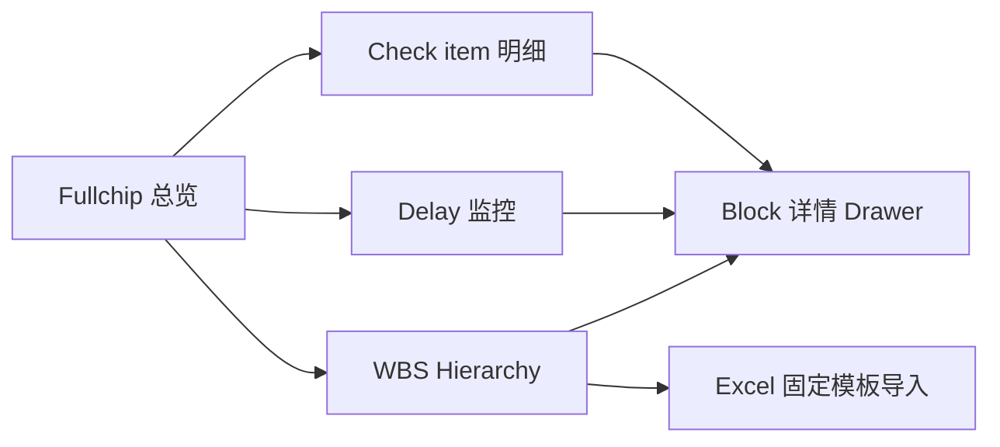
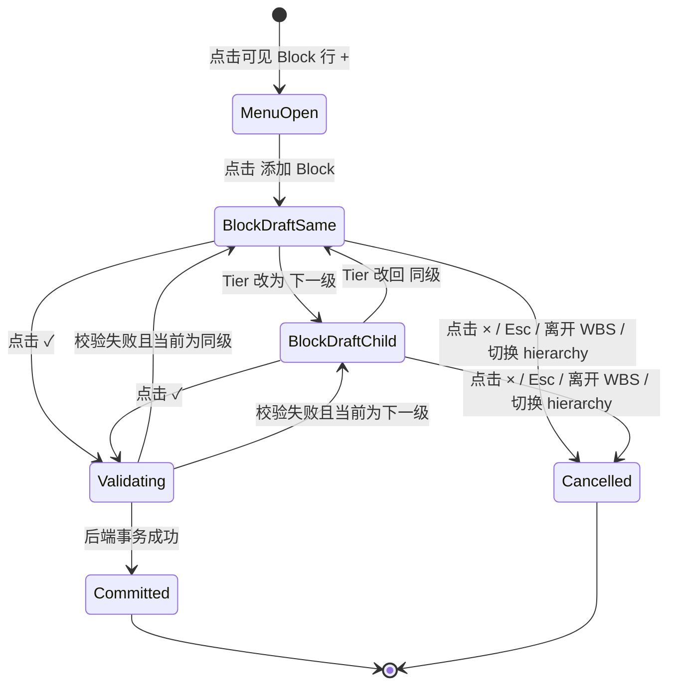
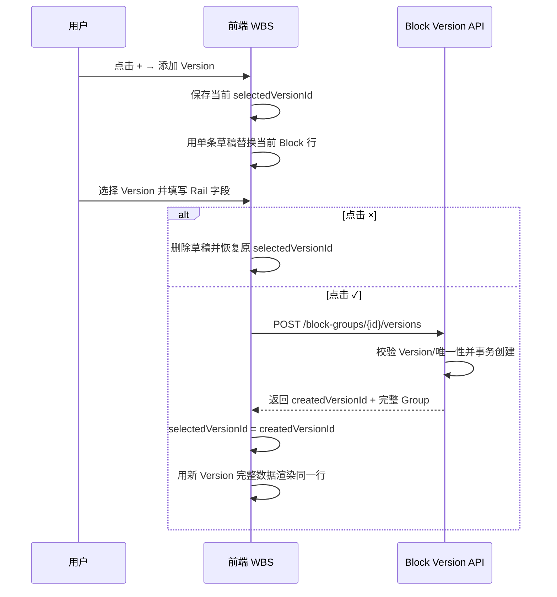
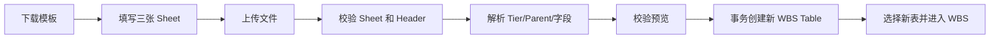
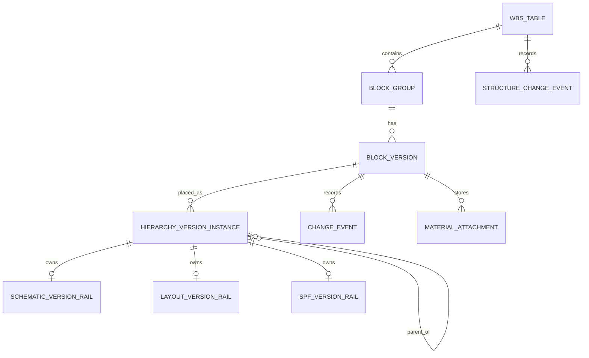

# DE-WBS 前后端开发 PRD

> 文档状态：开发评审基线  
> 版本：v1.0  
> 日期：2026-09-02  
> 适用对象：产品、前端、后端、测试、项目 PL/LPL  
> 对应原型：`DE-WBS-prototype-v1.html`

## 0. 文档使用说明

### 0.1 需求状态标识

| 标识 | 含义 | 开发处理 |
|---|---|---|
| 已确认 | 已由用户确认，并已在当前原型中体现 | 本期必须实现 |
| 实现约束 | 为保证前后端一致而明确的技术契约 | 路径可调整，业务语义不可改变 |
| 开放 | 尚未确认的产品问题 | 不得自行实现；评审后补充决策 |
| 不在范围 | 已明确排除或被后续需求取代 | 不得恢复 |

### 0.2 需求优先级

本 PRD 的规则优先级如下：

1. 本 PRD 中标记为“已确认”的规则。
2. 最新用户确认与 `decisions.json` 中未被 superseded 的决策。
3. 当前交互原型 `DE-WBS-prototype-v1.html`。
4. `CONTEXT.md` 与 `data-model.md`。
5. 历史对话和旧方案仅用于追溯，不作为开发依据。

### 0.3 术语

| 术语 | 定义 |
|---|---|
| Block | DRAM 设计与 Layout 工作分解中的功能/物理设计单元 |
| Tier | Block 在某一 hierarchy 中的层级，显示为 T1、T2…… |
| Block Version Group | 同一 WBS 表、同一 hierarchy、同 Parent、同标准化 Block name、同 Tier 的底层 Version 记录集合；仅作数据和逻辑分组，不显示为 UI 模块 |
| Version Record | Block 在 1st～5th 中某一个 Version 对应的完整记录，拥有自己的业务 Rail 数据 |
| Definition | Block 的定义数据。Schematic/Layout 冻结身份字段共享；SPF 独立 |
| Instance | Block/Version 在某一 hierarchy 中的位置，含 Parent、Tier、排序信息 |
| Rail | 某 hierarchy 独立的 Owner、日期、Check、Materials、Comments 等业务数据 |
| WBS Table | DDCPC 项目下的一张 WBS 数据集，如 ChanEdgel、ChanLeft、ChanMid |
| PL/LPL | 项目管理角色；生产系统的实际角色来源仍开放 |
| KR | Layout Check 的确认角色/机制术语 |
| SPF | 独立的寄生提取/RC hierarchy |

---

## 1. 产品概述

### 1.1 背景

当前团队使用飞书/Lark 表格管理 DRAM 设计和 Layout WBS，依赖 Tier 列、单元格颜色、人工筛选和人工维护状态。目标是建设独立的 DE-WBS 产品，将 hierarchy、Owner、日期、Check、状态、版本和审计记录结构化，并降低 PL 的人工维护成本。

### 1.2 产品目标

1. 支持 Block 级 Schematic、Layout、SPF 三套 hierarchy 的统一查看和维护。
2. Schematic/Layout 共享冻结身份区域，业务 Rail 独立。
3. 状态和 Progress 尽量由日期及 Check 自动派生，禁止人工填写百分比。
4. 支持 100+ Block、40+ 人、多 WBS 表的数据规模。
5. 通过固定 Excel 模板创建新 WBS 表，并保留导入审计与回滚边界。
6. 提供可直接用于项目推进的 Fullchip、WBS、Delay 和 Check 明细视图。

### 1.3 成功标准

- 用户可在一个产品中切换 Schematic/Layout/SPF，无需依赖单元格颜色。
- Schematic/Layout 冻结身份行数、顺序及字段始终一致。
- Check、Progress、Delay 的前后端计算结果一致。
- 多 Version Block 在 WBS 中始终只显示一行，切换后整行数据正确替换。
- 所有新增、删除、字段修改和结构变更具有明确校验与审计边界。
- Excel 导入对错误数据进行阻断，不允许部分脏数据进入新表。

### 1.4 产品范围

**已确认范围**

- Block-level Schematic 和 Layout，直到 Block signoff。
- SPF 独立 hierarchy。
- Fullchip 总览、WBS Hierarchy、Check item 明细、Delay 监控、Block 详情、Excel 导入。
- WBS 表切换与表级数据隔离。

**不在范围**

- Tape-out、Top-level 集成流程、silicon debug。
- 飞书/Lark 生产落地。
- Mapping 页面及 Mapping 异常功能。
- 跨项目 IP registry、跨项目 ECO 扇出、Definition ID 展示。
- SPF Validation、自动文件验证、人工确认工作流。
- Changed-date 列及 reason-required reschedule 流程。
- WBS 表头级 Add Block、全部折叠、导出当前视图。
- 移动端适配；本期为桌面端产品。

---

## 2. 用户与权限

### 2.1 用户角色

| 角色 | 本期能力 |
|---|---|
| 普通成员 | 查看全部页面；编辑有权限的 WBS 字段；填写空的 Planned release 一次；编辑 Check、Materials、Comments、AI Routing；新增/删除 Block 或 Version（最终权限矩阵开放） |
| Schematic Owner | 维护 Schematic Rail 字段和 Check；当前原型不做额外权限限制 |
| Layout Owner | 维护 Layout Rail 字段和 Check；当前原型不做额外权限限制 |
| PL/LPL | 具备 Schematic Planned release 解锁/重新上锁能力 |
| 系统 | 派生 Progress、Check status、Delay，执行校验、审计及导入事务 |

### 2.2 权限开放项

以下项目在生产开发前必须确认，未确认前不得由开发自行扩展：

- PL/LPL 的实际组织/项目角色来源。
- 新增、删除、改名、Check 同步的角色授权矩阵。
- 导入新表和回滚 Import Job 的授权角色。
- Materials 附件的访问控制和下载权限。

当前原型中的 `Lin Q. / Process Leader` 仅作为 PL 占位，不是生产角色映射。

---

## 3. 信息架构与全局导航



### 3.1 全局页面

| 页面/容器 | 入口 | 主要用途 |
|---|---|---|
| Fullchip 总览 | 左侧导航 | 项目级 Check 和 Delay 汇总 |
| WBS Hierarchy | 左侧导航 | 三 hierarchy 核心数据维护 |
| Delay 监控 | 左侧导航/Fullchip | Schematic/Layout 延误列表 |
| Check item 明细 | Fullchip `查看全部` 或 hierarchy 汇总行 | 只读 Check 矩阵与 Block 钻取 |
| Excel 导入 | WBS 页唯一 `导入 Excel 表格` 按钮 | 下载模板、上传、校验、创建新表 |
| Block 详情 | WBS/Delay/Check 明细点击 Block | 编辑详细 Check、AI Routing、Materials 等 |

### 3.2 全局顶部栏

- 高度：58px。
- 左侧展示固定 Project：`DDCPC`。
- 展示 WBS 表名称选择器，宽度 104px，初始值：ChanEdgel、ChanLeft、ChanMid。
- 表名称切换不改变 Project，也不改变 hierarchy 类型。
- 右侧保留通知和帮助按钮。
- 不展示 `Execution` 标签。
- 不展示 Project week 或当前日期文本。
- Delay 计算使用服务端业务日期；原型固定日期不得带入生产。

### 3.3 左侧导航

- 展开宽度：224px。
- 收起宽度：64px。
- 收起/展开状态需持久化到用户偏好。
- 切换动画约 200ms，不得遮挡 WBS 表头筛选和调宽交互。
- 当前项使用深色选中背景和左侧蓝色强调线。
- 收起按钮位于左下用户区右侧；使用 PanelLeftClose/PanelLeftOpen 图标。

---

## 4. 前端视觉系统

### 4.1 基础环境

- 桌面端最小设计宽度：1180px。
- 最小设计高度：720px。
- 字体：Aptos、PingFang SC、Microsoft YaHei 的顺序降级。
- 字间距：0。
- 页面背景：`#F4F6F8`。
- 内容表面：`#FFFFFF`。
- 次级表面：`#F8FAFC`。

### 4.2 核心颜色

| Token | 色值 | 用途 |
|---|---|---|
| Primary | `#1769E0` | 主按钮、选中、Focus、筛选激活 |
| Primary soft | `#EAF2FF` | Hover、浅色选中背景 |
| Success | `#178255` | Done、On schedule、确认操作 |
| Success soft | `#E8F6EF` | Success 背景 |
| Warning | `#A86300` | 风险/提醒 |
| Warning soft | `#FFF3DD` | Warning 背景 |
| Danger | `#C53D3D` | Delay、删除、错误 |
| Danger soft | `#FFF0EF` | Danger 背景 |
| Text primary | `#18212F` | 主要文本 |
| Text secondary | `#536172` | 次级文本 |
| Text tertiary | `#7D8998` | 辅助文本、未激活图标 |
| Border | `#DFE4EA` | 普通分隔线 |
| Border strong | `#C9D1DA` | 输入框边框 |
| Sidebar | `#16212B` | 左侧导航 |

### 4.3 通用控件

- 普通按钮：高度 34px，圆角 6px，1px 边框。
- 表格行内编辑器：高度 30px，白底，1px 灰边，圆角 5px。
- Focus：蓝色边框或 2px 低透明蓝色 outline，不引发布局变化。
- Toast：右下角，深色背景，操作后短暂显示；生产建议 2～3 秒。
- 弹窗圆角不超过 7px；抽屉宽度 520px。
- 表格普通行高度 48px；行内新增草稿高度 54px。

---

## 5. Fullchip 总览

### 5.1 页面结构

1. 顶部 4 个指标卡。
2. Check item progress 面板。
3. 需要关注/Delay 列表。

### 5.2 指标卡

| 指标 | 数据口径 | 显示色 |
|---|---|---|
| Schematic check status | 当前表 Schematic Block 的完成数/总数 | 完成色绿色 |
| Layout check status | 当前表 Layout Block 的完成数/总数 | 完成色绿色 |
| Schematic Delay | Delay 监控中 Schematic 延误数 | 红色 |
| Layout Delay | Delay 监控中 Layout 延误数 | 琥珀色 |

展示要求：

- 只显示指标名称和值。
- 不显示 helper text。
- 不显示右上角装饰图标。
- 指标卡采用白底、1px 边框、7px 圆角和轻阴影。

统计口径：当前开发基线沿用原型，Fullchip、Delay 监控和 Check 明细按底层 Version Record 参与统计；WBS 的“一个 Block 只显示一个选中 Version 行”属于表格展示规则，不自动去除其他 Version 的汇总数据。若产品评审决定汇总仅统计当前可见 Version，需要同步调整 dashboard/delay/check-matrix API 入参和缓存策略。

### 5.3 Check item progress

- 分别显示 Schematic、Layout、SPF。
- 统计详细 Check 的 `completed / total` 和百分比。
- `查看全部` 和每个 hierarchy 汇总行可点击进入 Check item 明细。
- Hover 只展示各 Check 类型完成数量，不展开明细表。
- 不在 WBS 页重复展示相同的百分比面板。

---

## 6. WBS Hierarchy 页面

### 6.1 页头

- 标题：`WBS Hierarchy`。
- 右侧唯一命令：`导入 Excel 表格`。
- 不展示 Add Block / Instance、全部折叠、导出当前视图。

### 6.2 hierarchy 工具行

从左到右：

1. Schematic / Layout / SPF tabs。
2. 40～84px 间距。
3. 310px Block 搜索框。
4. 弹性空间。
5. 32px 无边框全屏按钮。

规则：

- tabs 只显示名称，不显示实例数徽标。
- hierarchy 切换表示更换 hierarchy/业务 Rail，不是状态或交接字段。
- 搜索范围：Block、Owner、Reference project；与列筛选按 AND 组合。
- 全屏按钮默认灰色，Hover 蓝色，Focus 仅图标 glow。

### 6.3 三张表的列顺序

#### 6.3.1 Schematic

| 顺序 | 字段 | 类型 | 编辑 | 筛选 | 最小宽度 |
|---:|---|---|---|---|---:|
| 1 | Block | 冻结身份 | 详情标题改名 | 是 | 165 |
| 2 | Version | 冻结身份/记录切换 | 多 Version 时切换 | 是 | 100 |
| 3 | Block Category | 冻结身份 | 单选，可空 | 是 | 100 |
| 4 | Reference project | 冻结身份 | 模糊搜索，可空 | 是 | 105 |
| 5 | Schematic Progress | 派生 | 否 | 是 | 135 |
| 6 | Planned release | 日期/锁定 | 条件编辑 | 否 | 135 |
| 7 | Actual release | 日期 | 是 | 否 | 100 |
| 8 | Schematic Owner | 人员 | 模糊搜索，可空 | 是 | 110 |
| 9 | Check item | 5 个方框 | 是 | 是 | 110 |
| 10 | Schematic check status | 派生 | 否 | 是 | 175 |
| 11 | Layout Progress | 关联派生 | 否 | 是 | 120 |
| 12 | 最近修改 | sticky | 打开历史 | 是 | 220/收起 38 |

#### 6.3.2 Layout

| 顺序 | 字段 | 类型 | 编辑 | 筛选 | 最小宽度 |
|---:|---|---|---|---|---:|
| 1 | Block | 冻结身份 | 详情标题改名 | 是 | 165 |
| 2 | Version | 冻结身份/记录切换 | 多 Version 时切换 | 是 | 100 |
| 3 | Block Category | 冻结身份 | 单选，可空 | 是 | 100 |
| 4 | Reference project | 冻结身份 | 模糊搜索，可空 | 是 | 105 |
| 5 | Schematic Progress | 关联派生 | 否 | 是 | 135 |
| 6 | Layout Owner | 人员 | 模糊搜索，可空 | 是 | 110 |
| 7 | Plan workdays | 整数 | 是 | 是 | 88 |
| 8 | Resource | 有符号数值文本 | 是 | 是 | 75 |
| 9 | Start date | 日期 | 是 | 否 | 95 |
| 10 | Plan finish | 日期 | 是 | 否 | 105 |
| 11 | Actual finish | 日期 | 是 | 否 | 105 |
| 12 | Layout Progress | 派生 | 否 | 是 | 120 |
| 13 | Check item | 4 个方框 | 是 | 是 | 100 |
| 14 | Layout check status | 派生 | 否 | 是 | 165 |
| 15 | 最近修改 | sticky | 打开历史 | 是 | 220/收起 38 |

`Actual workdays` 存储并在详情展示，但不出现在 WBS 表。

#### 6.3.3 SPF

| 顺序 | 字段 | 类型 | 编辑 | 筛选 | 最小宽度 |
|---:|---|---|---|---|---:|
| 1 | Block | 冻结身份 | 详情标题改名 | 是 | 165 |
| 2 | Version | 冻结身份/记录切换 | 多 Version 时切换 | 是 | 100 |
| 3 | Schematic Owner | 人员 | 模糊搜索，可空 | 是 | 110 |
| 4 | Layout Owner | 人员 | 模糊搜索，可空 | 是 | 110 |
| 5 | Check item | 5 个方框 | 是 | 是 | 110 |
| 6 | SPF check status | 派生 | 否 | 是 | 150 |
| 7 | LVS path | 文本 | 是 | 是 | 130 |
| 8 | cdl | 文本 | 是 | 是 | 130 |
| 9 | gds | 文本 | 是 | 是 | 130 |
| 10 | Planned SPF release | 日期 | 是 | 否 | 110 |
| 11 | Actual SPF release | 日期 | 是 | 否 | 110 |
| 12 | 最近修改 | sticky | 打开历史 | 是 | 220/收起 38 |

SPF 无 Block Category、Reference project、SPF Owner、Progress、Validation。

### 6.3.4 三张表时间字段开发规则

#### 通用日期契约

| 项目 | 规则 |
|---|---|
| API/数据库格式 | ISO date：`YYYY-MM-DD`；字段类型使用 date/null，不使用 datetime 代替 |
| 前端空值 | `null` 或空字符串统一渲染为空白，不显示 `—`、`Invalid Date` 或默认日期 |
| 前端编辑 | 默认展示日期文本；单元格 Hover 或 Focus 时显示原生 date picker |
| 提交时机 | date picker `change` 或明确保存后提交；未改变值不发送 PATCH、不生成审计 |
| 比较方式 | 按业务日历日期比较，不比较时分秒；前后端不得因时区转换产生日期 ±1 天 |
| 非法值 | 前端阻止提交；后端返回 `INVALID_DATE`。非法值不得按空值、today 或 1970-01-01 参与计算 |
| 未来日期 | 当前未限制；只要格式合法即可保存。若需限制，必须另行确认 |
| Today | 仅 Delay 监控对 Actual 为空的记录使用后端业务日期；WBS Progress 不使用 Today |

#### Schematic 时间字段

| 字段 | 存储 | 可空 | 编辑规则 | 参与计算 | 最近修改 |
|---|---|---|---|---|---|
| Planned release | SchematicVersionRail | 是 | 受表级锁控制；锁定且为空可填写一次，锁定且非空不可改，解锁后可改 | Schematic Progress、Schematic Delay | 是 |
| Actual release | SchematicVersionRail | 是 | 普通 date picker；保存后可再次修改 | Schematic Progress、Schematic Delay | 否 |

Schematic WBS Progress 伪代码：

```text
function schematicProgress(planned, actual):
  if planned is null:
    return "Not started"
  if actual is not null AND actual > planned:
    return "Delay"
  return "On schedule"
```

优先级和边界：

1. Planned 为空时始终为 Not started，即使 Actual 被异常写入也不能显示 On schedule/Delay；后端应同时返回数据完整性 warning。
2. Planned 有值、Actual 为空时为 On schedule；WBS Progress 不比较 today。
3. Actual = Planned 时为 On schedule。
4. Actual < Planned 时为 On schedule。
5. Actual > Planned 时为 Delay。
6. Schematic Delay 的基准永远是 Planned release；不存在 Changed release 或隐藏的 immutable original baseline 字段。

本文中的“原始 Planned release”表示“使用 Planned 字段而非已移除的 Changed date 字段”。本期数据模型仅存一个 `plannedRelease`：PL/LPL 解锁后若该值被成功修改，新值立即成为 WBS Progress 和 Delay 的计算基准；旧值仅保留在 ChangeEvent 中。

示例：

| Planned | Actual | WBS Progress | 是否进入 Delay 监控（假设 today=2026-09-20） | Delay 基准 |
|---|---|---|---|---|
| 空 | 空 | Not started | 否 | 无 |
| 2026-09-10 | 空 | On schedule | 是 | today - planned = 10 天 |
| 2026-09-20 | 空 | On schedule | 否 | 未逾期 |
| 2026-09-10 | 2026-09-10 | On schedule | 否 | 0 天 |
| 2026-09-10 | 2026-09-08 | On schedule | 否 | 提前 2 天，不进入 Delay |
| 2026-09-10 | 2026-09-12 | Delay | 是 | actual - planned = 2 天 |

#### Layout 时间和工期字段

| 字段 | 存储 | 可空 | 输入/编辑规则 | 参与计算 | 最近修改 |
|---|---|---|---|---|---|
| Start date | LayoutVersionRail | 是 | 普通 date picker | 当前不自动推导 Plan finish；详情展示 | 否 |
| Plan finish | LayoutVersionRail | 是 | 普通 date picker；当前为手工计划日期 | Layout Progress、Layout Delay | 是 |
| Actual finish | LayoutVersionRail | 是 | 普通 date picker | Layout Progress、Layout Delay | 否 |
| Plan workdays | LayoutVersionRail | 是 | 整数；前端 inputmode=numeric，后端整数校验 | 展示和详情；当前不计算 Plan finish | 否 |
| Actual workdays | LayoutVersionRail | 是 | 整数；仅详情展示，不在 WBS 列中 | 不参与当前派生状态 | 否 |
| Resource | LayoutVersionRail | 是 | 有符号数值文本；生产存储类型见开放项 | 不参与日期/Progress 计算 | 否 |

**明确排除：** 本期不得实现 `Plan finish = Start date + Plan workdays`。这是未确认提案。Start date 或 Plan workdays 修改时，Plan finish 不自动变化。

Layout WBS Progress 伪代码：

```text
function layoutProgress(planFinish, actualFinish):
  if planFinish is null:
    return "Not started"
  if actualFinish is not null AND actualFinish > planFinish:
    return "Delay"
  return "On schedule"
```

边界与示例：

| Start | Plan finish | Actual finish | WBS Progress | 是否进入 Delay 监控（today=2026-09-20） |
|---|---|---|---|---|
| 任意 | 空 | 空 | Not started | 否 |
| 2026-09-01 | 2026-09-10 | 空 | On schedule | 是，逾期 10 天 |
| 2026-09-01 | 2026-09-20 | 空 | On schedule | 否 |
| 2026-09-01 | 2026-09-10 | 2026-09-10 | On schedule | 否 |
| 2026-09-01 | 2026-09-10 | 2026-09-08 | On schedule | 否 |
| 2026-09-01 | 2026-09-10 | 2026-09-12 | Delay | 是，延误 2 天 |

Layout 页面及 API 中禁止使用 release date 命名；必须使用 Start date、Plan finish、Actual finish。

#### SPF 时间字段

| 字段 | 存储 | 可空 | 编辑规则 | 派生逻辑 | 最近修改 |
|---|---|---|---|---|---|
| Planned SPF release | SpfVersionRail | 是 | 普通 date picker | 当前不派生 SPF Progress，不进入 Delay 监控 | 否 |
| Actual SPF release | SpfVersionRail | 是 | 普通 date picker | 当前不派生 SPF Progress，不进入 Delay 监控 | 否 |

SPF 当前只有 `SPF check status`，由五个 Check item 派生。前后端不得根据 Planned/Actual SPF release 新增 SPF Progress、SPF Delay 或 Validation 状态。

#### 时间字段修改后的统一刷新顺序

```text
1. 前端本地格式校验
2. PATCH 目标 Version Rail（携带 revision）
3. 后端校验权限、锁状态和日期格式
4. 后端写入字段；仅白名单字段生成 ChangeEvent
5. 后端重新计算当前 Version 的 Progress/Delay 相关派生值
6. 返回 rail + derived + revision + optional changeEvent
7. 前端替换当前行数据
8. 刷新 Fullchip 指标、Delay 数量/列表；不改变当前 Version 选择
```

失败时前端恢复服务端值；不得保留一个仅前端成功的日期。

### 6.4 冻结区域

- Schematic/Layout 冻结：Block、Version、Block Category、Reference project。
- SPF 冻结：Block、Version。
- Schematic/Layout 冻结身份的行数、顺序、Block name、Version、Tier/Parent、Category、Reference、列宽、筛选必须一致。
- Schematic/Layout 的 Owner、日期、Check、Progress、Materials、Comments 等非冻结 Rail 独立。

### 6.5 表头筛选与列宽

#### 筛选按钮

- 每个非日期列展示 18×18px 小漏斗按钮。
- 按钮固定在列右侧，距右边界 14px，位于调宽竖线前。
- 字段名和计算/锁图标左对齐；长字段名在筛选按钮前截断。
- 默认灰色；Hover/Focus 使用蓝色和浅蓝底；筛选激活后为实心蓝底白图标。
- 日期列不显示筛选按钮，也不保留空槽。

#### 调宽竖线

- 每列表头右边界显示 2px 竖线，贯穿完整 38px 表头高度。
- 默认中性灰 `#B8C2CC`。
- Hover/Focus/拖动时变主蓝，并有 1px 双侧浅蓝高亮。
- 实际拖拽热区 12px，全部位于当前表头内部。
- 点击竖线不打开筛选。
- 键盘 Focus 后 Left/Right 每次调整 10px。
- 宽度限制：不得低于字段最小宽度，不得高于 600px。
- Schematic/Layout 共享冻结列宽；SPF 独立。

#### 筛选弹层

- 第一行是自动聚焦的无框搜索输入。
- placeholder 只使用列名，不附加“筛选”。
- 搜索行无边框、背景、阴影、圆角和分隔线。
- 选项包括：全选、空白、当前表/当前 hierarchy 的唯一显示值。
- 支持多选；多列筛选与 Block 搜索按 AND 组合。
- Schematic/Layout 共享 Block、Version、Category、Reference 筛选；其他筛选独立。
- 切换 WBS 表或完成导入时清空筛选。

#### 筛选与单行 Version 的计算顺序

```text
1. 对每个 Block Group 解析 selectedVersionId；无效时回退最早 Version。
2. 使用 selected Version 的完整行数据生成唯一筛选值集合。
3. 对 selected Version 行依次应用：Block search AND 每个激活列筛选。
4. 再结合真实 Parent 链的展开状态决定最终可见行。
5. 每个 Group 最多输出一行。
```

- 筛选仅判断当前显示 Version，不扫描隐藏 Versions 寻找匹配项。
- 例如当前显示 2nd、Owner=Alice，Owner 筛选 Bob 时该 Group 隐藏；即使其 1st Owner=Bob，也不得自动切到 1st。
- Version 筛选同理：当前显示 2nd 时，筛选 1st 会隐藏该 Group，不自动选择 1st。
- Group 因筛选隐藏时，`selectedVersionId` 继续保留在前端会话；清除筛选后恢复同一 Version。
- 仅当该 Version 被删除或 Group 数据刷新后不再存在时，才回退到固定枚举顺序的最早剩余 Version。
- `空白` 匹配 null/空字符串；显示文本“空”不是持久化值。
- 筛选值集合来自当前 WBS Table，不得混入其他表的数据。
- 搜索/筛选逐行判断，不要求祖先也匹配：Parent 因搜索/筛选不匹配而隐藏时，匹配的子行仍可显示并保留原 Tier 缩进。
- 展开状态优先于筛选匹配：任一真实祖先处于 collapsed 时，其后代即使匹配也隐藏。清除筛选不会改变展开状态。

### 6.6 行展示与编辑

- 默认展示纯文本或状态 pill。
- Block Category、Reference project、Owner、日期、Version 等仅在 Hover/Focus 时显示编辑器。
- 空值显示空白，不显示 `—`。
- 日期默认显示文本，Hover/Focus 显示原生 date picker。
- Progress、Check status 为只读。
- Check item 直接展示方框，不通过下拉编辑。
- 所有编辑成功后刷新该行派生状态和相关视图。

### 6.7 Block 树与箭头

- Tier 显示为 T1、T2、T3……；不显示 Layout `TOP` 后缀。
- Tier 缩进步长 17px。
- Block 前固定 16×20px 箭头/对齐槽。
- 只有任一底层 Version Instance 拥有直接子节点时显示箭头。
- 不允许根据相邻行 Tier 变化推断箭头。
- `▾`：展开；`▸`：收起。
- 点击箭头同时更新该 Block 全部 Version 的展开状态。
- 子节点是否显示按其真实 Parent 链判断。
- 叶子 Block 保留隐藏槽，保证文字对齐。

### 6.8 单行 Version 模型

#### 展示原则

- 同一 Parent、Block name、Tier 的多个 Version 在 WBS 中只显示一行。
- 不使用 merged cell 或 rowspan。
- 默认选择最早的可用 Version；在当前 WBS Table 的前端会话中保留当前选择。切换 WBS Table 或刷新页面后回退到最早可用 Version，除非后续另行确认用户偏好持久化。
- 删除当前 Version 后回退到最早剩余 Version。

#### Version 单元格

- 单 Version：默认无框文本；Hover/Focus 可编辑 Version 值，但必须满足唯一性。
- 多 Version：默认无框文本，与普通行一致。
- Hover 或键盘 Focus 后显示 Version selector。
- selector 仅展示 `1st`、`2nd`、`3rd`、`4th`、`5th`，不显示“当前”前缀。
- tooltip/aria-label 说明“当前展示 Version：X；选择后整行切换为对应 Version 数据”。
- selector click 必须停止冒泡，不能触发行点击导致控件被重建。
- 切换后替换整行：Owner、日期、Check、Progress、Check status、SPF 字段、最近修改等全部切到对应 Version Record。
- Schematic/Layout 当前可见 Version 同步；SPF 独立。
- Version 切换属于 UI 选择，不新增 ChangeEvent。

### 6.9 行级操作

- Block 行 Hover 或键盘 Focus 时显示 `+` 和 trash，顺序固定。
- 两个按钮均为 22×22px。
- `+` 距可见 Block name 2px，trash 紧随其后。
- 非 Hover/Focus 状态完全隐藏，不预留按钮宽度。
- 长名称需在按钮前截断，不得遮挡操作。

### 6.10 Add 菜单

点击行内 `+` 后显示两行菜单：

| 项目 | 主文案 | 辅助文案 |
|---|---|---|
| Add Version | 添加 Version | 可添加：剩余 Version；无剩余时“已包含全部 Version” |
| Add Block | 添加 Block | 选择添加为同级或下一级 Block |

视觉：

- 两项左侧均使用无底框大 `+`。
- 左侧槽固定 32px，`+` 约 22px，跨主/辅文案两行垂直居中。
- 禁止使用 V+、Copy+、List+、彩色 icon tile。
- Hover 整行浅蓝，`+` 加深。
- Add Version 无剩余选项时整项置灰且不可点击。

### 6.11 Add Block

#### 默认值

- Block name：必填。
- Version：可空，空选项显示 `选择 Version`，不显示必填星号或“可选”字样。
- Tier：默认与点击行同级。
- Parent：不展示选择器；由点击行和 Tier 自动计算。

#### Tier 控件

- 草稿行内直接展示 Tier selector。
- 选项仅有：`Tn（同级）`、在未到最大 Tier 时的 `Tn+1（下一级）`。
- 同级：Parent = 点击行 Parent。
- 下一级：Parent = 点击行。
- Schematic/Layout 最大 T6；SPF 最大 T4。
- 到最大 Tier 时显示静态 `Tn（同级）`，无下拉箭头。

#### 位置

- 草稿和提交后的新 Block 始终紧跟点击行。
- 同级/下一级只改变 Tier 和 Parent，不改变视觉锚点。
- 多次在同一行新增时，最新新增紧跟锚点，之前新增依次后移。
- 嵌套新增应保持 `锚点 → 新子节点 → 新孙节点` 连续。
- 使用内部 `displayAfterId` 保存视觉锚点。

#### 提交

- `✓` 提交，`×` 取消。
- Schematic/Layout 从任一侧新增均创建共享冻结身份，并在另一侧创建空白业务 Rail。
- SPF 只写入 SPF hierarchy。
- 新增成功写 StructureChangeEvent。

#### 草稿行字段展示

Add Block 草稿使用当前 hierarchy 的正式列顺序，不另开 modal，也不新增操作列。

| hierarchy | 草稿中可编辑 | 草稿中只读占位 |
|---|---|---|
| Schematic | Block name、Tier、Version、Block Category、Reference project、Planned release、Actual release、Schematic Owner | Schematic Progress、Check item、Schematic check status、Layout Progress、最近修改 |
| Layout | Block name、Tier、Version、Block Category、Reference project、Layout Owner、Plan workdays、Resource、Start date、Plan finish、Actual finish | Schematic Progress、Layout Progress、Check item、Layout check status、最近修改 |
| SPF | Block name、Tier、Version、Schematic Owner、Layout Owner、LVS path、cdl、gds、Planned SPF release、Actual SPF release | Check item、SPF check status、最近修改 |

只读占位统一表达“确认后生成”或目标状态，不允许用户在草稿阶段手填派生字段。新 Block 的 Check arrays 在提交后全部初始化为 false。

#### 前端状态机



状态规则：

1. 打开 Add Block 时立即创建一个前端临时 draft；不得提前写后端。
2. draft 默认 `tier = anchor.tier`、`parent = anchor.parent`，即同级。
3. Tier 改为下一级时立即设置 `tier = anchor.tier + 1`、`parent = anchor.instanceId`。
4. Tier 改回同级时恢复 `tier = anchor.tier`、`parent = anchor.parentInstanceId`。
5. Tier 改变只更新 Tier/Parent；用户已填写的 Block name、Version 和业务字段不得清空。
6. 同一时间每个 WBS 页面最多一个新增草稿。点击另一行 `+` 时取消旧草稿后打开新菜单。
7. 点击 `×`、按 Esc、切换 hierarchy、切换页面或 WBS Table，均丢弃未提交草稿，不生成事件。
8. 后端校验失败时保留草稿、字段和 Tier 选择，定位到错误字段。

#### 位置计算算法

前端预览和后端提交必须使用同一锚点语义：

```text
input:
  anchorGroupId       点击行所属 Block Group
  tierMode            same | child

derive:
  if tierMode == same:
    newTier = anchor.tier
    newParentGroupId = anchor.parentGroupId
  else:
    assert anchor.tier < hierarchy.maxTier
    newTier = anchor.tier + 1
    newParentGroupId = anchor.groupId

display:
  newGroup.displayAfterGroupId = anchor.groupId
```

可见顺序生成：

```text
1. 先得到基础 Block Group 顺序。
2. 对存在 displayAfterGroupId 的 Group，挂到其 anchor 后。
3. 递归输出：anchor -> anchored children -> anchored grandchildren。
4. 同一 anchor 连续新增时，最新创建的 Group 放在 anchor 后，旧新增项顺延。
5. 不按 Tier 全局重排；允许 T2 -> 新 T3 -> 后续 T2。
```

示例：

```text
原始：CORE_ARRAY T2 | IO_RING T2 | ROW_CTRL T3

在 CORE_ARRAY 点 +，选择同级：
CORE_ARRAY T2 | NEW_A T2 | IO_RING T2 | ROW_CTRL T3

在 CORE_ARRAY 点 +，选择下一级：
CORE_ARRAY T2 | NEW_B T3 | IO_RING T2 | ROW_CTRL T3

再在 NEW_B 点 +，选择下一级：
CORE_ARRAY T2 | NEW_B T3 | NEW_C T4 | IO_RING T2 | ROW_CTRL T3

再次在 CORE_ARRAY 点 + 新增 NEW_D：
CORE_ARRAY T2 | NEW_D T2/T3 | NEW_B T3 | NEW_C T4 | IO_RING T2 ...
```

筛选/搜索边界：

- 只能从当前可见行点击 `+`，因此 anchor 在打开草稿时一定可见。
- 草稿在提交前始终展示，不因自己填写的值不匹配当前筛选而消失。
- 提交后立即按正式搜索/筛选重新计算；若新行不满足激活筛选，可以从当前视图消失，但数据已成功创建，Toast 必须提示成功。
- 收起 Parent 后，其真实后代按 Parent 链隐藏；同级新增不随 anchor 的展开状态隐藏。

#### 后端事务

```text
BEGIN
  1. 锁定/读取 anchor 和目标 WBS Table
  2. 校验 hierarchy、anchor 存在、Tier 上限
  3. 根据 tierMode 计算 Tier/Parent；不接受客户端任意 Parent
  4. 标准化 name/version，执行唯一性校验
  5. 创建 BlockGroup + 初始 BlockVersion + active hierarchy Instance/Rail
  6. 若 hierarchy 为 Schematic/Layout：原子创建另一侧 counterpart Instance 和空 Rail
  7. 保存 displayAfterGroupId = anchorGroupId
  8. 创建每个受影响 hierarchy 的 StructureChangeEvent
COMMIT
```

任何步骤失败必须整体回滚；不得只在 Schematic 创建而 Layout counterpart 失败。

### 6.12 Add Version

- Block name、Tier、Parent、Category、Reference 继承当前 Block，不可修改。
- Version 必填，只列出尚未使用的 Version。
- 当前 Block 行被一条草稿行替换，总行数不增加。
- 切换待添加 Version 时仍使用同一草稿行，已填业务字段不得丢失。
- `✓` 提交后新 Version 成为 WBS 当前显示记录。
- `×` 取消后恢复打开草稿前的 Version Record。
- Schematic/Layout 新 Version 同时创建对应底层记录，但两侧业务 Rail 独立。
- SPF Version 独立。

#### 继承与初始化规则

| 数据 | 新 Version 处理 |
|---|---|
| Block name | 继承 Group，不可编辑 |
| Tier / Parent / displayAfter | 继承 Group/对应 Instance，不可编辑 |
| Block Category | 从打开 Add Version 时的可见 Version 继承，作为新 Version 的初始值；草稿中只读 |
| Reference project | 从当前可见 Version 继承；草稿中只读 |
| Active hierarchy Owner/日期/工期/SPF 字段 | 新草稿输入，默认空，不复制旧 Version Rail |
| 另一侧 Schematic/Layout Rail | 创建为空 Rail |
| Check item | 全部 false；草稿显示只读占位 |
| Progress / Check status | 提交后基于空日期/空 Check 重新派生 |
| Materials / Comments | 初始化为空，不复制旧 Version |
| AI Routing | 默认 No，不复制旧 Version |
| 最近修改 | 新 Version 无行字段修改记录；新增动作进入 Block变更记录 |

Parent 的“继承”是精确继承 sourceVisibleVersion 的 `parentInstanceId`：

```text
newInstance.tier = sourceVisibleInstance.tier
newInstance.parentInstanceId = sourceVisibleInstance.parentInstanceId
newGroup.displayAfterGroupId = sourceGroup.displayAfterGroupId
```

不得因新 Version 值不同而自动寻找“同 Version Parent”。Schematic/Layout counterpart 分别继承 source counterpart 的 Parent Instance。若 source、counterpart 或其 Parent 引用在事务校验时已不存在，返回 409 并保持草稿，不创建半边 Version。

#### 可选 Version 计算

```text
allowed = [1st, 2nd, 3rd, 4th, 5th]
used = underlying Version values in current Block Group
available = allowed - used
```

- available 按 1st～5th 固定顺序展示。
- available 为空时 Add Version 菜单项 disabled，辅助文案为 `已包含全部 Version`。
- 后端提交时必须重新校验 available，避免并发创建重复 Version。

#### 单行替换显示算法

```text
before opening:
  previousSelectedVersionId = selectedVersionRows[hierarchy][groupKey]

open draft:
  remove the currently visible Version row from rendering
  insert exactly one Add Version draft at the same visible row index
  visible row count remains unchanged

change draft.version:
  update the same draft object and same row position
  preserve all entered business fields
  do not reveal old Version rows
  do not create a backend record

confirm success:
  replace draft with created Version Record
  selectedVersionId = createdVersionId
  Schematic/Layout selected counterparts synchronize

cancel:
  discard draft
  selectedVersionId = previousSelectedVersionId
  restore the previous complete row
```

显示示例：

```text
打开前：CORE_ARRAY | 2nd | Han Li | 2026-08-12 | ...
草稿：  CORE_ARRAY | 选择 Version [✓][×] | Owner/日期输入 | ...
选择 1st 后：仍然只有同一条草稿行，不新增第二行、不移动行
确认后：CORE_ARRAY | 1st | 新 Version 的 Owner/日期/Check/状态 | ...
表中切回 2nd：同一行恢复 Han Li、2026-08-12 及 2nd 的全部数据
```

#### 失败和并发分支

- Version 未选：前端红框 + Focus Version；不发请求。
- Version 已被其他用户创建：后端 409；保留草稿并刷新 available options。
- revision 冲突：后端 409；前端保留草稿输入，提示用户刷新 Group 后重试。
- anchor Version 被删除但 Group 仍在：以 Group 为单位继续校验；若 Group 已不存在则关闭草稿并提示刷新。
- 后端成功但前端刷新失败：以返回的 createdVersionId 重试获取 Group，禁止重复 POST。



### 6.13 唯一性

在同一 `WBS Table + hierarchy` 内：

`normalized Block name + Tier + Version` 必须唯一，Parent 不参与唯一性。

标准化规则：

- 去除首尾空格。
- Block name 比较不区分大小写。
- Version 空值作为一个可比较值；同名、同 Tier、Version 都为空时重复。

冲突时：

- 阻止提交。
- 弹窗明确显示 Block name、Tier、Version（空值显示“空”）。
- 保留草稿供用户修改。

### 6.14 删除

#### 单 Version

- 点击 trash 后弹出确认。
- 文案包含 Block、Tier、Version。
- 有直接子节点时阻止删除，提示先删除或移动子节点。

#### 多 Version

- 打开 Version 多选弹窗，数据来源为完整底层 Version Group，不受当前筛选影响。
- 按 1st～5th 排序。
- 每项显示 Version、Owner、派生 Check status、直接子节点数量。
- 有直接子节点的 Version 禁用。
- 至少选择一个才能提交。
- 删除当前可见 Version 后，WBS 回退到最早剩余 Version。
- 选择全部 Version 时显示“删除整个 Block”警告并二次确认。
- 每个删除记录独立写 StructureChangeEvent。

### 6.15 最近修改和 Block变更记录

#### 最近修改

- 位于表格最右，sticky。
- 默认收起为 38px 条带。
- 左箭头展开；右箭头收起。
- 展开宽度默认/最小 220px，并保存用户宽度。
- 若收起时仍有筛选，显示蓝点。
- 行内显示最近一条 actor、字段、时间、前后值。
- 点击打开最多 20 条记录。

白名单：

| hierarchy | 记录字段 |
|---|---|
| Schematic | Version、Block Category、Reference project、Schematic Owner、Planned release |
| Layout | Version、Block Category、Reference project、Layout Owner、Plan finish |
| SPF | Schematic Owner、Layout Owner |

不进入最近修改：Block name、Actual 日期、Check、SPF path/cdl/gds、Materials、Comments、AI Routing 等。

#### Block变更记录

- 按钮和数量放在展开后的最近修改表头内。
- 数据独立于行 ChangeEvent。
- 包括 add、delete、move Instance。
- 即使 Block 已删除，记录仍保留。

### 6.16 计算规则图标

展示字段：

- Schematic Progress
- Layout Progress
- Schematic check status
- Layout check status
- SPF check status

规则：

- 固定在字段名右侧、筛选按钮左侧。
- Hover/Focus 打开完整说明和有序步骤。
- Pointer leave/Blur 关闭 Hover 预览。
- Click 固定；再次点击或关闭按钮关闭。
- Focus 引起的表格滚动不得关闭预览。

### 6.17 全屏表格

- 不使用浏览器 Fullscreen API。
- `tableWrap` 固定覆盖 viewport。
- 仅显示表格、sticky 表头和低强调 minimize 按钮。
- 所有筛选、调宽、行内新增、抽屉、弹窗仍可用且层级高于表格。
- 宽屏：除收起最近修改外的业务列按比例吸收多余宽度。
- 窄屏：保留基础宽度并水平滚动，不压缩字段。
- resize 时重算。
- Exit/Esc 恢复精确保存宽度。

### 6.18 空 SPF

- 固定模板允许 SPF 0 条记录，只要 Schematic/Layout 至少一张有数据。
- SPF 表始终在 body 首行展示 12-cell BlankCreateRow。
- Block cell 中常驻 22×22px `+`，居中不移动。
- 行 Hover/Focus 为浅蓝；只有直接 Hover `+` 显示 `新增 Block`。
- Click/Enter/Space 创建 T1、无 Parent 的 Add Block 草稿。
- BlankCreateRow 不持久化为 Instance。

---

## 7. Block 详情 Drawer

### 7.1 通用结构

1. 顶部 Block name、Tier、Version 摘要。
2. 多 Version 时显示 Version tabs。
3. Block 信息。
4. hierarchy 业务日期/Check。
5. AI Routing。
6. Back up：Materials + Comments。

### 7.2 Block name 编辑

- 标题旁使用无框 pencil 图标。
- 点击后标题原位 contentEditable。
- Enter 或 blur 保存。
- Escape 取消，且不得关闭 Drawer。
- 空名称阻止保存。
- 重复 `name + Tier + Version` 阻止保存。
- 多 Version 改名先确认，再更新整个 Version Group。
- 不在 Block 信息区重复 Block name 输入框。

### 7.3 Version tabs

- 多 Version 才显示。
- 顺序 1st～5th。
- tab 切换保留 Drawer scroll。
- 切换后所有详情绑定到目标 Version Record。
- 同时更新 WBS 单行 Version 选择；Schematic/Layout 同步。

### 7.4 AI Routing

- 位于 Back up 正上方。
- `Yes | No` 滑动分段控件。
- 选中侧绿色、白字；未选侧灰色。
- 默认 No。
- 按 WBS Table 隔离。
- 新导入 Block 默认 No。
- 不进入最近修改。

### 7.5 Materials

- 一个大边框 fieldset，`Materials` 位于上边框。
- 内含：文字说明、HTTP/HTTPS 链接、附件上传、附件列表。
- 允许多附件。
- 扩展名：PPT/PPTX、XLS/XLSX、DOC/DOCX。
- 链接合法时可点击新窗口打开。
- 附件可打开/下载/删除。
- Comments 位于 Materials fieldset 外。
- 原型内存存储；生产必须持久化。

---

## 8. Check item 明细

- 入口：Fullchip `查看全部` 或 hierarchy 汇总行。
- 只读矩阵，不在本页直接编辑 Check。
- tabs：Schematic、Layout、SPF，内容宽度适配，不拉满整行。
- 支持完成状态过滤和 Block/Owner/Reference 搜索。
- 不展示 Check-type dropdown。
- 不展示结果数量文本。
- 冻结身份列。
- 展示全部详细 Check 列和派生 check status。
- SPF 同时展示 Schematic Owner 和 Layout Owner。
- 点击 Block 打开既有 Drawer，并聚焦 Check item。
- 多 Version Block 按 WBS 当前选中 Version 显示一行。

---

## 9. Delay 监控

### 9.1 分类

- Schematic Delay。
- Layout Delay。
- 不展示 Mapping 分类。
- 标题下无解释性 subtitle。

### 9.2 列

| 分类 | 基准日期列 | 实际日期列 |
|---|---|---|
| Schematic | Planned release | Actual release |
| Layout | Plan finish | Actual finish |

Body 只显示日期值，不重复字段名称。

### 9.3 Delay 监控计算

生产使用服务端业务日期 `today`：

```text
Schematic:
  planned 为空 -> 不进入 Delay 列表
  actual 有值 -> actual > planned 时 Delay
  actual 为空 -> today > planned 时 Delay

Layout:
  planFinish 为空 -> 不进入 Delay 列表
  actualFinish 有值 -> actualFinish > planFinish 时 Delay
  actualFinish 为空 -> today > planFinish 时 Delay
```

延误天数：

- 已完成：`actual - planned`。
- 未完成：`today - planned`。
- 仅 Delay 记录进入列表。

注意：Schematic 始终使用原始 Planned release，不使用 Changed date。

### 9.4 WBS Progress 计算

WBS Progress 使用已确认的独立口径：

```text
planned 为空 -> Not started
actual 有值且 actual > planned -> Delay
其他 -> On schedule
```

前端不得用 Delay 监控的 `today` 逻辑替代 WBS Progress 逻辑。

---

## 10. Check 与派生状态

### 10.1 Check 定义

#### Schematic（5）

1. Power mapping
2. ERC
3. Fanout
4. CN marker
5. Verification (Verilog & Finesim)

#### Layout（4）

1. Floorplan Reviewed
2. IO 满足上层需求
3. Power 合理并满足上层需求
4. Verification (DRC/LVS)

#### SPF（5）

1. UT DRC
2. MRC / shielding check
3. LN net
4. LRC
5. Duplicate pin

### 10.2 Check status

```text
Schematic: 5/5 -> Done，否则 Ongoing
Layout:    4/4 -> Done，否则 Ongoing
SPF:       5/5 -> Done，否则 Ongoing
```

- 状态只读。
- 前端不提交 status，只提交详细 Check 值。
- 后端返回权威派生结果。

### 10.3 Parent 最后一项门禁

当用户将 Parent 的最后一个未完成 Check 改为完成：

1. 后端查同 hierarchy 的直接子 Instance。
2. 若任一直接子节点有未完成 Check，拒绝本次修改。
3. 返回每个子节点 ID、Block name、缺失 Check labels。
4. 前端打开阻断弹窗。
5. 点击子 Block，关闭弹窗，打开 Drawer 并聚焦 Check 列表。

若已完成的子节点后来被重新打开：

- 自动清除所有已完成祖先的最终 Check。
- 递归向上处理。
- 自动回滚不进入最近修改。

#### 门禁判定伪代码

```text
function validateCompletion(targetVersion, checkKey, proposedValue):
  proposedChecks = copy(targetVersion.checks)
  proposedChecks[checkKey] = proposedValue

  if proposedValue == false:
    return allowed

  if NOT every(proposedChecks):
    return allowed

  blockers = directChildren(targetVersion.instance)
    .filter(child => NOT every(child.checks))
    .map(child => child.id, child.name, missingCheckLabels(child))

  return blockers is empty ? allowed : blocked(blockers)
```

“最后一个未完成 Check”由修改后的完整数组判断，不固定为 Check 定义列表的最后一列。任意一个方框若使该 Parent 从非 Done 变为 Done，都必须执行门禁。

直接子节点定义：目标 Version Instance 的 `parentInstanceId` 等于当前 Instance ID；只检查一层。更深层依靠每个直接子节点自身的相同门禁形成自下而上的完整约束。

### 10.4 跨 Tier 同名 Check

若当前 Check 修改后，会与同 hierarchy、其他 Tier 的同名 Block 产生不同值：

- 前端弹窗提供：`仅修改当前 Block`、`确认同步`。
- 仅修改：只更新当前 Version Record。
- 确认同步：复制该 Check 值到所有列出的其他 Tier Block。
- 每个目标仍需通过 Parent 最后一项门禁。
- 被门禁阻止的目标保持不变，并返回结果。

#### 匹配对象

一次编辑以当前 hierarchy、当前可见 Block 行、当前选中 Version Record 和一个 `checkKey` 为源。候选目标必须同时满足：

1. 与源属于同一 WBS Table。
2. 与源属于同一 hierarchy；Schematic、Layout、SPF 绝不跨表同步。
3. `normalize(candidate.blockName) == normalize(source.blockName)`；规则为 trim 后不区分大小写。
4. `candidate.tier != source.tier`。
5. 候选当前显示 Version 的该 check boolean 与 proposed value 不同。

Parent 不参与匹配：相同名称位于不同 Parent，只要 Tier 不同，仍是候选。相同名称且 Tier 相同的其他 Group 不是本功能目标。每个其他 Tier Block Group 只取当前前端选中的可见 Version Record；该 Group 未显示的 Version Records 保持不变。

列表示例：

| 行 | Tier | Version | 当前 ERC | 用户将 T2 ERC 改为 true 时 |
|---|---:|---|---|---|
| SENSE_AMP | T2 | 2nd（源） | false | 当前目标 |
| SENSE_AMP | T3 | 1st（当前显示） | false | 候选，弹窗列出 |
| SENSE_AMP | T3 | 2nd（未显示） | false | 不同步 |
| SENSE_AMP | T4 | 1st | true | 已与 proposed value 一致，不列出 |
| sense_amp（前后有空格） | T5 | 1st | false | 标准化同名，弹窗列出 |
| SENSE_AMP | T2 | 1st | false | Tier 与源相同，不列出 |

#### 触发和交互顺序

```text
1. 用户点击源行 Check 方框，得到 proposedValue。
2. 前端先对源执行 Parent 完成门禁预检。
3. 源被阻止：恢复方框，直接打开子节点阻断弹窗；不打开同名同步弹窗，不写任何目标。
4. 源可修改：计算不同 Tier、同名、值不同的候选。
5. 无候选：直接提交 current scope。
6. 有候选：方框显示 pending，不提前落库；打开同步弹窗并列出 Block、Tier、Version、当前值 -> 目标值。
7. 用户选 仅修改当前 Block：提交 current scope。
8. 用户选 确认同步：提交 same-name-other-tiers scope。
9. 用户关闭/Esc：取消整次修改，源方框恢复原值。
```

#### 后端同步算法

```text
BEGIN
  1. 读取并锁定 source Version、其 Instance 和 checks
  2. 从请求读取 selectionSnapshot（每个候选 Group 当前显示的 versionId）
  3. 逐项校验 versionId 确属对应 Group，并按服务端数据重算名称、Tier、当前值和 source gate
  4. source gate 失败 -> 整次 422，无任何写入
  5. syncScope=current -> targets=[source]
  6. syncScope=same-name-other-tiers -> targets=[source + 校验通过的 snapshot Versions]
  7. proposedValue=true 时按 tier 从深到浅排序；false 时源优先，其余顺序不影响门禁
  8. 对每个 target：
       a. 值已相同 -> unchanged
       b. 若本次会使 target Done，重新读取其直接子节点并执行门禁
       c. peer 被阻止 -> 不修改该 peer，追加 blockedTargets
       d. 其余写 checks[checkKey]=proposedValue 并重新计算 checkStatus
  9. proposedValue=false 时，对每个成功修改目标递归查找祖先：
       若祖先当前 Done，清除祖先使其 Done 的最终 Check，并继续向上
  10. 提交 successfulTargets、ancestorRollbacks；blocked peers 保持旧值
COMMIT
```

`selectionSnapshot` 是目标选择，不是业务状态持久化。后端不得把它保存为用户偏好；但必须拒绝不存在、跨 hierarchy、同 Tier 或名称不匹配的目标。这样既保留“同步弹窗列出的当前 Version”语义，也不信任前端直接指定任意记录。

为何完成时从深到浅：若同一批同步同时包含父/子同名 Block，先完成较深 Tier 后，父节点门禁应读取已更新的子节点状态。不得先处理父节点并产生虚假的阻断。

#### 状态重算和结果展示

- 每个成功目标独立计算：全部 checks=true 为 Done，否则 Ongoing。
- 源成功、部分 peer 被门禁阻止属于“部分同步成功”，HTTP 200；Toast 说明成功数量，弹层/结果清单列出被阻止 Tier 和缺失子 Check。
- 源自身被阻止属于整次失败，HTTP 422；所有目标保持不变。
- 乐观锁冲突属于整次 409；事务回滚，前端刷新所有涉及行后再发起。
- Check 修改、同步及自动祖先回退均不进入行级最近修改；Check status 为派生值，也不进入最近修改。

#### API 成功结果示例

```json
{
  "sourceVersionId": "ver-t2-2nd",
  "checkKey": "erc",
  "value": true,
  "successfulTargets": [
    {"versionId": "ver-t2-2nd", "tier": 2, "checkStatus": "Ongoing"},
    {"versionId": "ver-t3-1st", "tier": 3, "checkStatus": "Done"}
  ],
  "unchangedTargets": [],
  "blockedTargets": [
    {
      "versionId": "ver-t5-1st",
      "tier": 5,
      "code": "CHILD_CHECKS_INCOMPLETE",
      "children": [
        {"instanceId": "child-1", "blockName": "ADC", "missingChecks": ["ERC"]}
      ]
    }
  ],
  "ancestorRollbacks": []
}
```

---

## 11. Planned release 锁

### 11.1 默认状态

- 每张 WBS Table 单独存储 `plannedReleaseUnlocked=false`。
- 导入新表默认 locked。
- 表头始终显示锁图标。

### 11.2 locked 行为

- Planned release 为空：任意用户可填写一次。
- 首次成功保存后：变为只读。
- 已有值：普通用户不可修改。

### 11.3 unlocked 行为

- 仅 PL/LPL 可解锁/重新上锁。
- unlocked 时所有用户可修改已有值。
- 重新上锁后恢复 locked 规则。
- 前端权限提示不能替代后端授权。

### 11.4 状态与单元格权限矩阵

锁状态属于 WBS Table，不属于 Block/Version。锁只控制 Schematic `Planned release`，不控制 Actual release、Layout 或 SPF 日期。

| 表级状态 | 当前单元格 | 用户 | 允许动作 | 保存后表级状态 |
|---|---|---|---|---|
| locked | 空 | 任意用户 | 仅可写入一个非空合法日期 | 仍 locked |
| locked | 非空 | 任意用户 | 不允许改值或清空 | locked |
| unlocked | 空 | 任意用户 | 可写入日期 | unlocked |
| unlocked | 非空 | 任意用户 | 可改值或清空 | unlocked |
| 任意 | 任意 | PL/LPL | 可切换 locked/unlocked | 请求指定状态 |
| 任意 | 任意 | 非 PL/LPL | 不允许切换表级状态 | 不变 |

“填写一次”不是额外 boolean：服务端在 locked 状态下以保存前字段是否为 null 原子判断。两个用户同时填写同一空单元格时，仅第一个事务成功，后一个返回 409。

### 11.5 前端状态

- 表头锁图标始终可见：locked 与 unlocked 使用不同图标/tooltip。
- 非 PL/LPL 可聚焦锁图标查看状态，但不能切换。
- locked + 空：Hover/Focus 显示 date picker。
- locked + 非空：只显示文本，不显示可编辑 date picker；Focus 仍可读取值。
- unlocked：空/非空均显示正常 date picker。
- PATCH 进行中锁定该单元格编辑器，避免重复保存。
- 403/409/422 时恢复服务端值和服务端锁状态。

### 11.6 后端写入顺序

```text
PATCH planned release:
BEGIN
  1. 锁定 WBS Table lock-state row 和目标 SchematicVersionRail
  2. 校验 revision
  3. if table.locked AND oldValue is not null: reject PLANNED_RELEASE_LOCKED
  4. 校验 newValue 为非空 ISO date
     （unlocked 状态允许显式 null；locked 首填不允许提交 null）
  5. oldValue == newValue: 返回当前数据，不生成事件
  6. 写入日期，重新计算 Schematic Progress/Delay
  7. 创建 Planned release ChangeEvent
COMMIT

PATCH table lock:
BEGIN
  1. 校验操作者是该项目 PL/LPL
  2. oldState == requestedState: 幂等返回，不生成事件
  3. 更新 table.plannedReleaseUnlocked
  4. 追加 table-level LockStateAuditEvent
COMMIT
```

LockStateAuditEvent 不显示在行级最近修改；用于生产审计。实际 PL/LPL 身份来源仍是开放项，禁止硬编码原型占位用户。

---

## 12. Excel 固定模板导入

### 12.1 流程



### 12.2 固定 Sheet

- 填写说明
- Schematic
- Layout
- SPF

不得修改 Sheet 名称和首行字段。

### 12.3 精确 Header

#### Schematic

```text
Tier1, Tier2, Tier3, Tier4, Tier5, Tier6,
Version, Block Category, Reference project, Schematic Owner,
Planned release, Actual release,
Power mapping, ERC, Fanout, CN marker, Verification (Verilog & Finesim)
```

#### Layout

```text
Tier1, Tier2, Tier3, Tier4, Tier5, Tier6,
Version, Block Category, Reference project, Layout Owner,
Start date, Plan finish, Actual finish,
Plan workdays, Actual workdays, Resource,
Floorplan Reviewed, IO 满足上层需求,
Power 合理并满足上层需求, Verification (DRC/LVS)
```

#### SPF

```text
Tier1, Tier2, Tier3, Tier4,
Version, Schematic Owner, Layout Owner,
LVS path, cdl, gds,
Planned SPF release, Actual SPF release,
UT DRC, MRC / shielding check, LN net, LRC, Duplicate pin
```

### 12.4 校验规则

- 至少一张 hierarchy 有数据；SPF 可 0 行。
- 每行仅一个最终 Block Tier；上级路径可由本行与前序上下文组合。
- Version 必填且属于 1st～5th。
- Block Category 必须属于枚举或为空。
- Owner 必须匹配人员主数据或为空。
- 日期格式：YYYY-MM-DD。
- Plan workdays / Actual workdays：整数格式。
- Resource：有符号数值；生产需确认孤立 `-` 是否允许最终保存。
- Check 完成值：1、true、yes、y、done、完成、✓、√；其他值为未完成。
- Parent 必须存在且位于子节点之前。
- 同 hierarchy 的 `normalized name + Tier + Version` 重复为阻断错误。
- 同 name/Tier 不同 Version 合法，成为一个 Block Version Group 的底层记录。

### 12.5 Tier 路径解析算法

每个 Sheet 独立按 Excel 行号从上到下解析，并维护 `lastValueByTier`：

```text
for each non-empty data row in original order:
  populated = all non-empty Tier1...TierN cells
  tier = deepest populated Tier index
  blockName = value at Tier[tier]

  if no populated Tier:
    error TIER_NOT_FOUND

  for level in 1...(tier-1):
    path[level] = currentRow.Tier[level] OR lastValueByTier[level]
    if path[level] is empty:
      error PARENT_PATH_INCOMPLETE(level)

  parentPath = path[1...(tier-1)]
  lastValueByTier[tier] = blockName
  clear lastValueByTier levels deeper than tier
```

| Excel 行 | Tier1 | Tier2 | Tier3 | 解析结果 |
|---:|---|---|---|---|
| 2 | TOP | 空 | 空 | TOP，T1，无 Parent |
| 3 | 空 | ARRAY | 空 | ARRAY，T2，Parent path=TOP |
| 4 | 空 | 空 | SENSE | SENSE，T3，Parent path=TOP/ARRAY |
| 5 | 空 | IO | 空 | IO，T2，Parent path=TOP；清除旧 T3 context |

不得根据后续行补齐缺失 Parent，也不得仅凭 Tier 数值猜测 Parent。

### 12.6 Parent Instance 解析

第一遍生成 ParsedRow 和完整 path；第二遍按原始行号解析 Parent：

```text
pathKey = normalize(parentPath segments joined by "/")
parentCandidates = alreadyParsedInstancesByPath[pathKey]

if tier == 1:
  assert parentPath is empty
  parentInstanceId = null
else if parentCandidates is empty:
  error PARENT_NOT_FOUND
else if every candidate.rowNumber >= child.rowNumber:
  error PARENT_MUST_PRECEDE_CHILD
else:
  parent = candidate with same Version as child
           OR earliest Version by [1st,2nd,3rd,4th,5th]
  parentInstanceId = parent.instanceId
```

同一路径有多个 Parent Version 时，必须优先匹配子行的 Version；没有同 Version 时才回退最早可用 Version。解析出的 Parent Block、Tier、Version 必须显示在导入预览中，前后端使用相同算法。

### 12.7 Schematic/Layout 共享身份 union

Schematic 与 Layout 各自校验通过后，按以下 key 合并共享身份：

> 状态：union 本身已确认；当两张 Sheet 对同一 shared key 填写冲突身份值时，用户尚未单独确认处理方式。以下“阻断并要求重传”为保证共享身份一致性的开发提案，在评审确认前不得作为已确认产品决策上线。

```text
sharedIdentityKey = normalize(blockName) + "|T" + tier + "|" + version
```

| 情况 | 处理 |
|---|---|
| key 只在 Schematic 存在 | 创建共享身份、Schematic Rail、空 Layout Rail 和对应 Layout Instance |
| key 只在 Layout 存在 | 创建共享身份、Layout Rail、空 Schematic Rail 和对应 Schematic Instance |
| key 两侧都存在且 Parent/Category/Reference 一致 | 合并为一个共享身份；保留两侧独立 Rail |
| key 两侧都存在但 Parent path 不一致 | 阻断 `SHARED_PARENT_CONFLICT` |
| key 两侧都存在但 Category 或 Reference 不一致 | 阻断 `SHARED_IDENTITY_CONFLICT`，预览并列两侧值 |

空值与非空值不视为一致，后端不得静默用非空覆盖空值；用户需在 Excel 中统一后重传。Block name 大小写/首尾空格仅用于 key 标准化，若两侧展示文本不同，预览提示并要求统一，避免产生不确定的显示名称优先级。

union 完成后，Schematic/Layout 的 Group 数、顺序、Tier、Parent、Version、Category、Reference 必须完全一致；仅业务 Rail 可一侧为空。

counterpart Parent 绑定在 union 后统一执行，不能直接复用另一张 Sheet 的 instanceId：

```text
1. 先为所有 sharedIdentityKey 创建两侧 Group/Version/Instance 壳。
2. 每个源行将逻辑 parentSharedIdentityKey 写入解析结果。
3. 对 Schematic 和 Layout 分别查找该 parent Group 的 Instance：
  优先与 child Version 相同的 Parent Version，否则取 1st→5th 最早 Version。
4. 将结果写入各自 hierarchy 的 parentInstanceId。
5. parentSharedIdentityKey 存在但任一侧无可绑定 Instance时，阻断整个导入。
```

导入预览必须展示 union 后解析出的 Parent Block/Tier/Version；不能只展示源 Sheet 的 path 文本。

### 12.8 提交

- 单次 Import Job 必须事务提交。
- 任一阻断错误存在时不得创建部分数据。
- 创建新的 WBS Table，不覆盖现有表。
- Schematic/Layout 冻结身份取两张 Sheet 的 union；缺失侧创建空业务 Rail。
- 写入 Definition、Instance、Rail、Check、SPF detail。
- 新表 Planned release locked。
- AI Routing 默认 No。
- 成功后加入表名称选择器并立即选中。
- 生产保存 source snapshot、创建 ID 清单和 rollback 状态。

事务顺序：

```text
BEGIN Import Job
  1. 再校验模板版本、Sheet/Header 与 draft checksum
  2. 再执行全部字段、唯一性、路径、Parent 和 shared union 校验
  3. 检查新 WBS Table name 唯一
  4. 创建 WBS Table，plannedReleaseUnlocked=false
  5. 创建 shared Schematic/Layout identities、Versions、Instances 和独立 Rails
  6. 创建 SPF identities、Versions、Instances 和 Rails
  7. 初始化 checks、AI Routing、Materials/Comments
  8. 重新计算所有 Progress 和 check status；校验 Parent 完成不变量
  9. 保存 ImportJob source/template snapshot 和 created IDs
COMMIT
```

任一步失败必须回滚 WBS Table、所有 Definition/Version/Instance/Rail 和 ImportJob 创建结果。前端只在 COMMIT 成功响应后将新表加入 selector 并切换；随后清空该新表所有列筛选。旧表数据和前端会话状态不受影响。

---

## 13. 后端领域模型

> 下列为开发实现契约。实体名称可按团队规范调整，但关联关系和业务语义必须保持。



### 13.1 WbsTable

| 字段 | 类型 | 说明 |
|---|---|---|
| id | UUID | 主键 |
| projectId | UUID | DDCPC 项目 |
| name | string | 项目内大小写不敏感唯一 |
| plannedReleaseUnlocked | boolean | 默认 false |
| createdBy/createdAt | audit | 审计 |
| status | active/archived | 当前原型只使用 active |

### 13.2 BlockGroup（内部实体，不展示 ID）

一条可见 WBS Block 行的稳定身份。

| 字段 | 类型 | 说明 |
|---|---|---|
| id | UUID | 内部主键 |
| wbsTableId | UUID | 所属表 |
| scope | shared_sl / spf | S/L 共享身份或 SPF 独立 |
| name | string | Block name |
| normalizedName | string | 唯一校验 |
| tier | integer | S/L 1～6；SPF 1～4 |
| parentGroupId | UUID/null | 逻辑 Parent |
| displayAfterGroupId | UUID/null | 行内新增视觉锚点 |

### 13.3 BlockVersion

| 字段 | 类型 | 说明 |
|---|---|---|
| id | UUID | 主键 |
| blockGroupId | UUID | Version Group |
| version | enum/null | 1st～5th；手工 Add Block 可空 |
| blockCategory | enum/null | 当前 Version 的 S/L 共享字段；SPF 不适用 |
| referenceProjectId | UUID/null | 当前 Version 的 S/L 共享字段；SPF 不适用 |
| aiRoutingEnabled | boolean | 当前 Version 的共享 Definition 字段；默认 false，按表隔离 |
| createdBy/createdAt | audit | 审计 |
| revision | integer | 乐观锁版本号 |

约束：

- 每个 Group 最多一个相同 Version。
- 业务服务还需验证 hierarchy 级 `normalizedName + tier + version` 唯一。
- 数据库对 null Version 使用部分唯一索引或标准化 sentinel，保证一个 Group 最多一个空 Version。

### 13.4 HierarchyVersionInstance

| 字段 | 类型 | 说明 |
|---|---|---|
| id | UUID | 主键 |
| blockVersionId | UUID | Version Record |
| hierarchy | schematic/layout/spf | 所属 hierarchy |
| parentInstanceId | UUID/null | Version 级真实 Parent |
| expandedDefault | boolean | 可选；用户展开状态建议前端会话保存 |
| isTierTop | boolean | Layout 详情 Own/Rollup 使用 |

### 13.5 SchematicVersionRail

| 字段 | 类型 |
|---|---|
| instanceId | UUID |
| schematicOwnerId | UUID/null |
| plannedRelease | date/null |
| actualRelease | date/null |
| checks | 5 项结构化 boolean |
| materials | MaterialBundle |
| comments | text |

### 13.6 LayoutVersionRail

| 字段 | 类型 |
|---|---|
| instanceId | UUID |
| layoutOwnerId | UUID/null |
| planWorkdays | integer/null |
| actualWorkdays | integer/null |
| resource | string/null |
| startDate | date/null |
| planFinish | date/null |
| actualFinish | date/null |
| checks | 4 项结构化 boolean |
| materials | MaterialBundle |
| comments | text |

### 13.7 SpfVersionRail

| 字段 | 类型 |
|---|---|
| instanceId | UUID |
| version | enum/null |
| schematicOwnerId | UUID/null |
| layoutOwnerId | UUID/null |
| lvsPath/cdl/gds | string/null |
| plannedSpfRelease | date/null |
| actualSpfRelease | date/null |
| checks | 5 项结构化 boolean |
| materials | MaterialBundle |
| comments | text |

### 13.8 ChangeEvent

| 字段 | 类型 |
|---|---|
| id | UUID |
| wbsTableId | UUID |
| hierarchy | enum |
| blockVersionId | UUID |
| actorId/actorNameSnapshot | UUID/string |
| fieldKey/fieldLabel | string |
| previousValue/newValue | JSON/string |
| scope | definition/rail |
| createdAt | datetime |

仅白名单字段写入。

生成规则：

- 由后端业务服务生成并 append-only 存储；前端不得构造权威事件。
- 标准化后的 old/new 相等时不生成。
- 数据库保存真实空值 null；UI 展示时再转换为空白，不保存 `—`。
- shared Schematic/Layout 冻结字段修改时，两侧可查询到同一业务事件，使用一个 `correlationId` 关联，避免审计误认为两次独立操作。
- Version selector 的纯显示切换不生成；直接编辑 Version 字段成功后生成。
- 一次 API 请求生成的业务数据和 ChangeEvent 必须同事务成功或失败。

### 13.9 StructureChangeEvent

| 字段 | 类型 |
|---|---|
| id | UUID |
| wbsTableId/hierarchy | UUID/enum |
| action | add_instance/delete_instance/move_instance/add_version/delete_version |
| blockGroupId/blockVersionId/instanceId | UUID |
| previousLocation/newLocation | JSON/null |
| actorId/createdAt | audit |

必须额外保存删除后仍可读的不可变快照：

```json
{
  "blockName": "CORE_ARRAY",
  "tier": 2,
  "version": "2nd",
  "parentBlockName": "TOP",
  "parentInstanceId": "uuid-or-null",
  "displayAfterGroupId": "uuid-or-null"
}
```

- Add Block、Add Version、delete Version、delete entire Block、未来确认的 move 操作由后端生成 StructureChangeEvent。
- Schematic/Layout shared identity 结构变更需在两个 hierarchy 的查询结果中均可见，并以同一 `correlationId` 关联。
- SPF 只生成 SPF 事件。
- 删除业务记录和保存删除前快照/事件必须同事务；外键不得级联删除审计事件。
- Block变更记录按 `createdAt desc, id desc` 稳定排序，不受当前行、Version 筛选或 Block 是否已删除影响。

### 13.9.1 事件生成矩阵

| 动作 | ChangeEvent | StructureChangeEvent | 说明 |
|---|---|---|---|
| Version selector 切换 | 否 | 否 | 仅前端会话状态 |
| 编辑 Version 值 | 是 | 否 | S/L shared 字段；需唯一性校验 |
| 编辑 Category/Reference | 是 | 否 | S/L shared 字段 |
| 编辑 Owner | 按白名单 | 否 | SPF 两个 Owner 进入记录 |
| 编辑 Planned release/Plan finish | 是 | 否 | Actual dates 不记录 |
| Check 修改/同步/祖先回退 | 否 | 否 | 业务数据仍需 actor/updatedAt，一律不进最近修改 |
| Block name 改名 | 否 | 否 | 当前确认不进最近修改；保留普通 updated metadata |
| Add Block | 否 | 是 | 每个受影响 hierarchy 可查询 |
| Add Version | 否 | 是 | 即使初始化了业务字段，也不拆成多条 ChangeEvent |
| Delete Version/Block | 否 | 是 | 保存删除快照 |
| AI Routing/Materials/Comments/SPF 文件字段 | 否 | 否 | 不进两种现有 UI 历史 |
| PL/LPL 切换 Planned lock | 否 | 否 | 独立 LockStateAuditEvent，不显示在行历史 |

### 13.10 MaterialBundle

```json
{
  "text": "string",
  "link": "https://...",
  "attachments": [
    {
      "id": "uuid",
      "name": "file.pptx",
      "size": 12345,
      "mimeType": "...",
      "storageUrl": "authenticated-url"
    }
  ]
}
```

### 13.11 字段归属矩阵

| 字段/状态 | 归属 | Schematic/Layout 关系 | SPF 关系 | Version 切换效果 |
|---|---|---|---|---|
| Block name | BlockGroup | 同一 Group 共用；改名更新全部 Version | SPF Group 独立 | 不变 |
| Tier / 逻辑 Parent / displayAfter | BlockGroup + Instance | S/L 冻结身份同步 | SPF 独立 | WBS 行位置不变；Version 级 Parent Instance 仍保留 |
| Version | BlockVersion | 同一 Version Record 被 S/L 两侧实例引用 | SPF Version 独立 | selector 的切换目标 |
| Block Category | BlockVersion Definition | 当前 Version 在 S/L 共享 | SPF 不适用 | 随 Version 替换 |
| Reference project | BlockVersion Definition | 当前 Version 在 S/L 共享 | SPF 不适用 | 随 Version 替换 |
| AI Routing | BlockVersion Definition | 当前 Version 在 S/L 共享、按表隔离 | SPF 当前 Version 独立 | 随 Version 替换 |
| Schematic Owner | SchematicVersionRail | Layout 表可通过关联字段读取 Schematic Rail | SPF 自己的字段 | 随 Version 替换 |
| Layout Owner | LayoutVersionRail | Schematic/Layout 各按列需求读取 | SPF 自己的字段 | 随 Version 替换 |
| 日期/工期/Resource | 对应 Version Rail | 两侧独立 | SPF 独立 | 随 Version 替换 |
| Check item / Materials / Comments | 对应 Version Rail | 两侧独立 | SPF 独立 | 随 Version 替换 |
| Schematic/Layout Progress、Delay | 派生值 | 从对应 Version Rail 日期计算 | SPF 不适用 | 随 Version 重新计算 |
| Check status | 派生值 | 从各自 Check Rail 计算 | 从 SPF 五项 Check 计算 | 随 Version 重新计算 |
| 最近修改 | ChangeEvent | 按 Version + hierarchy 查询 | SPF 独立 | 随 Version 替换 |
| Block变更记录 | StructureChangeEvent | 按 WBS Table + hierarchy 查询 | SPF 独立 | 不属于当前 Version 行字段 |
| 当前可见 Version | 前端会话状态 | S/L 同步 | SPF 独立 | 不写业务审计；切表/刷新回退最早 Version |
| 列宽/筛选/全屏 | 前端用户偏好或会话状态 | S/L 冻结列宽/筛选共享 | SPF 独立 | 不受 Version 切换影响 |

---

## 14. 后端业务服务规则

### 14.1 权威计算位置

以下规则必须在后端再次执行，前端校验只用于体验：

- Block/Tier/Version 唯一性。
- Parent/Tier 合法性。
- Check 最后一项门禁及祖先回滚。
- Progress、Check status、Delay。
- Planned release 锁与角色授权。
- 删除时直接子节点检查。
- Excel 导入全部校验。
- 附件类型和 URL 安全校验。

### 14.2 派生字段返回

API 返回：

```json
{
  "schematicProgress": "Not started | On schedule | Delay",
  "layoutProgress": "Not started | On schedule | Delay",
  "schematicCheckStatus": "Ongoing | Done",
  "layoutCheckStatus": "Ongoing | Done",
  "spfCheckStatus": "Ongoing | Done"
}
```

前端不得提交这些字段。

### 14.3 Version 切换

- 切换当前可见 Version 为当前 WBS Table 的前端会话状态，不产生后端写请求；前端已获得 Group 的 Version records 后本地切换。
- 切换 WBS Table 或刷新页面时清除该选择并回退到最早 Version；本期不做跨会话偏好持久化。
- 若采用按需加载，可调用 Group detail API，但仍不得写 ChangeEvent。
- Schematic/Layout 前端选中状态同步。
- SPF 状态独立。
- 新增 Version 成功后前端将返回的 `createdVersionId` 设为当前选中。

### 14.4 并发

- BlockVersion 和各 Rail 使用 `revision` 或 ETag 乐观锁。
- PATCH 请求携带 `If-Match`/revision。
- 冲突返回 409，前端提示“数据已被其他用户更新”，刷新目标行而非整页。
- Check 门禁必须在同一事务中重新读取直接子节点，不能只依赖前端快照。
- 删除 Version/Block 与 StructureChangeEvent 同事务提交。

---

## 15. API 契约建议

> URL 可按现有后端规范调整；请求语义、校验与返回数据为开发契约。

### 15.1 查询

| Method | Endpoint | 用途 |
|---|---|---|
| GET | `/projects/{projectId}/wbs-tables` | 表名称列表 |
| GET | `/wbs-tables/{tableId}/hierarchies/{type}` | WBS Group、Versions、当前 Rail 数据 |
| GET | `/wbs-tables/{tableId}/dashboard` | Fullchip 指标和 Check 汇总 |
| GET | `/wbs-tables/{tableId}/delay?type=schematic|layout` | Delay 列表 |
| GET | `/wbs-tables/{tableId}/check-matrix?type=...` | Check item 明细 |
| GET | `/block-groups/{groupId}` | Drawer 所需完整 Version 和详情 |
| GET | `/block-versions/{versionId}/changes` | 最近修改 |
| GET | `/wbs-tables/{tableId}/structure-changes` | Block变更记录 |

WBS hierarchy 建议返回：

```json
{
  "hierarchy": "schematic",
  "groups": [
    {
      "groupId": "uuid",
      "name": "CORE_ARRAY",
      "tier": 2,
      "parentGroupId": "uuid",
      "displayAfterGroupId": null,
      "blockCategory": "Banklogic",
      "referenceProject": "DPKRC",
      "versions": [
        {
          "versionId": "uuid",
          "version": "1st",
          "instanceId": "uuid",
          "parentInstanceId": "uuid",
          "rail": {},
          "derived": {},
          "latestChange": {}
        }
      ],
      "hasChildrenInAnyVersion": true
    }
  ],
  "plannedReleaseUnlocked": false
}
```

### 15.2 新增 Block

`POST /wbs-tables/{tableId}/hierarchies/{type}/blocks`

```json
{
  "anchorInstanceId": "uuid",
  "tierMode": "same | child",
  "name": "NEW_BLOCK",
  "version": null,
  "clientRequestId": "uuid",
  "identity": {
    "blockCategory": "Analog",
    "referenceProjectId": "uuid"
  },
  "rail": {}
}
```

`clientRequestId` 用于幂等重试。前端不提交 Parent/Tier；后端从 anchor + tierMode 权威推导。

成功返回 201：

```json
{
  "createdGroupId": "group-new",
  "createdVersionId": "version-new",
  "hierarchy": "schematic",
  "tier": 3,
  "parentGroupId": "group-anchor",
  "displayAfterGroupId": "group-anchor",
  "group": {
    "groupId": "group-new",
    "versions": [
      {
        "versionId": "version-new",
        "version": null,
        "instanceId": "instance-new",
        "parentInstanceId": "instance-anchor",
        "rail": {},
        "derived": {},
        "latestChange": null,
        "revision": 1
      }
    ],
    "hasChildrenInAnyVersion": false
  },
  "counterpartGroup": {
    "hierarchy": "layout",
    "versions": [{"versionId": "version-new", "instanceId": "instance-layout-new", "rail": {}, "derived": {}, "revision": 1}]
  },
  "structureChangeEvents": []
}
```

前端以响应 Group 替换草稿，不使用本地推导对象作为最终数据。SPF 响应不含 counterpartGroup。

### 15.3 新增 Version

`POST /block-groups/{groupId}/versions`

```json
{
  "version": "3rd",
  "sourceVisibleVersionId": "uuid",
  "clientRequestId": "uuid",
  "rail": {}
}
```

- Version 必填。
- identity/Parent/Tier 继承 Group。
- 返回 `createdVersionId`、刷新后的完整 Group、S/L counterpart 和 StructureChangeEvents。
- 前端成功后设置 `selectedVersionId=createdVersionId` 并用响应数据替换同一行。
- `DUPLICATE_BLOCK_TIER_VERSION` 或 `VERSION_ALREADY_EXISTS` 返回 409，草稿保留。

### 15.4 修改字段

`PATCH /block-versions/{versionId}`

```json
{
  "revision": 12,
  "changes": {
    "schematicOwnerId": "uuid",
    "plannedRelease": "2026-09-20"
  }
}
```

返回最新 Rail、派生状态、revision、可能生成的 ChangeEvent。

日期字段响应必须包含后端权威派生值：

```json
{
  "versionId": "uuid",
  "rail": {"plannedRelease": "2026-09-20", "actualRelease": null},
  "derived": {
    "schematicProgress": "On schedule",
    "isSchematicDelayed": false,
    "schematicDelayDays": 0
  },
  "plannedReleaseUnlocked": false,
  "revision": 13,
  "changeEvent": {"id": "uuid"}
}
```

`isDelayed/delayDays` 使用请求完成时的服务端业务日期；前端不得自行覆盖。

### 15.5 修改 Check

`PATCH /block-versions/{versionId}/checks/{checkKey}`

```json
{
  "value": true,
  "syncScope": "current | same-name-other-tiers",
  "revision": 12,
  "selectionSnapshot": [
    {"groupId": "group-t3", "versionId": "version-t3-1st", "revision": 7},
    {"groupId": "group-t5", "versionId": "version-t5-2nd", "revision": 4}
  ]
}
```

`syncScope=current` 时 selectionSnapshot 可为空；同步时必须是弹窗所列 Group 的当前显示 Version 快照。成功返回第 10.4 节定义的 successfulTargets、unchangedTargets、blockedTargets 和 ancestorRollbacks，并返回每个受影响 Version 的新 revision。

门禁失败：HTTP 422。

```json
{
  "code": "CHILD_CHECKS_INCOMPLETE",
  "children": [
    {
      "instanceId": "uuid",
      "blockName": "CHILD",
      "missingChecks": ["ERC", "Fanout"]
    }
  ]
}
```

### 15.6 删除

- `DELETE /block-versions/{versionId}`
- `POST /block-groups/{groupId}/delete-versions`

```json
{
  "versionIds": ["uuid"],
  "confirmDeleteEntireGroup": false
}
```

返回：remainingVersions、fallbackVersionId、StructureChangeEvents。

### 15.7 Planned release 锁

`PATCH /wbs-tables/{tableId}/planned-release-lock`

```json
{ "unlocked": true }
```

仅 PL/LPL 成功；其他返回 403。

成功返回 `{plannedReleaseUnlocked, changedBy, changedAt, revision}`。相同状态请求为幂等成功，不新增 LockStateAuditEvent。

### 15.8 Materials

- `PATCH /block-versions/{versionId}/materials`
- `POST /block-versions/{versionId}/attachments`
- `DELETE /attachments/{attachmentId}`

上传限制需前后端同时校验扩展名/MIME；生产不得使用原始本地对象 URL。

### 15.9 导入

| Method | Endpoint | 用途 |
|---|---|---|
| GET | `/wbs-import/template` | 下载固定模板 |
| POST | `/wbs-import/drafts` | 上传并创建 ImportDraft |
| GET | `/wbs-import/drafts/{id}` | 查询校验结果 |
| POST | `/wbs-import/drafts/{id}/commit` | 事务创建新表 |
| POST | `/wbs-import/jobs/{id}/rollback` | 回滚导入（权限开放） |

ImportDraft 校验结果至少包含：

```json
{
  "draftId": "uuid",
  "templateVersion": "string",
  "checksum": "sha256",
  "canCommit": false,
  "summary": {"schematic": 10, "layout": 9, "spf": 0, "errors": 1},
  "issues": [
    {
      "sheet": "Layout",
      "row": 8,
      "field": "Reference project",
      "code": "SHARED_IDENTITY_CONFLICT",
      "message": "Schematic=DPKRC，Layout=DBPLG",
      "blocking": true
    }
  ],
  "parsedRows": []
}
```

commit 请求携带 `draftId + checksum + newTableName`；checksum 与预览时不一致则返回 409，要求重新校验。成功返回 createdTable、ImportJob、各 hierarchy 数量和 created IDs；失败不得返回部分可用 tableId。

---

## 16. 标准错误码

| HTTP | code | 场景 | 前端处理 |
|---:|---|---|---|
| 400 | INVALID_FIELD | 格式或枚举错误 | 字段就地提示 |
| 400 | INVALID_DATE | 非法日期或非 ISO date | 日期字段就地提示并恢复旧值 |
| 403 | FORBIDDEN | 权限不足 | Toast/弹窗，不修改 UI 状态 |
| 404 | NOT_FOUND | 表/Block/Version 不存在 | 刷新当前数据 |
| 409 | REVISION_CONFLICT | 乐观锁冲突 | 提示并刷新行 |
| 409 | VERSION_ALREADY_EXISTS | Add Version 已被并发创建 | 保留草稿并刷新可选 Version |
| 409 | DUPLICATE_BLOCK_TIER_VERSION | 唯一性冲突 | 阻断弹窗，保留草稿 |
| 409 | TABLE_NAME_EXISTS | 新表名称重复 | 停留导入页 |
| 409 | IMPORT_DRAFT_CHANGED | draft checksum 不一致 | 重新校验并生成预览 |
| 422 | PLANNED_RELEASE_LOCKED | 锁定且已有 Planned release | 恢复服务端值和锁状态 |
| 422 | CHILD_CHECKS_INCOMPLETE | Parent 最后一项门禁 | 展示子节点与缺失 Check |
| 422 | INVALID_CHECK_SYNC_TARGET | 同步目标跨表/跨 hierarchy/同 Tier/名称不匹配 | 取消本次同步并刷新目标行 |
| 422 | VERSION_HAS_CHILDREN | 删除有子节点 Version | 禁用/提示 |
| 422 | IMPORT_VALIDATION_FAILED | 导入有阻断错误 | 返回逐行 issues |
| 422 | SHARED_PARENT_CONFLICT | S/L 同 key Parent path 冲突 | 导入预览并列两侧路径 |
| 422 | SHARED_IDENTITY_CONFLICT | S/L 同 key Category/Reference 冲突 | 导入预览并列两侧值 |
| 413 | ATTACHMENT_TOO_LARGE | 附件超限 | 文件级提示 |
| 415 | ATTACHMENT_TYPE_NOT_ALLOWED | 类型不允许 | 文件级提示 |

---

## 17. 非功能要求

### 17.1 性能

- 100+ 可见 Block 下，表格首次可交互建议 ≤ 2s（企业内网基线）。
- 单行字段修改、Version 切换的视觉反馈 ≤ 100ms；网络保存可异步显示 saving 状态。
- 筛选、搜索、展开/收起不得整页重载。
- 大表建议虚拟滚动，但必须兼容 sticky/frozen 列及行内草稿。

### 17.2 可访问性

- 所有 icon button 具备 aria-label 和 title。
- Tier、Version、filter、resize 支持键盘。
- resize line 使用 separator role、aria-valuemin/max/now。
- 状态不能只通过颜色表达，必须保留文本。
- Focus 不得被 Hover/pointerleave 或自动滚动误关闭。

### 17.3 安全

- 所有权限后端校验。
- Materials link 只接受 HTTP/HTTPS。
- 文件上传校验扩展名、MIME、大小并进行恶意文件扫描。
- 富文本/名称/路径输出 HTML escape。
- 下载使用鉴权 URL。
- 审计事件 append-only，普通业务接口不可覆盖历史。

### 17.4 一致性

- 日期统一 ISO `YYYY-MM-DD`。
- datetime API 使用 ISO 8601 + 时区；前端按用户时区显示。
- Owner 使用 ID 存储、displayName 快照展示。
- 枚举由后端下发或前后端共享 schema，不允许各自硬编码产生偏差。

---

## 18. 验收测试矩阵

### 18.1 全局和页面

- [ ] Sidebar 224/64px 切换、刷新后保持。
- [ ] Fullchip/WBS/Delay 导航正常。
- [ ] Check 明细和 Excel 导入返回 WBS 后状态正确。
- [ ] 表名称切换恢复各自数据、锁状态和宽度。

### 18.2 WBS 表

- [ ] Schematic/Layout/SPF 列顺序完全符合 PRD。
- [ ] Schematic/Layout 冻结身份行数、顺序、宽度一致。
- [ ] SPF 独立。
- [ ] 日期列无筛选按钮，其他列有。
- [ ] 筛选按钮固定距右边界 14px，长标题不覆盖按钮。
- [ ] 2px 调宽线贯穿表头；拖动只调宽，点击不筛选。
- [ ] 冻结列调宽后 sticky offset 同步。
- [ ] 全屏中筛选、调宽、抽屉、弹窗、新增均可用。

### 18.3 Version

- [ ] 多 Version Block 只显示一行，无 rowspan。
- [ ] 默认无框显示 Version；Hover/Focus 显示 selector。
- [ ] selector click 不冒泡、不闪烁。
- [ ] 切换后 Owner、日期、Check、状态、历史全部替换。
- [ ] Schematic/Layout 当前 Version 同步；SPF 独立。
- [ ] Add Version 草稿替换当前行，总行数不变。
- [ ] `×` 恢复原 Version；确认后显示新 Version。
- [ ] 删除当前 Version 后回退最早剩余 Version。

### 18.4 Add Block

- [ ] 默认同级、Version 可空。
- [ ] Parent 不可手选。
- [ ] 同级/下一级 Parent 推导正确。
- [ ] 草稿和提交行均紧跟点击行。
- [ ] 嵌套和连续新增顺序正确。
- [ ] Schematic/Layout counterpart 创建且业务 Rail 独立。
- [ ] 空 SPF 创建 T1/no Parent。

### 18.5 Check

- [ ] 5/4/5 方框数量正确。
- [ ] 派生状态与后端一致。
- [ ] Parent 最后一项被未完成直接子节点阻断。
- [ ] 点击阻断弹窗中的 Block 打开 Drawer 并聚焦 Check。
- [ ] 子节点重新打开后祖先自动回滚。
- [ ] 跨 Tier 同名同步选择有效，门禁仍生效。

### 18.6 日期和 Delay

- [ ] WBS Progress 按 WBS 口径计算。
- [ ] Delay 监控未完成项按 today 计算。
- [ ] Schematic 使用 Planned release，不使用 Changed date。
- [ ] Layout 只使用 start/finish，不出现 release 文案。
- [ ] Planned release 锁、一次填写、PL/LPL 解锁均由后端强制。

### 18.7 历史和详情

- [ ] 最近修改只记录白名单字段。
- [ ] Block变更记录保留删除后的事件。
- [ ] Block 标题 Enter/blur 保存、Escape 只取消编辑不关 Drawer。
- [ ] Version tabs 同步 WBS 单行选择。
- [ ] AI Routing 按表隔离且不进入最近修改。
- [ ] Materials 类型、链接、附件和 Comments 正常。

### 18.8 Excel 导入

- [ ] 模板 Sheet/Header 完全一致。
- [ ] 缺 Sheet、改 Header、无数据、非法 Version、非法日期、重复 key 均正确提示。
- [ ] SPF 0 行且其他 Sheet 有数据可成功。
- [ ] 事务失败无部分写入。
- [ ] 成功创建并选择新表，旧表数据不受影响。

### 18.9 核心算法 Given / When / Then

#### 时间和锁

| ID | Given | When | Then |
|---|---|---|---|
| DATE-01 | Schematic Planned=null，Actual=null | 查询 WBS | Progress=Not started；不在 Delay |
| DATE-02 | Planned=09-10，Actual=null，today=09-20 | 查询 WBS/Delay | WBS=On schedule；Delay=true，10 天 |
| DATE-03 | Planned=09-10，Actual=09-10 | 查询 | WBS=On schedule；不在 Delay |
| DATE-04 | Planned=09-10，Actual=09-12 | 查询 | WBS=Delay；Delay=2 天 |
| DATE-05 | Layout Start=09-01，Workdays=5，Plan finish=null | 修改 Start/Workdays | Plan finish 仍为空；Layout Progress=Not started |
| DATE-06 | SPF Planned=09-10，Actual=09-12 | 查询 | 日期照常显示；无 SPF Progress/Delay |
| LOCK-01 | 表 locked，Planned 为空 | 普通用户保存 09-10 | 成功；单元格只读；表仍 locked |
| LOCK-02 | 表 locked，Planned=09-10 | 普通用户改 09-11 | 422；值仍为 09-10 |
| LOCK-03 | 表 unlocked，Planned=09-10 | 普通用户改 09-11 | 成功；新值成为 Progress/Delay 基准；生成 ChangeEvent |

#### Add Version 单行替换

| ID | Given | When | Then |
|---|---|---|---|
| VER-01 | Group 有 2nd，当前显示 2nd | 点击 Add Version | 2nd 行被一个草稿替换；总行数不变 |
| VER-02 | 草稿中 Owner=Alice | Version 从 1st 改 3rd | 仍为同一草稿行；Owner 保留 Alice |
| VER-03 | previous=2nd 的草稿 | 点击 × | 草稿消失；完整恢复 2nd 的 Owner/日期/Check/历史 |
| VER-04 | 选择 3rd 并提交成功 | API 返回 createdVersionId | 同一行显示 3rd 及其完整 Rail；S/L selection 同步 |
| VER-05 | Schematic 当前显示 3rd | Layout 打开同 Group | Layout 也显示 3rd，但使用 Layout 3rd Rail |
| VER-06 | Group 1st Owner=Bob、2nd Owner=Alice，当前 2nd | Owner 筛选 Bob | Group 隐藏，不自动切换 1st；清筛选后仍显示 2nd |
| VER-07 | Add Version 草稿选 3rd | 并发用户已创建 3rd | 409；草稿字段保留，3rd 从 available 移除 |

#### Add Block 行位置

| ID | Given | When | Then |
|---|---|---|---|
| BLOCK-01 | 点击 T2 A | 打开 Add Block | draft=T2（同级），Parent=A.Parent，紧跟 A |
| BLOCK-02 | BLOCK-01 草稿 | 改为 T3（下一级） | Parent=A；草稿仍紧跟 A，其他字段不清空 |
| BLOCK-03 | 顺序 A、B、C | 在 A 创建 X，再在 A 创建 Y | 顺序 A、Y、X、B、C |
| BLOCK-04 | A T2 -> X T3 | 在 X 创建 Z 下一级 | 顺序 A T2、X T3、Z T4；Z.Parent=X |
| BLOCK-05 | 当前筛选 Owner=Alice，draft Owner为空 | 提交成功 | 数据成功创建；正式过滤后新行可隐藏；显示成功 Toast |
| BLOCK-06 | 从 Schematic 创建 | 提交成功 | S/L shared identity 同时存在；Layout Rail 为空；SPF 不变 |
| BLOCK-07 | SPF 无实例 | 点击 BlankCreateRow + | 创建 T1/no Parent 草稿；空白行本身不持久化 |

#### 同名跨 Tier Check

| ID | Given | When | Then |
|---|---|---|---|
| CHECK-01 | T2/T3 同名 ERC=false | T2 改 true | 提交前弹同步选择；尚无数据写入 |
| CHECK-02 | CHECK-01 | 选仅修改当前 | 仅 T2 当前 Version=true；T3 保持 false |
| CHECK-03 | T2/T3/T4 同名，T4 已 true | 选确认同步 true | T2/T3 改 true；T4 unchanged，不重复写 |
| CHECK-04 | T3 Group 有 1st/2nd，当前显示 2nd | 从 T2 同步 | 只改 T3 2nd；隐藏 1st 不变 |
| CHECK-05 | 同名候选与源 Tier 相同但 Parent 不同 | 源修改 | 该候选不进入跨 Tier 同步列表 |
| CHECK-06 | 同名候选 Tier 不同且 Parent 不同 | 源修改 | 该候选进入列表；Parent 不参与同名匹配 |
| CHECK-07 | peer 的修改会使其 Done，但直接子未完成 | 确认同步 | 源/其他可用目标成功；该 peer blocked 且保持旧值 |
| CHECK-08 | 源的修改会使其 Done，但直接子未完成 | 点击 Check | 直接 422；不打开同名弹窗；所有目标不变 |
| CHECK-09 | 已 Done 子节点取消任一 Check | 提交成功 | 该子 Ongoing；所有已 Done 祖先递归清除最终 Check |
| CHECK-10 | Schematic 与 Layout 有同名/Tier 数据 | 在 Schematic 同步 | 只修改 Schematic Rails；Layout/SPF 不变 |

---

## 19. 开放项与评审决策清单

| 开放项 | 对开发的影响 | 评审建议 |
|---|---|---|
| 非核心 Block 关键词及匹配方式 | 导入和统计范围无法最终确定 | 后端先预留规则表，不启用自动排除 |
| PL/LPL 实际来源 | Planned release 锁权限无法上线 | 确认组织/项目角色接口 |
| 完整权限矩阵 | 新增、删除、同步、导入权限不明确 | 评审明确动作×角色矩阵 |
| Layout/SPF 追加 Check | 数据 schema 是否需动态化 | 本期只实现 4/5 项，schema 预留扩展 |
| Reference project area/power | 是否增加历史数据联动 | 本期只做选择，不做自动带值 |
| 手工 hierarchy 移动流程 | move API/UI 未完整定义 | 本期不提供独立移动操作 |
| Resource 单独 `-` 的持久化语义 | 数值字段后端类型选择 | 评审确认保存为编辑中间态还是合法值 |
| 汇总是否统计全部 Version | Fullchip、Delay、Check 明细的分母和列表结果 | 当前基线统计全部底层 Version Record；评审确认是否改为当前可见 Version |
| Import rollback 权限和时限 | 运维与审计 | 明确谁可回滚、多久可回滚 |

开放项未确认前，不得新增 UI 字段、按钮或工作流。

---

## 20. 建议开发拆分

### Phase 1：基础和查询

- WBS Table、Block Group、Version、Instance、Rail schema。
- 三 hierarchy 查询和单行 Version DTO。
- 全局 shell、表切换、冻结列、列宽/筛选。

### Phase 2：WBS 编辑

- display-first 字段编辑。
- Version 切换。
- Add Block / Add Version。
- 删除、Drawer、Materials、AI Routing。

### Phase 3：规则和审计

- Check 门禁、跨 Tier 同步、祖先回滚。
- Progress/Delay 派生。
- Planned release 锁。
- ChangeEvent/StructureChangeEvent。

### Phase 4：汇总和导入

- Fullchip、Check 明细、Delay 监控。
- 固定 Excel 模板、校验预览、事务提交和回滚。

### Phase 5：联合验收

- 按第 18 章执行前后端联调。
- 对所有开放项形成评审结论并更新 PRD 版本。

---

## 21. 前后端联调最小数据集

至少准备：

1. 一个 T1 Parent、多个 T2、T3、T4 子节点。
2. 一个拥有 1st/2nd 两个 Version 的 Block，两个 Version 的 Owner、日期、Check 不同。
3. 子节点挂在非当前 Version 下的 Block，用于验证箭头。
4. 同名但不同 Tier 的 Block，用于 Check 同步弹窗。
5. 有子节点的 Version 与无子节点的 Version，用于删除禁用与回退。
6. Planned release 为空、已填写锁定、延误未完成、延误已完成数据。
7. 空 SPF 表和非空 SPF 表。
8. 合法/非法 Excel 文件各一套。

---

## 22. Definition of Done

本期功能仅在以下条件全部满足时视为完成：

- 前端页面、字段、顺序、样式、状态和交互与本 PRD 一致。
- 后端对所有业务规则执行权威校验。
- API contract 和错误码联调完成。
- 三 hierarchy 和多 WBS 表的数据隔离通过测试。
- 单行 Version 切换无闪烁、无数据串行、无合并单元格。
- Check 门禁、Delay、锁、删除、审计和导入通过自动化测试。
- 无恢复本 PRD“不在范围”的历史功能。
- 所有开放项有明确的延期标识，不以临时实现混入生产。
